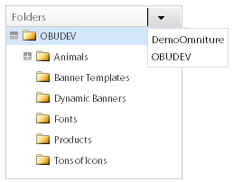
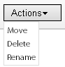
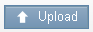
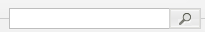
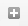
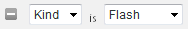
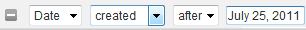
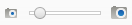

# Om banners {#about-banners}

Du kan använda Banners för att hantera bannerannonser som finns på webbplatsen.

## Använda banderoller {#concept_5BBE01FEC6134393B43CC917C8CC64DA}

<!-- 

c_about_banners.xml

 -->

Det finns två metoder som du kan använda för att lägga till banners på din webbplats.

Den första metoden är att lägga till banners via Target, Search &amp; Promote. Banderollerna är HTML-kodfragment som visas när en kund söker på webbplatsen. Din banderoll kan innehålla text eller en bild i GIF-, JPEG- eller PNG-format, eller en kombination av båda. Du kan välja mellan förinställda storlekar eller definiera egna mått så att de passar sidan. Den HTML-kod som du använder för att visa banderollen kan också ange exempelvis vilken stil som ska användas och kantlinjen. Den här metoden för att lägga till en banderoll erbjuder grundläggande funktioner och kräver ingen ytterligare programvara.

Den andra metoden är att använda Adobe Dynamic Media Classic, en dynamisk mediahanterings- och publiceringstjänst. Med ett giltigt Adobe Dynamic Media Classic-konto kan du hantera och leverera banderollinnehåll direkt till Target, Search &amp; Promote, med hjälp av Dynamic Media Classic. Om du söker efter/säljer webbplatser konfigurerar du åtkomst till ditt Dynamic Media Classic-konto. Sedan öppnar du Dynamic Media Classic-medieläsaren och väljer en mediefil som du vill använda som banner.

>[!NOTE]
>
>Innan du kan använda dynamiska medieresurser som banners i webbplatssökningar/-marknadsföring överförs resurserna först och förbereds för publicering i Scene7 Publishing System. Du kan överföra resurser från webbplatssökningar och -försäljningar och få dem automatiskt förberedda för publicering via Scene7 Publishing System. Eller så kan du överföra och publicera material direkt från Scene7 Publishing System.

## Integrering av banners med Adobe Scene7 Publishing System {#section_D4D7ADEA6A6348E68EDA138E184FE579}

Du kan använda resurstyper i Dynamic Media Classic som banners vid webbplatssökning/försäljning, inklusive bilder, dynamiska banners och mallar, som bildmallar eller Flash-mallar.

Mallar skapas och adresseras dynamiskt lageruppbyggda bildfiler som lageruppbyggda filer i bildredigeringsprogram som Adobe Photoshop®. Till skillnad från en statisk bildfil kan en mall innehålla parametrar. Med hjälp av parametrar kan du anpassa egenskaper för variabla bilder och bildinnehåll.

>[!NOTE]
>
>Du kan också skapa mallar från layoutbaserade designer genom att använda mallpublicering i Scene7 Publishing System och filer från Adobe Illustrator och Adobe InDesign.

Se [Mallpublicering](https://help.adobe.com/en_US/scene7/using/WSFBFBAD30-2694-4b18-B7CE-894F9FC5CDDF.html) i användarhandboken för Dynamic Media Classic (Scene7).

En mall kan innehålla valfritt antal bildlager och textlager. Du kan konvertera en statisk fil som innehåller lager, till exempel en PSD-fil med lager, till en mall eller skapa mallar i Dynamic Media Classic. Du kan skapa textlager i mallar med teckensnitt som du överfört till Scene7 Publishing System. När du har lagt till text i en mall kan du formatera den genom att ändra dess justering, teckensnitt, teckenstorlek och färg.

På parameterskärmen i Dynamic Media Classic kan du konvertera alla delar av en mall till adresserbara parametrar. Om du gör det kan du ändra vilken bild i lager som ska användas eller vilket textvärde som ska användas i mallen. Parametrar skickas med URL-strängen så att du kan ändra alla parametrar för att dynamiskt anpassa svarsbilden som genereras från bildservern.

Du kan lära dig mer om hur du använder Dynamic Media Classic för att skapa mallar och parametrisera egenskaperna för lagren så att du kan använda dem i banners.

Se [Mallgrunder](https://help.adobe.com/en_US/scene7/using/WS60B68844-9054-4099-BF69-3DC998A04D3C.html) i användarhandboken för Dynamic Media Classic (Scene7).

**Överföra och publicera resurser**

Du måste överföra och publicera resurser i Dynamic Media Classic innan du kan använda dem för banners i webbplatssökningar/-marknadsföring. Den här förutsättningen innehåller även resurser som används av en bildmall eller en Flash-mall. Använd ditt Dynamic Media Classic-konto för att överföra och publicera digitalt material. Du kan också använda webbplatssökning/försäljning för att överföra en digital resurs och sedan låta Dynamic Media Classic publicera den automatiskt åt dig baserat på dina överföringsinställningar. Om du försöker välja en resurs som ännu inte har överförts och publicerats visas ett meddelande i användargränssnittet och du kan välja att överföra den innan du fortsätter.

Du kan läsa mer om hur du överför och publicerar digitala resurser med Scene7 Publishing System.

Se [Överför och publicera resurser](https://help.adobe.com/en_US/scene7/using/WS3673AD39-098B-4f08-8A24-CA51261B7366.html) i användarhandboken för Dynamic Media Classic (Scene7).

>[!NOTE]
>
>Om du vill använda överföringsfunktionen i Dynamic Media Classic Asset Viewer måste du kontrollera att det Dynamic Media Classic-konto du använder redan har rollen SPS Company Admin.

Se [Administrationsinställningar](https://help.adobe.com/en_US/scene7/using/WS662101DF-D697-47a7-A7D8-B52FD8E94438.html) i användarhandboken för Dynamic Media Classic (Scene7).

**Ändra Dynamic Media Classic-mallparametrar i en banderoll med affärsregler**

Om du har lagt till en Dynamic Media Classic-resurs som en banderoll kan du använda [!DNL Visual Rule Builder] i [!DNL Business Rules] för att lägga till den i valfritt banderollområde på webbplatsen. Du kan t.ex. lägga till banderollen på sökresultatsidorna, precis som med andra banderoller. Du kan också åsidosätta standardparametervärdena i Dynamic Media Classic-mallar genom att anpassa dem efter dina behov. Med den här typen av funktioner kan du anpassa Dynamic Media Classic-mallar med olika marknadsföringsmeddelanden och hyperlänkar till olika slutpunkter.

Se även [Lägga till en ny affärsregel](../c-about-rules-menu/c-about-business-rules.md#task_BD3B31ED48BB4B1B8F1DCD3BFA2528E7).

Se även [Redigera en affärsregel](../c-about-rules-menu/c-about-business-rules.md#task_375CFA75D1D94D9E92A35DE1228E5087).

## Lägga till en banderoll {#task_549D02B5F73B4158B105A94E39D937B7}

Du kan använda [!DNL Banners] för att hantera bannerannonserna och var de finns på webbplatsen. När du lägger till en banderoll refererar du bilden externt med HTML-kodfragment som visas vid sökningen.

<!-- 

t_adding_a_new_banner.xml

 -->

Om du har ett giltigt Adobe Dynamic Media Classic-konto kan du lägga till banners via Scene7 Publishing System.

Se [Lägga till en banderoll med Adobe Dynamic Media Classic](../c-about-design-menu/c-about-banners.md#task_AD1E0C00A9E04B1FA819EB93288786B3).

Se [Konfigurera åtkomst till ditt Adobe Dynamic Media Classic-konto](../c-about-settings-menu/c-about-account-options-menu.md#task_CEFF88C2033D41D0B2FE86C435EDAC6D).

**Lägga till en banderoll**

1. Klicka på **[!UICONTROL Design]** > **[!UICONTROL Banners]** på produktmenyn.
1. På sidan [!DNL Banners] väljer du **[!UICONTROL HTML code]** i listrutan **[!UICONTROL Add Banner]**.
1. Ange önskade alternativ i dialogrutan [!DNL Add Banner].

   <table> 
    <thead> 
      <tr> 
      <th colname="col1" class="entry"> 
Alternativ 
 </th> 
      <th colname="col2" class="entry"> 
Beskrivning 
 </th> 
      </tr> 
    </thead>
    <tbody> 
      <tr> 
      <td colname="col1"> 
Namn 
 </td> 
      <td colname="col2"> 
Obligatoriskt. Identifierar namnet på din banderoll. Namnet används för att referera till banderollen när du lägger till den i Visual Rule Builder in Business Rules. Namnet visas inte i själva banderollen. 
 
Se <a href="../c-about-rules-menu/c-about-business-rules.md#task_BD3B31ED48BB4B1B8F1DCD3BFA2528E7" type="task" format="dita" scope="local"> Lägga till en ny affärsregel.</a> 
 </td> 
      </tr> 
      <tr> 
      <td colname="col1"> 
Banderoll-HTML 
 </td> 
      <td colname="col2"> 
 Gör att du kan klistra in HTML-koden som är kopplad till banderollen. 
 
Valfri HTML-kod tillåts, inklusive CSS-kod som omges av 
        <code>
          &lt;style&gt; 
        </code>-taggar eller JavaScript-kod som omges av 
        <code>
          &lt;script&gt; 
        </code>-taggar. Följande kodblock gäller till exempel för en textbanderoll av typen Vågrät överkant: <code> &lt;div&nbsp;style="width:&nbsp;684px;&nbsp;background-image:&nbsp;url('https://www.brough.com/blackb.gif');&nbsp; 
          padding-top:&nbsp;10px;&nbsp;padding-bottom:&nbsp;10px;&nbsp;color:&nbsp;white;&nbsp;font-family:&nbsp;verdana;&nbsp; 
          text-align:&nbsp;center;&nbsp;font-size:&nbsp;20px;"&gt;&nbsp;Sound&nbsp;Study&nbsp;ships&nbsp;free!&nbsp;&lt;/div&gt; </code>I följande exempel gäller kodblocket för en fullständig välkomstbild: <code> &lt;img&amp;nbsp;src='https://geometrixx.com/images/GEOAds/geometrixx-beauty-home-01.jpg'&amp;nbsp;border="0"&amp;nbsp;/&gt; </code> 
 </td> 
      </tr> 
      <tr> 
      <td colname="col1"> 
Typ 
 </td> 
      <td colname="col2"> 
Anger följande typer av banners: 
        <ul id="ul_6423AEDB9E664049989EB529D63C4A62"> 
          <li id="li_BF6CD60B3ED748D49CFFB9C5D607661C">  [ny typ]   
Här kan du ange vilken typ av banderoll du vill använda, inklusive mått och namn. 
 </li> 
          <li id="li_1A29AB22AD644E60A12298187B5E898E">  Helt välkomststpapper   
Den angivna dimensionen för den här typen av banderoll är 680 pixlar bred och 650 pixlar hög. Du kan också ange namnet på typen eller acceptera standardnamnet som är namnet på själva banderolltypen. 
 </li> 
          <li id="li_2BE06D013CB54DDE851051BFC038BB57">  Vågrät överkant   
 Banderollen placeras över webbplatsens övre del. Den här typen är användbar om du tänker lägga till hyperlänkar till vänster eller höger om banderollen. Den angivna dimensionen för den här typen av banderoll är 468 pixlar bred och 60 pixlar hög. Du kan också ange namnet på typen eller acceptera standardnamnet som är namnet på själva banderolltypen. 
 </li> 
          <li id="li_EC35AB92234749F08AA8A9BD26D0EA8D">  Vågrät överkant - full bredd   
Den här typen är standard när du lägger till en ny banderoll. Banderollen är placerad över webbplatsens övre del och tar upp hela sidans bredd. Den angivna dimensionen för den här typen av banderoll är 670 pixlar bred och 150 pixlar hög. Du kan också ange namnet på typen eller acceptera standardnamnet som är namnet på själva banderolltypen. 
 </li> 
        </ul> 
 </td> 
      </tr> 
      <tr> 
      <td colname="col1"> 
Taggar 
 </td> 
      <td colname="col2"> 
Lägger till taggar eller"nyckelord" som du vill associera med banderollen. Om du använder många banners kan taggarna hjälpa dig att förfina din banderollsökning så att du snabbt kan hitta precis rätt banderoll för dina behov. Du kan också ta bort taggar som du har lagt till. 
 </td> 
      </tr> 
    </tbody> 
    </table>

1. Klicka på **[!UICONTROL Save]**.
1. (Valfritt) Gör något av följande:

   * Klicka på **[!UICONTROL History]** om du vill återställa ändringar som du har gjort.

      Se [Använda alternativet Historik](../t-using-the-history-option.md#task_70DD3F87A67242BBBD2CB27156F43002).

   * Klicka på **[!UICONTROL Live]**.

      Se [Visa Live-inställningar](../c-about-staging.md#task_401A0EBDB5DB4D4CA933CBA7BECDC10F).

   * Klicka på **[!UICONTROL Push Live]**.

      Se [Publicera sceninställningar live](../c-about-staging.md#task_44306783B4C0408AAA58B471DAF2D9A4).

## Redigera en banderoll {#task_D4081083BE7B40F5A003D1A2F1435AEA}

Använd [!DNL Edit Banner] om du vill ändra t.ex. bannernamnet, banners-HTML, bannertypen och associerade taggar.

<!-- 

t_editing_a_banner.xml

 -->

Om du har lagt till en banderoll med hjälp av webbplatssökningar och -marknadsföring kan du även redigera banderollen med Adobe Dynamic Media Classic.

Se även [Redigera en banderoll med Adobe Dynamic Media Classic](../c-about-design-menu/c-about-banners.md#task_C3E782477FBF428ABEA220751781ACA9).

**Redigera en banderoll**

1. Klicka på **[!UICONTROL Design]** > **[!UICONTROL Banners]** på produktmenyn.
1. Klicka på  på sidan [!DNL Banners].

   ovanför en miniatyrbild för banderollen som du vill redigera.
1. Ange önskade alternativ på sidan [!DNL Edit Banner].

   Se tabellen med alternativ under [Lägga till en banderoll](../c-about-design-menu/c-about-banners.md#task_549D02B5F73B4158B105A94E39D937B7).
1. När du är klar med redigeringen av banderollen klickar du på **[!UICONTROL Save]**.
1. (Valfritt) Gör något av följande:

   * Klicka på **[!UICONTROL History]** om du vill återställa ändringar som du har gjort.

      Se [Använda alternativet Historik](../t-using-the-history-option.md#task_70DD3F87A67242BBBD2CB27156F43002).

   * Klicka på **[!UICONTROL Live]**.

      Se [Visa Live-inställningar](../c-about-staging.md#task_401A0EBDB5DB4D4CA933CBA7BECDC10F).

   * Klicka på **[!UICONTROL Push Live]**.

      Se [Publicera sceninställningar live](../c-about-staging.md#task_44306783B4C0408AAA58B471DAF2D9A4).

## Lägga till en banderoll med Adobe Dynamic Media Classic {#task_AD1E0C00A9E04B1FA819EB93288786B3}

Du kan använda [!DNL Banners] för att hantera bannerannonserna på webbplatsen. När du lägger till en banderoll med Adobe Dynamic Media Classic kan du välja bland alla digitala resurser som du har överfört till Scene7 Publishing System.

<!-- 

t_adding_a_banner_using_adobe_scene7.xml

 -->

Om du vill lägga till en banderoll med Adobe Dynamic Media Classic måste du ha konfigurerat åtkomsten till ditt giltiga Dynamic Media Classic-konto.

Se [Konfigurera åtkomst till ditt Adobe Dynamic Media Classic-konto](../c-about-settings-menu/c-about-account-options-menu.md#task_CEFF88C2033D41D0B2FE86C435EDAC6D).

**Lägga till en banderoll med Adobe Dynamic Media Classic**

1. Klicka på **[!UICONTROL Design]** > **[!UICONTROL Banners.]** på produktmenyn
1. På sidan [!DNL Banners] går du till listrutan **[!UICONTROL Add Banner]** och klickar på **[!UICONTROL Adobe Scene7]**.
1. I dialogrutan [!DNL Pick an Asset] i den vänstra rutan använder du navigeringsalternativen i användargränssnittet för att hitta mappen som innehåller den digitala resursen som du vill använda för en banderoll.

   Med undantag för alternativ för resursnavigering är alla andra alternativ beroende av den digitala resurs som du har valt att lägga till eller redigera.

   Använd alternativen för resursnavigering för att hitta en resurs som du vill använda för en ny banderoll i webbplatssökning/försäljning. Navigeringsalternativen gäller för alla typer av valda digitala resurser.

   >[!NOTE]
   >
   >Alternativen för resursnavigering visas inte när du redigerar banderollen i dialogrutan [!DNL Change Parameters].

   Se [Redigera en banderoll med Adobe Dynamic Media Classic](../c-about-design-menu/c-about-banners.md#task_C3E782477FBF428ABEA220751781ACA9).

   **Alternativ för resursnavigering**

   <table> 
    <thead> 
      <tr> 
      <th colname="col1" class="entry"> 
Navigeringsalternativ 
 </th> 
      <th colname="col2" class="entry"> 
Beskrivning 
 </th> 
      </tr> 
    </thead>
    <tbody> 
      <tr> 
      <td colname="col1"> 
  
 </td> 
      <td colname="col2"> 
Gör att du kan välja Dynamic Media Classic-konto för ditt företag i listrutan och även navigera i de digitala resursmapparna i det kontot. 
 
När du väljer en mapp visar den högra rutan i dialogrutan  Välj en resurs  alla tillgängliga digitala resurser som finns i den mappen. 
 </td> 
      </tr> 
      <tr> 
      <td colname="col1"> 
  
 </td> 
      <td colname="col2"> 
Gör att du kan gå framåt eller bakåt genom mappnavigeringshistoriken. 
 </td> 
      </tr> 
      <tr> 
      <td colname="col1"> 
  
 </td> 
      <td colname="col2"> 
Uppdaterar listan med digitala resurser som visas för en vald mapp. 
 
Du kan behöva klicka på den här kontrollen om du flyttar, tar bort eller byter namn på en markerad resurs med listrutan  Åtgärder . 
 </td> 
      </tr> 
      <tr> 
      <td colname="col1"> 
  
 </td> 
      <td colname="col2"> 
Visar digitala resurser i en listvy. I listan visas varje tillgångs associerade ikon eller miniatyrbild, filnamn, digital resurstyp, dimensioner (där det är tillämpligt) och datumet då den senast redigerades. 
 
I stödrastervyn visas digitala resurser i den valda mappen som ikoner, miniatyrer eller båda. 
 </td> 
      </tr> 
      <tr> 
      <td colname="col1"> 
  
 </td> 
      <td colname="col2"> 
I listvyn kan du flytta, ta bort eller byta namn på en vald digital resurs. 
 
I stödrastervyn kan du flytta eller ta bort en eller flera markerade digitala resurser. 
 </td> 
      </tr> 
      <tr> 
      <td colname="col1"> 
  
 </td> 
      <td colname="col2"> 
Öppnar dialogrutan  Överför  där du kan överföra en vald digital resurs från skrivbordet eller från en extern server så att du kan använda den som en banderoll. 
 
När du har överfört resursen schemaläggs ett publiceringsjobb automatiskt åt dig i Scene7 Publishing System. 
 
Se tabellen med alternativ i <a href="../c-about-design-menu/c-about-banners.md#task_AD1E0C00A9E04B1FA819EB93288786B3" type="reference" format="dita" scope="local"> Lägga till en banderoll med Adobe Dynamic Media Classic </a>. 
 
Du kan läsa mer om hur du överför och publicerar digitala resurser med Scene7 Publishing System. 
 
Se <a href="https://help.adobe.com/en_US/scene7/using/WS3673AD39-098B-4f08-8A24-CA51261B7366.html" scope="external" format="html"> Överför och publicera resurser </a> i användarhandboken för Scene7 Publishing System. 
 </td> 
      </tr> 
      <tr> 
      <td colname="col1"> 
  
 </td> 
      <td colname="col2"> 
Gör att du kan söka efter en digital resurs efter nyckelord eller söka efter filplats i den markerade mappen och tillhörande undermappar. 
 
När du klickar på sökfältet läggs ett valfritt filterfält automatiskt till. 
 </td> 
      </tr> 
      <tr> 
      <td colname="col1"> 
  
 </td> 
      <td colname="col2"> 
Lägger till ett annat resursfilter så att du kan förfina listan med visade digitala resurser ytterligare per typ eller ett visst datum. 
 </td> 
      </tr> 
      <tr> 
      <td colname="col1"> 
  
 </td> 
      <td colname="col2"> 
Förfina listan med visade digitala resurser så att endast de visas med en viss typ, till exempel Flash, Bild, Mall eller Någon. 
 
Klicka på  för att ta bort filtret från sökningen. 
 </td> 
      </tr> 
      <tr> 
      <td colname="col1"> 
  
 </td> 
      <td colname="col2"> 
Förfina listan med visade digitala resurser så att endast de som skapats eller redigerats före ett visst datum eller efter ett visst datum visas. 
 
Klicka på  för att ta bort filtret från sökningen. 
 </td> 
      </tr> 
      <tr> 
      <td colname="col1"> 
  
 </td> 
      <td colname="col2"> 
Gör att du kan dra skjutreglaget åt vänster eller höger för att förminska eller förstora hela vyn av rutan för digitala resurser. 
 </td> 
      </tr> 
    </tbody> 
    </table>

   **Egenskapsalternativ**

   Egenskapsalternativen visas om du väljer en Flash-mall, bildmall eller en bild. Alla alternativ är inte tillgängliga beroende på vilken digital resurs du väljer.

   <table> 
    <thead> 
      <tr> 
      <th colname="col1" class="entry"> 
Egenskaper, alternativ 
 </th> 
      <th colname="col2" class="entry"> 
Beskrivning 
 </th> 
      </tr> 
    </thead>
    <tbody> 
      <tr> 
      <td colname="col1"> 
Namn 
 </td> 
      <td colname="col2"> 
Mallens eller bildens beskrivande namn, utan blanksteg. Om du vill kan du inkludera bildstorleksspecifikationen i namnet för att hjälpa användarna att identifiera resursen ytterligare. 
 </td> 
      </tr> 
      <tr> 
      <td colname="col1"> 
Format 
 </td> 
      <td colname="col2"> 
Identifierar bildens eller bildmallens format. 
 
Du kan välja mellan följande format: 
 
        <ul id="ul_9A19421BCC424CF585645049DCB87F10"> 
        <li id="li_A4913D783BD547F9AFA1A259C56EC2B3">jpeg </li> 
        <li id="li_66237D7BE8754FB0B0088CE5A02C0214">png </li> 
        <li id="li_4EDDFD7C8AB04677BEC20EFC9AEBBF1F">png-alpha </li> 
        <li id="li_4FCB03C29AE647ACBAF5105016DF7579">gif </li> 
        <li id="li_B884BD7DFF1845FAA9C58EF09B888A77">gif-alpha </li> 
        </ul> 
Det här alternativet gäller inte Flash-mallar. 
 </td> 
      </tr> 
      <tr> 
      <td colname="col1"> 
Kvalitet 
 </td> 
      <td colname="col2"> 
Styr komprimeringsnivån för JPEG- eller GIF-bilder. Den här inställningen påverkar både filstorlek och bildkvalitet. Kvalitetsskalan är 1-100. 
 
När du drar skjutreglaget åt vänster eller höger uppdateras bilden i förhandsvisningsfönstret för att återspegla kvalitetsändringen. 
 
Det här alternativet gäller inte Flash-mallar. 
 </td> 
      </tr> 
      <tr> 
      <td colname="col1"> 
Bredd 
 </td> 
      <td colname="col2"> 
Anger den digitala resursens bredd i pixlar. Detta är den bredd som de kunder som besöker er webbplats ser på. 
 
Det här alternativet gäller inte Flash-mallar. 
 </td> 
      </tr> 
      <tr> 
      <td colname="col1"> 
Höjd 
 </td> 
      <td colname="col2"> 
Anger den digitala resursens höjd i pixlar. Detta är den höjd som de kunder som besöker er webbplats ser på. 
 
Det här alternativet gäller inte Flash-mallar. 
 </td> 
      </tr> 
    </tbody> 
    </table>

   **Alternativ för banderolllänk**

   Alternativen för Banner Link visas bara om du väljer en bild eller bildmall för banderollen.

   <table> 
    <thead> 
      <tr> 
      <th colname="col1" class="entry"> 
Alternativet Banderolllänk 
 </th> 
      <th colname="col2" class="entry"> 
Beskrivning 
 </th> 
      </tr> 
    </thead>
    <tbody> 
      <tr> 
      <td colname="col1"> 
Länk-URL 
 </td> 
      <td colname="col2"> 
Anger den URL-adress som du vill att banderollen ska länka till när en kund klickar på bilden. 
 
Om du inte vill att banderollen ska länka till något lämnar du fältet Länk-URL tomt. 
 </td> 
      </tr> 
      <tr> 
      <td colname="col1"> 
Mål 
 </td> 
      <td colname="col2"> 
Anger var den länkade banderollen ska öppnas, t.ex. i ett nytt webbläsarfönster eller på en ny flik. 
 </td> 
      </tr> 
    </tbody> 
    </table>

   **Alternativet Ändra länkar**

   Alternativet Ändra länkar visas bara om du väljer en Flash-mall för banderollen.

   <table> 
    <thead> 
      <tr> 
      <th colname="col1" class="entry"> 
Alternativet Ändra länkar 
 </th> 
      <th colname="col2" class="entry"> 
Beskrivning 
 </th> 
      </tr> 
    </thead>
    <tbody> 
      <tr> 
      <td colname="col1"> 
  
 </td> 
      <td colname="col2"> 
Här kan du redigera URL-länkfältet som används i mallen Flash. 
 </td> 
      </tr> 
    </tbody> 
    </table>

   **Alternativ för Ersätt text**

   Alternativen för Ersätt text visas bara om du väljer en Flash-mall för banderollen med redigerbara textlager.

   Alla ändringar du gör i Flash-mallen visas i förhandsgranskningsfönstret.

   >[!NOTE]
   >
   >Om du lägger till ett sök- och ersätt-kommando som ersätter&quot;ko&quot; med&quot;äpple&quot; och sedan skapar ett andra kommando som ersätter&quot;äpple&quot; med&quot;orange&quot;, påverkar inte det andra kommandot.

   <table> 
    <thead> 
      <tr> 
      <th colname="col1" class="entry"> 
Ersätt text, alternativ 
 </th> 
      <th colname="col2" class="entry"> 
Beskrivning 
 </th> 
      </tr> 
    </thead>
    <tbody> 
      <tr> 
      <td colname="col1"> 
  
 </td> 
      <td colname="col2"> 
Lägger till ett sök- och ersättningsfält. 
 </td> 
      </tr> 
      <tr> 
      <td colname="col1"> 
  
 </td> 
      <td colname="col2"> 
Tar bort ett Sök och ersätt-fält och återställer den tidigare använda texten. 
 </td> 
      </tr> 
      <tr> 
      <td colname="col1"> 
Sök 
 </td> 
      <td colname="col2"> 
Här kan du ange en sökterm för icke-länkad text i lagren i mallen Flash. 
 </td> 
      </tr> 
      <tr> 
      <td colname="col1"> 
Ersätt 
 </td> 
      <td colname="col2"> 
Här kan du ange den text som du vill infoga i stället för den text som du söker efter. 
 
När du trycker på  Retur  i det här fältet uppdateras förhandsvisningsfönstret med din ersättningstext. 
 </td> 
      </tr> 
    </tbody> 
    </table>

   **Parameteralternativ**

   Parameteralternativen visas bara om du väljer en bildmall eller en Flash-mall för banderollen. De faktiska parameteralternativen varierar beroende på hur mallen skapades och parametriserades i Scene7 Publishing System. Mallen kan t.ex. innehålla parametriserade fält som gör att du kan ändra t.ex. text, teckensnittsstil, pris, specialkoder som används för fri frakt, storleken på bilden i banderollen eller bläddra efter en annan bild.

   >[!NOTE]
   >
   >Observera att alla ändringar du gör i parametrar kan åsidosättas av affärsregler. Parametrarna fungerar bara som standard när inga affärsregler skapas som annars skulle ändra parametrarna.

   Se [Lägga till en ny affärsregel](../c-about-rules-menu/c-about-business-rules.md#task_BD3B31ED48BB4B1B8F1DCD3BFA2528E7).

   Se [Redigera en affärsregel](../c-about-rules-menu/c-about-business-rules.md#task_375CFA75D1D94D9E92A35DE1228E5087).

   **Växla alternativ för lagervisning**

   Alternativet Växla lagervisning gäller bara om du väljer en Flash-mall för banderollen.

   <table> 
    <thead> 
      <tr> 
      <th colname="col1" class="entry"> 
Växla lagersynlighet, alternativ 
 </th> 
      <th colname="col2" class="entry"> 
Beskrivning 
 </th> 
      </tr> 
    </thead>
    <tbody> 
      <tr> 
      <td colname="col1"> 
  
 </td> 
      <td colname="col2"> 
Gör att du kan aktivera eller inaktivera synligheten för de olika lager som utgör mallfilen för Flash. 
 
Varje gång du aktiverar eller inaktiverar synligheten för ett lager uppdateras förhandsvisningsfönstret så att visningen uppdateras. 
 </td> 
      </tr> 
    </tbody> 
    </table>

   (Valfritt) Om den digitala resursen som du vill använda för en banderoll inte är tillgänglig i den valda mappen kan du behöva överföra den. Klicka på **[!UICONTROL Upload]** och välj sedan den fil och de alternativ som du vill använda. Filen överförs till den valda mappen.

   >[!NOTE]
   >
   >Om du vill använda överföringsfunktionen i Scene7 resursvisningsprogram måste du kontrollera att det Scene7-konto du använder redan har rollen SPS-företagsadministratör angiven.

   Se [Administrationsinställningar](https://help.adobe.com/en_US/scene7/using/WS662101DF-D697-47a7-A7D8-B52FD8E94438.html) i användarhandboken för Scene7 Publishing System.

   **Grundläggande alternativ**

   <table> 
    <thead> 
      <tr> 
      <th colname="col1" class="entry"> 
Alternativ 
 </th> 
      <th colname="col2" class="entry"> 
Beskrivning 
 </th> 
      </tr> 
    </thead>
    <tbody> 
      <tr> 
      <td colname="col1"> 
Bläddra 
 </td> 
      <td colname="col2"> 
 Gör att du kan bläddra till filen som du vill överföra, publicera och sedan välja att använda som banderoll. 
 </td> 
      </tr> 
      <tr> 
      <td colname="col1"> 
 Skriv över 
 </td> 
      <td colname="col2"> 
Filer som du överför ersätter befintliga filer med samma filnamn i den valda mappen. 
 </td> 
      </tr> 
      <tr> 
      <td colname="col1"> 
E-postinställningar 
 </td> 
      <td colname="col2"> 
 Gör att du kan välja vilket e-postmeddelande du får för överföringen, eller välja att inte få något meddelande om överföringen. 
 </td> 
      </tr> 
    </tbody> 
    </table>

   **Avancerade alternativ**

   När du överför bildfiler från PostScript (EPS) eller Illustrator (AI) kan du formatera dem på olika sätt. Du kan rastrera filerna, konvertera dem till FXG för mallpublicering, behålla den genomskinliga bakgrunden, välja en upplösning och välja en färgrymd.

   PSD (Photoshop Document Files) används oftast i Dynamic Media Classic för att skapa mallar. När du överför en PSD-fil kan du skapa en Dynamic Media Classic-mall automatiskt från filen (välj alternativet **[!UICONTROL Create Template]**).

   Scene7 Publishing System skapar flera bilder från en PSD-fil med lager om du använder filen för att skapa en mall. skapas en bild för varje lager.

   <table> 
    <thead> 
      <tr> 
      <th colname="col1" class="entry"> 
Alternativgruppsnamn 
 </th> 
      <th colname="col02" class="entry"> 
Alternativ 
 </th> 
      <th colname="col2" class="entry"> 
Beskrivning 
 </th> 
      </tr> 
    </thead>
    <tbody> 
      <tr> 
      <td colname="col1"> 
Alternativ för färgprofil 
 </td> 
      <td colname="col02"> 
Färgprofil 
 </td> 
      <td colname="col2"> 
 Välj bland följande alternativ: 
 
        <ul id="ul_6927BC08CA2647EDB2C85DAD2B82AE31"> 
        <li id="li_CA3F44FF9C0F4CE987DCB0AF9303C2E4">  Konvertera till SRGB   
Konverterar till SRGB (Standard Red Green Blue). SRGB är den rekommenderade färgrymden för visning av bilder på webbsidor. 
 </li> 
        <li id="li_FCCEE6B14CCD4246ADA152932010ABF1">  Behåll ursprunglig färgmodell   
Bevarar den ursprungliga färgrymden. 
 </li> 
        </ul> </td> 
      </tr> 
      <tr> 
      <td colname="col1"> 
Bildredigeringsalternativ 
 </td> 
      <td colname="col02"> 
Skapa mask från urklippsbana 
 </td> 
      <td colname="col2"> 
Skapa en mask för bilden baserat på dess urklippsbaneinformation. Det här alternativet gäller bilder som skapats med bildredigeringsprogram där en urklippsbana har skapats. 
 </td> 
      </tr> 
      <tr> 
      <td colname="col1"> 
PostScript-alternativ 
 
Illustrator-alternativ 
 </td> 
      <td colname="col02"> 
Bearbetar 
 </td> 
      <td colname="col2"> 
  Med   alternativet Rastrera konverteras vektorgrafik i filen till bitmappsformat. 
 </td> 
      </tr> 
      <tr> 
      <td colname="col1"> 
 PostScript-alternativ 
 
Illustrator-alternativ 
 </td> 
      <td colname="col02"> 
 Upplösning 
 </td> 
      <td colname="col2"> 
 Anger upplösningsinställningen. Den här inställningen avgör hur många pixlar som visas per tum i filen. Standardvärdet är 150. 
 </td> 
      </tr> 
      <tr> 
      <td colname="col1"> 
 PostScript-alternativ 
 
Illustrator-alternativ 
 </td> 
      <td colname="col02"> 
 Färgmodell 
 </td> 
      <td colname="col2"> 
Här kan du välja en färgrymd för Illustrator-filen. RGB-färgmodellen är att föredra när du vill visa bilden online. 
 
Du kan välja mellan följande alternativ för färgrymd: 
 
        <ul id="ul_0E83E2762A574480B243F963A7FB2ACD"> 
        <li id="li_B9FEC7D220D04CCABACD30839051DAE4">  Identifiera automatiskt   
 Behåller PDF-filens färgrymd. 
 </li> 
        <li id="li_ED0EB3B12BCF41C7AFC435447010B6FF">  Tvinga som RGB   
 Konverterar till RGB-färgmodellen. 
 </li> 
        <li id="li_3FB5DD8887C540BC97148A4D63B38F72">  Tvinga som CMYK   
 Konverterar till CMYK-färgmodellen. 
 </li> 
        <li id="li_6C018D3A4B254880AD41896E9F4AF3D9">  Tvinga som gråskala   
 Konverterar till färgmodellen Gråskala. 
 </li> 
        </ul> </td> 
      </tr> 
      <tr> 
      <td colname="col1"> 
 PostScript-alternativ 
 
Illustrator-alternativ 
 </td> 
      <td colname="col02"> 
 Bevara genomskinlig bakgrund 
 </td> 
      <td colname="col2"> 
Bevarar filens genomskinlighet i bakgrunden. 
 </td> 
      </tr> 
      <tr> 
      <td colname="col1"> 
Photoshop-alternativ 
 </td> 
      <td colname="col02"> 
 Bevara lager 
 </td> 
      <td colname="col2"> 
Rippar lagren i PSD-filen, om det finns några, till enskilda resurser. Resurslagren förblir kopplade till PSD-filen. 
 </td> 
      </tr> 
      <tr> 
      <td colname="col1"> 
 Photoshop-alternativ 
 </td> 
      <td colname="col02"> 
Skapa mall 
 </td> 
      <td colname="col2"> 
 Skapar en mall från lagren i PSD-filen. 
 </td> 
      </tr> 
      <tr> 
      <td colname="col1"> 
 Photoshop-alternativ 
 </td> 
      <td colname="col02"> 
 Extrahera text 
 </td> 
      <td colname="col2"> 
 Extraherar texten så att kunderna kan söka efter nyckelord i en banderoll. 
 </td> 
      </tr> 
      <tr> 
      <td colname="col1"> 
Photoshop-alternativ 
 </td> 
      <td colname="col02"> 
 Utöka lager 
 </td> 
      <td colname="col2"> 
Utökar storleken på överlappade bildlager till storleken på bakgrundslagret. 
 </td> 
      </tr> 
      <tr> 
      <td colname="col1"> 
Photoshop-alternativ 
 </td> 
      <td colname="col02"> 
 Namnge lager 
 </td> 
      <td colname="col2"> 
Lager i PSD-filen överförs som separata bilder. Du kan välja bland följande alternativ för att bestämma hur du vill namnge bilderna i Scene7 Publishing System: 
 
        <ul id="ul_C2A25177A07740CA90B32C638304D39F"> 
        <li id="li_477D5BFF7238454BBF0E04B22DE378F7">  Använd lagernamn från PSD-fil   
Namnger bilderna efter deras lagernamn i PSD-filen. Ett lager med namnet  Price Tag  i den ursprungliga PSD-filen blir till exempel en bild med namnet  Price Tag . Om lagernamnen i PSD-filen däremot är Photoshop standardlagernamn (Bakgrund, Lager 1, Lager 2 och så vidare) får bilderna namn efter sina lagernummer i PSD-filen, inte efter deras standardlagernamn. 
 </li> 
        <li id="li_EB4173B884FC41328CFBDE27DA6D43AA">  Använd PSD-filnamn och lägg till nummer   
Namnger bilderna efter deras lagernummer i PSD-filen och ignorerar de ursprungliga lagernamnen. Bilderna får samma namn som Photoshop-filnamnet och ett nummer i det tillagda lagret. Det andra lagret i en fil med namnet  Spring Ad.psd  har till exempel namnet  Spring Ad_2  även om det har ett icke-standardnamn i Photoshop. 
 </li> 
        <li id="li_10B2D2DE2FD24BD08DB56D1D95ABA53D">  Använd PSD-filnamn och lagernamn eller -nummer   
Namnger bilderna efter PSD-filen följt av lagernamnet eller lagernumret. Lagernumret används om lagernamnen i PSD-filen är Photoshop standardlagernamn. Ett lager med namnet  Price Tag  i en PSD-fil med namnet  SpringAd  har till exempel namnet  Spring Ad_Price Tag . Ett lager med standardnamnet  Lager 2  heter  Spring Ad_2 . 
 </li> 
        <li id="li_5E57AC0719D4484B9C9BD14DB42B4455">  Skapa mapp baserat på PSD-filnamnet   
Skapar en mapp för lagerbilderna med PSD-filens namn. 
 </li> 
        </ul> </td> 
      </tr> 
      <tr> 
      <td colname="col1"> 
Photoshop-alternativ 
 </td> 
      <td colname="col02"> 
Ankarpunkt 
 </td> 
      <td colname="col2"> 
Ange hur bilder ska förankras i mallar som genereras från lagerkompositionen som skapas från PSD-filen. 
 
Som standard är ankarpunkten i mitten. Med en central ankarpunkt kan ersättningsbilder bäst fylla samma område, oavsett ersättningsbildens proportioner. Bilder med en annan aspekt som ersätter den här bilden upptar i själva verket samma utrymme när de refererar till mallen och använder parameterersättning. Ändra till en annan inställning om ditt program kräver att ersättningsbilderna fyller ut det tilldelade utrymmet i mallen. 
 </td> 
      </tr> 
      <tr> 
      <td colname="col1"> 
PDF-alternativ 
 </td> 
      <td colname="col02"> 
Bearbetar 
 </td> 
      <td colname="col2"> 
  Med   alternativet Rastrera kan du rippa sidorna i PDF-filen och konvertera vektorgrafik till bitmappsbilder.  
        <!--Choose this option to create an eCatalog. (This option is thedefault.)--> 
 </td> 
      </tr> 
      <tr> 
      <td colname="col1"> 
PDF-alternativ 
 </td> 
      <td colname="col02"> 
 Upplösning 
 </td> 
      <td colname="col2"> 
Anger upplösningsinställningen. Den här inställningen avgör hur många pixlar som visas per tum i PDF-filen. Standardvärdet är 150. 
 </td> 
      </tr> 
      <tr> 
      <td colname="col1"> 
PDF-alternativ 
 </td> 
      <td colname="col02"> 
 Färgmodell 
 </td> 
      <td colname="col2"> 
Här kan du välja en färgrymd för PDF-filen. De flesta PDF-filer har både RGB- och CMYK-färgbilder. RGB-färgmodellen är att föredra när du vill visa bilden online. 
 
Du kan välja mellan följande alternativ för färgrymd: 
 
        <ul id="ul_44A8C39DEB21473F9375E3962F14D3C6"> 
        <li id="li_1046FA0017934C5EB7C0100F8F78507D">  Identifiera automatiskt   
 Behåller PDF-filens färgrymd. 
 </li> 
        <li id="li_561CCF705EDD451993D2DA2EB33F05F7">  Tvinga som RGB   
 Konverterar till RGB-färgmodellen. 
 </li> 
        <li id="li_D9E8CF61C40140979484EDEF7DAD2C44">  Tvinga som CMYK   
 Konverterar till CMYK-färgmodellen. 
 </li> 
        <li id="li_F3606B45C0F84BA594263EA12243F67A">  Tvinga som gråskala   
 Konverterar till färgmodellen Gråskala. 
 </li> 
        </ul> </td> 
      </tr> 
      <tr> 
      <td colname="col1"> 
PDF-alternativ 
 </td> 
      <td colname="col02"> 
Generera eCatalog automatiskt från PDF med flera sidor 
 </td> 
      <td colname="col2"> 
 Skapar automatiskt en e-katalog från PDF-filen. eCatalog namnges efter den PDF-fil du överförde. 
 </td> 
      </tr> 
      <tr> 
      <td colname="col1"> 
 PDF-alternativ 
 </td> 
      <td colname="col02"> 
Extrahera nyckelord 
 </td> 
      <td colname="col2"> 
Extraherar ord från PDF-filen så att filen kan sökas igenom med nyckelord. 
 </td> 
      </tr> 
    </tbody> 
    </table>

1. Klicka i den högra rutan på bilden, mallen eller Flash-filen som du vill ha.

   Popup-fönstret [!DNL Pick An Asset] visas.
1. (Valfritt) Gör något av följande i listrutan [!DNL Pick An Asset] i popup-fönstret [!DNL Actions]:

   * Klicka på **[!UICONTROL Move]**. I dialogrutan [!DNL Select a folder to move to] väljer du den mapp där du vill flytta den digitala resursen. Klicka på **[!UICONTROL Move]**.

      Du kan också välja flera digitala resurser som du vill flytta till en annan mapp.

   * Klicka på **[!UICONTROL Delete]**. Klicka på **[!UICONTROL Delete]** i dialogrutan [!DNL Delete Selected Assets].

      Du kan också markera flera digitala resurser som du vill ta bort från mappen.

   * Klicka på **[!UICONTROL Rename]**. I dialogrutan [!DNL Enter a new name for] skriver du ett nytt namn för den digitala resursen i textfältet. Klicka på **[!UICONTROL Rename]**.

1. (Valfritt) Beroende på vilken digital resurs du har valt anger du önskade alternativ i den vänstra rutan i popup-fönstret [!DNL Pick an Asset].
1. Klicka på resursen för att välja den som en banderoll.
1. (Valfritt) Gör något av följande:

   * Klicka på **[!UICONTROL History]** om du vill återställa ändringar som du har gjort.

      Se [Använda alternativet Historik](../t-using-the-history-option.md#task_70DD3F87A67242BBBD2CB27156F43002).

   * Klicka på **[!UICONTROL Live]**.

      Se [Visa Live-inställningar](../c-about-staging.md#task_401A0EBDB5DB4D4CA933CBA7BECDC10F).

   * Klicka på **[!UICONTROL Push Live]**.

      Se [Publicera sceninställningar live](../c-about-staging.md#task_44306783B4C0408AAA58B471DAF2D9A4).

## Redigera en banderoll med Adobe Dynamic Media Classic {#task_C3E782477FBF428ABEA220751781ACA9}

Använd [!DNL Edit Banner] för att ändra egenskaper och parametrar för en banderoll som du har lagt till med Adobe Dynamic Media Classic.

<!-- 

t_editing_a_banner_using_adobe_scene7.xml

 -->

Om du har lagt till en banderoll genom att lägga till HTML-kod redigerar du banderollen med hjälp av webbplatssökning/försäljning i stället.

Se även [Redigera en banderoll](../c-about-design-menu/c-about-banners.md#task_D4081083BE7B40F5A003D1A2F1435AEA).

**Redigera en banderoll med Adobe Dynamic Media Classic**

1. Klicka på **[!UICONTROL Design]** > **[!UICONTROL Banners]** på produktmenyn.
1. På sidan [!DNL Banners] klickar du på  ovanför en miniatyrbild för banderoll som har en S7-ikon i det nedre vänstra hörnet av banderollfönstret.
1. Ange önskade alternativ på sidan [!DNL Change Parameter].
1. När du är klar med redigeringen av banderollen klickar du på **[!UICONTROL Save]**.
1. (Valfritt) Gör något av följande:

   * Klicka på **[!UICONTROL History]** om du vill återställa ändringar som du har gjort.

      Se [Använda alternativet Historik](../t-using-the-history-option.md#task_70DD3F87A67242BBBD2CB27156F43002).

   * Klicka på **[!UICONTROL Live]**.

      Se [Visa Live-inställningar](../c-about-staging.md#task_401A0EBDB5DB4D4CA933CBA7BECDC10F).

   * Klicka på **[!UICONTROL Push Live]**.

      Se [Publicera sceninställningar live](../c-about-staging.md#task_44306783B4C0408AAA58B471DAF2D9A4).

## Tar bort banners {#task_32F3BADC481E4E8984B2AA04B96052EB}

Du kan ta bort mellanlagrade banderoller som du inte längre behöver eller vill använda en åt gången eller som en grupp.

<!-- 

t_deleting_banners.xml

 -->

**Ta bort banners**

1. Klicka på **[!UICONTROL Design]** > **[!UICONTROL Banners]** på produktmenyn.
1. (Valfritt) Gör något av följande:

   * På sidan [!DNL Banners] väljer du den banderolltyp som du vill hitta i listrutan **[!UICONTROL Find banner of type]**. Om du vill kan du ange ett taggnamn i textfältet **[!UICONTROL with tag]** eller ett namn på en banderolltyp i textfältet **[!UICONTROL with name]**. Klicka på **[!UICONTROL Find.]**

   * I listrutan **[!UICONTROL Sort]** väljer du hur du vill att listan med banderoller ska ordnas.
   * I listrutan **[!UICONTROL Show]** väljer du antalet banners som du vill läsa in på den aktuella sidan som du visar.

1. Gör något av följande:

   * Klicka i kryssrutan för varje banderoll som du vill ta bort i det övre vänstra hörnet av en banderollruta.
   * I det övre fältet på sidan [!DNL Banners] markerar du **[!UICONTROL Select all]** för att välja alla banderoller som är inlästa på den sida som visas.

1. Klicka på **[!UICONTROL Delete]** i listrutan **[!UICONTROL Bulk Actions]**.
1. Klicka på **[!UICONTROL OK]** i dialogrutan [!DNL Confirmation Action].
1. (Valfritt) Gör något av följande:

   * Klicka på **[!UICONTROL History]** om du vill återställa ändringar som du har gjort.

      Se [Använda alternativet Historik](../t-using-the-history-option.md#task_70DD3F87A67242BBBD2CB27156F43002).

   * Klicka på **[!UICONTROL Live]**.

      Se [Visa Live-inställningar](../c-about-staging.md#task_401A0EBDB5DB4D4CA933CBA7BECDC10F).

   * Klicka på **[!UICONTROL Push Live]**.

      Se [Publicera sceninställningar live](../c-about-staging.md#task_44306783B4C0408AAA58B471DAF2D9A4).

## Förhandsgranska banners {#task_6AB1F81A984A4DC2ACACD1FE030545E2}

Du kan bläddra bland banners som du har lagt till på [!DNL Banners]-sidan för att visa deras fullständiga storlek. CSS i mallen som påverkar banderollen visas inte.

<!-- 

t_previewing_banners.xml

 -->

**Förhandsgranska banners**

1. Klicka på **[!UICONTROL Design]** > **[!UICONTROL Banners]** på produktmenyn.
1. (Valfritt) Gör något av följande:

   * På sidan [!DNL Banners] väljer du den banderolltyp som du vill hitta i listrutan **[!UICONTROL Find banner of type]**. Om du vill kan du ange ett taggnamn i textfältet **[!UICONTROL with tag]** eller ett namn på en banderolltyp i textfältet **[!UICONTROL with name]**. Klicka på **[!UICONTROL Find.]**

   * I listrutan **[!UICONTROL Sort]** väljer du hur du vill att listan med banderoller ska ordnas.
   * I listrutan **[!UICONTROL Show]** väljer du antalet banners som du vill läsa in på den aktuella sidan som du visar.

1. På sidan [!DNL Banners] klickar du på en miniatyrbild för banderollen för att visa dess fulla storlek.
1. Gör något av följande:

   * I dialogrutan för förhandsgranskning av banderoll klickar du på vänster- eller högerpilen för att navigera och visa de banderoller i full storlek som du har lagt till.
   * Klicka på stängningsknappen för att stänga förhandsvisningsdialogrutan för banderollen och återgå till sidan [!DNL Banners].

## Publicera banners live {#task_161F4FEC8362474296A566E64BF05B97}

Du kan publicera en eller flera markerade banners på webbplatsen.

<!-- 

t_pushing_banners_live.xml

 -->

Eller om du vill kan du skicka alla ändringar live till valfri banderoll med alternativet **[!UICONTROL Push Live]** längst ned på [!DNL Banners]-sidan.

Se [Publicera sceninställningar live](../c-about-staging.md#task_44306783B4C0408AAA58B471DAF2D9A4).

**Så här gör du banners tillgängliga**

1. Klicka på **[!UICONTROL Design]** > **[!UICONTROL Banners]** på produktmenyn.
1. (Valfritt) Gör något av följande:

   * På sidan [!DNL Banners] väljer du den banderolltyp som du vill hitta i listrutan **[!UICONTROL Find banner of type]**. Om du vill kan du ange ett taggnamn i textfältet **[!UICONTROL with tag]** eller ett namn på en banderolltyp i textfältet **[!UICONTROL with name]**. Klicka på **[!UICONTROL Find]**.

   * I listrutan **[!UICONTROL Sort]** väljer du hur du vill att listan med banderoller ska ordnas.
   * I listrutan **[!UICONTROL Show]** väljer du antalet banners som du vill läsa in på den aktuella sidan som du visar.

1. Gör något av följande:

   * Klicka i kryssrutan för varje banderoll som du vill ta bort i det övre vänstra hörnet av en banderollruta.
   * I det övre fältet på sidan [!DNL Banner] markerar du **[!UICONTROL Select all]** för att välja alla banderoller som är inlästa på den sida som visas.

1. Klicka på **[!UICONTROL Push live]** i listrutan **[!UICONTROL Bulk Actions]**.
1. Klicka på **[!UICONTROL OK]** i dialogrutan [!DNL Confirmation Action].
1. (Valfritt) På sidan [!DNL Banners] klickar du på **[!UICONTROL History]** för att återställa ändringar som du har gjort.

   Se [Använda alternativet Historik](../t-using-the-history-option.md#task_70DD3F87A67242BBBD2CB27156F43002).
