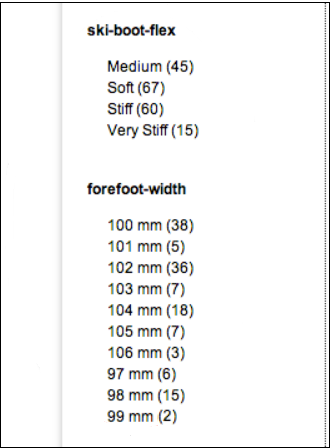
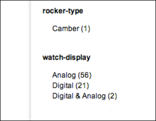
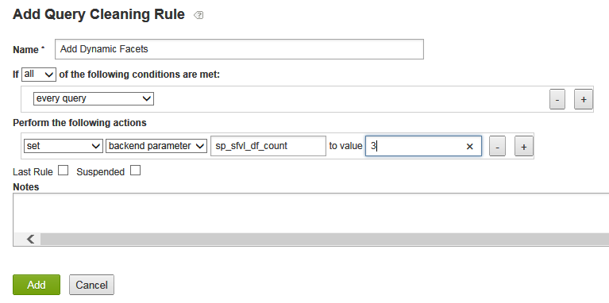
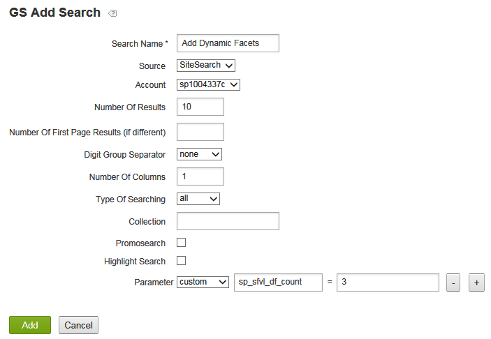
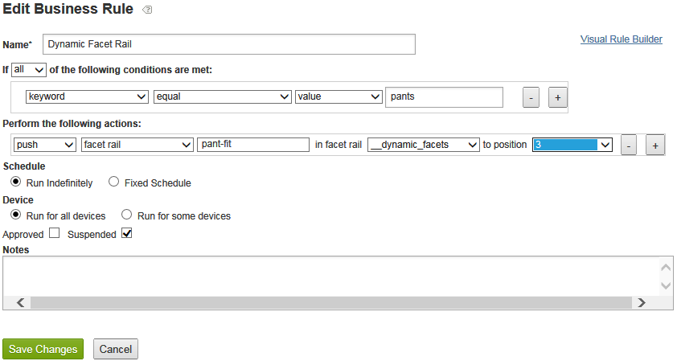

# Om dynamiska ansikten{#about-dynamic-facets}

Använd dynamiska ansikten om du vill skapa nya områdesmarkeringar automatiskt vid sökningen. Du kan även associera varje dynamiskt facet-fält med upp till ett tabellnamn i ditt Adobe Search &amp; Promote-konto. Du använder dessa tabellrelationer vid sökningen för alla dynamiska facettsfält som ingår i sökningen.

## Använda dynamiska ansikten {#concept_E65A70C9C2E04804BF24FBE1B3CAD899}

>[!NOTE]
>
>Den här funktionen är inte aktiverad i [!DNL Adobe Search&Promote] som standard. Kontakta teknisk support för att aktivera funktionen.

Utan Dynamic Facets behövde du sammanfoga relaterade attribut till &quot;fack&quot; och bara visa de fack som var homogena för en viss sökning. Det innebär att de bara kan innehålla ett logiskt attributs värden, till exempel &quot;skostorlek&quot; eller &quot;ringstorlek&quot;. Den här metoden gav tillräcklig söktidsprestanda med en stor uppsättning unika attribut.

När Dynamic Faceting används finns det dock ingen gräns för hur många faktorer som grundsökningen kan spåra effektivt. Du kan definiera hundratals dynamiska aspekter, från vilka huvudsökningen kan returnera de&quot;översta dynamiska egenskaperna&quot; för en viss sökning, där `N` vanligtvis är ett mer måttligt värde på 10-20 eller färre. `N` Den här metoden eliminerar behovet av att göra attributen rättvisa - du kan nu skapa en unik dynamisk aspekt för attribut på hela webbplatsen.

## Vilka aspekter ska du göra dynamiska? {#section_254EE034BCAD4250A5D09FBF6158C4A5}

Ansikten som är svagt populerade på webbplatsen och bara visas för en delmängd av sökningarna är bra för att göra dynamiska. En fasett med namnet &quot;fotsbredd&quot; kan till exempel bara fyllas i när du söker efter skor eller stövlar. En annan aspekt med namnet &quot;Ansiktsformat&quot;, med möjliga värden &quot;Romerska&quot; och &quot;Arabiska&quot;, kan bara visas när du söker efter färgrutor eller klockor.

Om ditt konto har ett stort antal sådana aspekter förbättras sökprestandan så att du kan använda dynamiska funktioner i stället för att alltid välja hela uppsättningen möjliga aspekter för varje sökning. Allmänna aspekter som&quot;SKU&quot; eller&quot;varumärke&quot;, som normalt passar för att visas med resultaten från varje sökning, är vanligtvis inte lämpliga som dynamiska aspekter.

## Relation mellan aspekter och metataggsfält {#section_2869E5FCDA8B431A87BC6E5573F2B0A0}

Ansikten byggs ovanpå metataggsfält. Ett metataggsfält är en grundläggande söklagerfunktion på låg nivå som är [!DNL Adobe Search&Promote]. Ansikten är å andra sidan en del av GS-presentationsskiktet (Guided Search) på hög nivå i Adobe Search &amp; Promote. Ansikten över egna metataggsfält är att metataggsfält inte kan någonting om ansikten. När du konfigurerar dynamiska aspekter lägger du först till ansikten och lägger sedan till metataggsfält med alternativet Dynamisk faktor markerat för att ange att den identifierade aspekten ska vara dynamisk.

>[!NOTE]
>
>Det finns ingen inställning för Dynamic Facet i **[!UICONTROL Design > Navigation > Facets]**. Det som gör en aspekt&quot;dynamisk&quot; är att dess underliggande&quot;meta tag-fält&quot; är dynamiskt enligt inställningen i **[!UICONTROL Settings > Metadata > Definitions]**.

## Exempel på dynamiska aspekter i åtgärd {#section_BC699A05E2E742EF94D41679163ACE84}

Exempel på dynamiska aspekter som visas efter en sökning efter&quot;starter&quot;:



Ett annat exempel på dynamiska aspekter som visas efter en sökning efter &quot;bevakningar&quot;:



Se även

* [CGI-parametrar för serversökning](../c-appendices/c-cgiparameters.md#reference_582E85C3886740C98FE88CA9DF7918E8)
* [Presentationsmalltaggar](../c-appendices/c-templates.md#reference_F1BBF616BCEC4AD7B2548ECD3CA74C64)
* [Transportmallstaggar](../c-appendices/c-templates.md#reference_227D199F5A7248049BE1D405C0584751)

## Konfigurera dynamiska aspekter {#task_D17F484130E448258100BAC1EEC53F39}

Konfigurera dynamiska ansikten i Search&amp;Promotate.

<!-- 

t_configuring_dynamic_facets.xml

 -->

>[!NOTE]
>
>Den här funktionen är inte aktiverad i Adobe Search &amp; Promote som standard. Kontakta teknisk support för att aktivera funktionen.

Innan effekterna av de dynamiska aspekterna blir synliga för kunderna måste du återskapa platsindexet.

Se även

* [CGI-parametrar för serversökning](../c-appendices/c-cgiparameters.md#reference_582E85C3886740C98FE88CA9DF7918E8)
* [Presentationsmalltaggar](../c-appendices/c-templates.md#reference_F1BBF616BCEC4AD7B2548ECD3CA74C64)
* [Transportmallstaggar](../c-appendices/c-templates.md#reference_227D199F5A7248049BE1D405C0584751)

**Konfigurera dynamiska aspekter**

1. Kontrollera att du redan har lagt till ansikten.

   Se [Lägga till en ny aspekt](../c-about-design-menu/c-about-facets.md#task_FC07BFFA62CA4B718D6CBF4F2855C89B).
1. När du har lagt till dina ansikten måste du se till att du har lagt till dem i nya användardefinierade meta-taggfält.

   Se [Lägga till ett nytt metataggsfält](../c-about-settings-menu/c-about-metadata-menu.md#task_6DF188C0FC7F4831A4444CA9AFA615E5).
1. På produktmenyn klickar du på **[!UICONTROL Settings]** > **[!UICONTROL Metadata]** > **[!UICONTROL Definitions.]**
1. På sidan [!DNL Definitions] i tabellen [!DNL User-defined fields] i kolumnen [!DNL Actions] klickar du på pennikonen (Redigera) i raden för metataggens fältnamn som är associerat med den aspekt som du vill göra dynamisk.
1. Markera **[!UICONTROL Dynamic Facet]** på sidan [!DNL Edit Field].

   Se tabellen med alternativ i [Lägga till ett nytt meta tag-fält](../c-about-settings-menu/c-about-metadata-menu.md#task_6DF188C0FC7F4831A4444CA9AFA615E5).
1. Klicka på **[!UICONTROL Save Changes]**.
1. Klicka på **återskapa indexet för den mellanlagrade platsen** i den blå rutan för att snabbt återskapa indexet för den mellanlagrade webbplatsen.

   Se även [Återskapa indexet för en aktiv eller mellanlagrad webbplats](../c-about-index-menu/c-about-regenerate-index.md#task_B28DE40C0E9A475ABCBCBC4FF993AACD).
1. Ange antalet dynamiska aspekter som ska väljas för en viss sökning. Du kan utföra den här uppgiften på något av följande sätt:

   * Skapa en frågerengöringsregel med önskat villkor som utför åtgärden `set`, `backend parameter`, `sp_sfvl_df_count` till värdet `X`, där `X` är det önskade antalet dynamiska aspekter som ska begäras vid sökningen och klicka sedan på **[!UICONTROL Add]**.

   

   Se [Lägga till en frågerengöringsregel](../c-about-rules-menu/c-about-query-cleaning-rules.md#task_47F43988D3D9485F8AE1DFDA7E00BF54).

   Se även [CGI-parametrar för backend-sökning](../c-appendices/c-cgiparameters.md#reference_582E85C3886740C98FE88CA9DF7918E8), rad 40 i tabellen för mer information om `sp_sfvl_df_count`.

   * Lägg till en sökning och ställ in parametern &quot;custom&quot; `sp_sfvl_df_count` på det önskade värdet och klicka sedan på **[!UICONTROL Add]**.

   

   Se [Lägga till en ny sökdefinition](../c-about-settings-menu/c-about-searching-menu.md#task_98D3A168AB5D4F30A1ADB6E0D48AB648).

   Se även [CGI-parametrar för backend-sökning](../c-appendices/c-cgiparameters.md#reference_582E85C3886740C98FE88CA9DF7918E8), rad 40 i tabellen för mer information om `sp_sfvl_df_count`.

1. Redigera rätt transportmall för att få fram de dynamiska aspekter som huvudsökningen returnerar.

   Se [Redigera en presentation eller en transportmall](../c-about-design-menu/c-about-templates.md#task_800E0E2265C34C028C92FEB5A1243EC3).

   Anta till exempel att transportmallen heter `guided.tpl`. I så fall klickar du på **[!UICONTROL Design > Templates]** på produktmenyn. På sidan [!DNL Templates] letar du reda på `guided.tpl` i tabellen. och klicka sedan på **[!UICONTROL Edit]** längst till höger om namnet. På sidan Redigering lägger du till följande kodblock i slutet av `</facets>`: JSON-utdata:

   ```
   ... 
   }<search-dynamic-facet-fields>, 
           { 
               "name" : "<search-dynamic-facet-field-name>", 
               "dynamic-facet" : 1, 
               "values" : [<search-field-value-list quotes="yes" commas="yes" data="values" sortby="values" encoding="json" />], 
               "counts" : [<search-field-value-list quotes="yes" commas="yes" data="results" sortby="values" />] 
   
           }</search-dynamic-facet-fields> 
   ...
   ```

1. Redigera lämplig presentationsmall eller mallar för att få fram de dynamiska egenskaperna.

   Se [Redigera en presentation eller en transportmall](../c-about-design-menu/c-about-templates.md#task_800E0E2265C34C028C92FEB5A1243EC3).

   Anta till exempel att du har en mall med namnet `sim.tmpl` som används för att visa innehåll i simulatorn. Om du vill redigera mallen klickar du på **[!UICONTROL Design > Templates]** på produktmenyn. På sidan [!DNL Templates] letar du reda på `sim.tmpl` i tabellen. och klicka sedan på **[!UICONTROL Edit]** längst till höger om namnet. På sidan Redigering lägger du till följande i mallens facet-visningsområde:

   ```
   <h6>DF RAIL</h6> 
   <guided-facet-rail gsname="__dynamic_facets"> 
               <guided-facet ><!-- behavior=Normal --> 
               <div class="facet-block" id="facet"> 
               <p><b><guided-facet-display-name /></b></p> 
               <ul> 
                   <guided-facet-values> 
                       <guided-if-facet-value-equals-length-threshold> 
               </ul> 
               <ul id="brand" style="display:none"> 
                       </guided-if-facet-value-equals-length-threshold> 
                       <guided-if-facet-value-selected> 
                           <li><guided-facet-value> [<guided-lt>a href="<guided-facet-value-undo-path />"<guided-gt>X</a>]</li> 
                       <guided-else-facet-value-selected> 
                           <li><guided-facet-link><guided-facet-value></guided-facet-link> (<guided-facet-count>) </li> 
                       </guided-if-facet-value-selected> 
                   </guided-facet-values> 
               </ul> 
               <guided-if-facet-long> 
                 <br /><guided-lt />a href="#" onclick="moreless(this,'brand');return false;" <guided-gt /><button style="font-size:10px;">VIEW MORE</button></a> 
               </guided-if-facet-long> 
               </div> 
               </guided-facet> 
   </guided-facet-rail> 
   <h6>/DF RAIL</h6>
   ```

   Du skulle också göra en liknande ändring som andra presentationsmallar efter behov, till exempel `json.tmpl`.

   Se till att du anger `__dynamic_facets` för `gsname` i taggen `guided-facet-rail`. Den här taggen är en fördefinierad facet rail som är reserverad för utdata av alla dynamiska aspekter som returneras för en viss sökning.

   Du kan också redigera den här speciella aspekträlen med **[!UICONTROL Rules > Business Rules]** och använda **[!UICONTROL Advanced Rule Builder]** enligt nedan.

   

   Se även [Lägga till en ny affärsregel](../c-about-rules-menu/c-about-business-rules.md#task_BD3B31ED48BB4B1B8F1DCD3BFA2528E7)
