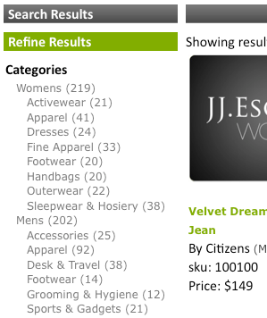

# Om ansikten{#about-facets}

Du kan använda Ansikten för att anpassa presentationslagret och ge användarna en guidad sökning där de kan fördjupa sig i sökresultaten.

## Använda ansikten {#concept_FA912B3B41EE493DB2F492D188457FF5}

Anta till exempel att en besökare på en webbplats som säljer verktyg gör en sökning efter växlingar. Företaget kunde använda två aspekter: en för att ange alla varumärken med skiftlägen som hittades och den andra för att ange alla skiftnyckelsstorlekar. Kunden kan klicka på vilket varumärke eller vilken storlek som helst inom lämplig aspekt för att begränsa resultaten och snabbt hitta rätt skiftnyckel.

Du kan basera en aspekt på en befintlig metadatadefinition. Om en faktor definieras som en datumtyp i metadata visas den som en datumintervallfaktor.

Tabellen på [!DNL Staged Facets] sidan innehåller en allmän översikt över inställningarna som utgör varje tillagd aspekt. Du kan lägga till nya ansikten och redigera eller ta bort befintliga facets. Du kan återställa alla ändringar som du gör i ansiktet genom att använda **[!UICONTROL History]** nära sidans övre högra hörn.

Fasettinställningarna mellanlagras som standard så att du kan testa ändringarna innan du publicerar dem.

Se [Om Förproduktion](../c-about-staging.md#concept_08B8F3CA1F4241108F14BA7FC7806CA7).

Du kan använda **[!UICONTROL View Live Settings]** för att jämföra dina mellanlagerinställningar med den aktuella direktinställningen. Används **[!UICONTROL View Staged Settings]** för att återgå till mellanlagringsområdet. För ett objekt som mellanlagras är den aktiva versionen av inställningarna skrivskyddad. Därför kan du ändra den genom att göra de mellanlagrade inställningarna tillgängliga. När du är nöjd med ändringarna som du har gjort i den mellanlagrade aspekten klickar du för **[!UICONTROL Push Live]** att göra dem tillgängliga.

## Datumintervallfaser {#section_FEFFF6B5B6534456913189FEF559BA58}

Ansikten som definieras som typen Datum i metadata behandlas annorlunda än andra aspekter. I stället för att behandlas som en uppsättning värden behandlas de som ett datumintervall, med ett startdatum, ett slutdatum eller båda.

En datumintervallfaktor har värdet för startdatumet, följt av &quot;BTW&quot; (för &quot;between&quot;), följt av slutdatumet. Datumen har följande två format:

mm-dd-yyyy

mm/dd/yyyy

Fyrsiffriga år krävs. Det måste finnas minst ett av startdatumen eller slutdatumen, men båda är inte obligatoriska. &quot;12/1/2007BTW1/4/2009&quot; betyder till exempel alla datum mellan 1 december 2007 och 4 januari 2009. &quot;1-1-2005BTW&quot; innebär dock alla datum sedan 1 januari 2005.

Du kan använda taggen för presentationsmallen `<guided-facet-value/>` för att få ett datumintervallvärde, som en normal faktor. För närvarande krävs JavaScript för att användare ska kunna ange datumintervall att söka efter. Du kan t.ex. hämta indata från två inmatningsfält för start- och slutdatum. Sedan kan du validera indata och lägga till den nya fasettens värde (byggt från de två inmatningsfälten) och ansiktsnamnet till den befintliga URL:en.

Se [Presentationsmalltaggar](../c-appendices/c-templates.md#reference_F1BBF616BCEC4AD7B2548ECD3CA74C64).

Följande kodexempel är ett exempel på hur du kan visa ett datumintervall på en sida. Det visar det befintliga datumintervallet om det är markerat. I annat fall visas ett enkelt indataformulär. När formuläret skickas utför det en enkel validering. Sedan skickas webbläsaren till en ny URL som innehåller två nya parametrar:

* `q#` - Representerar det valda datumintervallet som sammanfogats från de två inmatningsfälten.
* `x#` - Namnger ansiktet. I det här exemplet heter datumintervallsaspekten&quot;modified&quot;.

Delarna `replace(/%2F/ig, '~2F')` i koden behövs eftersom Apache inte tillåter `%2F` i URL-sökvägar av säkerhetsskäl, och när SEO-URL:er används finns frågan i URL-sökvägen. Därför `/` kodas som `~2F` istället för `%2F`, som det normalt skulle vara i en URL.

```
<div class="date_range"> 
 <p>Date Range</p> 
 <guided-if-facet-selected gsname="modified"> 
  <guided-facet-values gsname="modified"> 
   <script> 
   var modified_daterange= '<guided-facet-value />'.split(/BTW/) ; 
   if (modified_daterange[0]=='') modified_daterange[0]= '--/--/----' ; 
   if (modified_daterange[1]=='') modified_daterange[1]= '--/--/----' ; 
   document.write('From: ' + modified_daterange[0]) ; 
   document.write('<br>To: ' + modified_daterange[1]) ; 
   </script> 
  </guided-facet-values> 
 
 <guided-else-facet-selected> 
  <form action="#"> 
   From: <input name="dateFrom" size=10> 
   <br>To: <input name="dateTo" size=10> 
   <br><input type="button" value="Go" onclick="goClick(this.form)"> 
  </form> 
  <script> 
  function goClick(f) { 
   if (f.dateFrom.value=='' && f.dateTo.value=='') { 
    alert('You must enter either a From: date or a To: date.') ; 
    return ; 
   } 
   if ( f.dateFrom.value!='' && !f.dateFrom.value.match(/^\d+[\/\-]\d+[\/\-]\d\d\d\d$/) ) { 
    alert('From: date must be in "mm/dd/yyyy" or "mm-dd-yyyy" format.') ; 
    return ; 
   } 
   if ( f.dateTo.value!='' && !f.dateTo.value.match(/^\d+[\/\-]\d+[\/\-]\d\d\d\d$/) ) { 
    alert('To: date must be in "mm/dd/yyyy" or "mm-dd-yyyy" format.') ; 
    return ; 
   } 
   // Note that "/" is encoded as "~2F" instead of "%2F" to avoid Apache 404 error. 
   var new_url= '<guided-current-path />&<guided-query-param-name gsname="q#" offset="0" />=' 
    + encodeURIComponent(f.dateFrom.value).replace(/%2F/ig, '~2F') + 'BTW' 
    + encodeURIComponent(f.dateTo  .value).replace(/%2F/ig, '~2F') 
    + '&<guided-query-param-name gsname="x#" offset="0" />=modified' ; 
   location.href= new_url ; 
  } 
  </script> 
 </guided-if-facet-selected> 
</div>
```

## Om kapslade ansikten {#section_6BC77F38DE9F43D5B6911F8CECB15DFC}

Kapslade ytor är ytor som visar flera nivåer av kategorier som i följande exempel:



Kategorierna för kvinnor och män är översta eller överordnade. Underkategorierna, som tillbehör och skodon, är i den nedre eller underordnade aspekten.

Det aktuella kapslade ansiktsdjupet som stöds är två, men det kan finnas var som helst längs detaljlistan.

Följande är beteenden för olika typer av kapslade aspekter:

<table> 
 <thead> 
  <tr> 
   <th colname="col1" class="entry"> <p>Beteende för kapslad ansiktstyp </p> </th> 
   <th colname="col2" class="entry"> <p>Beteende </p> </th> 
  </tr> 
 </thead>
 <tbody> 
  <tr> 
   <td colname="col1"> <p>Normal </p> </td> 
   <td colname="col2"> <p>Beteendet för en normal kapslad aspekt är att den krymper om andra aspekter begränsar sökningen. </p> <p>Om den kapslade aspekten är markerad krymper den mot markeringen. Om du väljer en överordnad aspekt visas endast den överordnade aspekten med alla återstående underordnade aspekter. Om du väljer en underordnad aspekt visas endast den valda överordnade aspekten och den valda underordnade aspekten. </p> </td> 
  </tr> 
  <tr> 
   <td colname="col1"> <p>Fäst </p> </td> 
   <td colname="col2"> <p>Beteendet hos en klibbig kapslad aspekt är att den försöker hålla ansiktet öppet så mycket som möjligt baserat på andra fasetters tillstånd eller sökvillkor. Om den underordnade aspekten är markerad räknas den mot det klibbiga djupet. </p> </td> 
  </tr> 
  <tr> 
   <td colname="col1"> <p>Flera val </p> </td> 
   <td colname="col2"> <p>Beteendet för en flervalsaspekt är att den håller ansiktet öppet. Alla nya markeringar försöker radera alla andra fasetteringsmarkeringar såvida inte aspekten är en"överordnad" till den kapslade kategorin. I det här fallet avser"överordnad" kategoriaspekter, inte kategorier på den översta nivån för en kapslad aspekt. </p> </td> 
  </tr> 
  <tr> 
   <td colname="col1"> <p>Flera val för kategori </p> </td> 
   <td colname="col2"> <p>Precis som kapslad ansiktstyp för flerval med följande undantag: </p> 
    <ul id="ul_D5AB6AF3169A483E8F3FC6D2A2EA3A28"> 
     <li id="li_9308156EF2FF43CE9DFB933F13786C58">Andra aspekter som du tidigare valt avmarkeras om den här aspekten väljs för första gången. </li> 
     <li id="li_DD96D6802A9C479283212A0FD68C6F85">Andra faktorer som tidigare valts avmarkeras också om kunden går direkt ned till den underordnade aspekten utan att klicka på den överordnade aspekten eller om en jämställd del av en annan överordnad aspekt väljs. </li> 
     <li id="li_8BF58F10969B4743986D5D0E0086AD6C">De kan ha föräldrar i den mening att kategorifakter har föräldrar. Blanda inte ihop det här beteendet med överordnade och underordnade relationer som hittas med alla kapslade aspekter. </li> 
    </ul> </td> 
  </tr> 
 </tbody> 
</table>

Se även [Om Facet Rail](../c-about-design-menu/c-about-facet-rails.md#concept_1FDC8BCDFFC84A0889DA670F63D5F6DB).

## Lägga till en ny aspekt {#task_FC07BFFA62CA4B718D6CBF4F2855C89B}

Du kan lägga till ansikten för att anpassa presentationslagret och ge dina kunder en guidad sökning där de kan fördjupa sig i sökresultaten.

<!-- 

t_adding_a_new_facet.xml

 -->

Faktablad på [!DNL Facets] sidan visar ett utdrag av inställningarna som utgör en enda aspekt. Du kan lägga till nya ansikten och redigera eller ta bort befintliga facets. Alla ändringar du gör i ansiktet kan återställas med hjälp av funktionen Historik.

>[!NOTE]
>
>Se till att du refererar till aspekten i presentationsmallen så att den visas på webbplatsen.

Se även [Om Facet Rail](../c-about-design-menu/c-about-facet-rails.md#concept_1FDC8BCDFFC84A0889DA670F63D5F6DB).

**Lägga till en ny aspekt**

1. Innan du kan lägga till en ny aspekt måste du kontrollera att du redan har gjort följande innan du fortsätter till nästa steg:

   * Har vissa metataggsfält redan definierats.

      Se [Lägga till ett nytt fält](../c-about-settings-menu/c-about-metadata-menu.md#task_6DF188C0FC7F4831A4444CA9AFA615E5)för metataggar.
   * Lägg in metadata i indexet.
Se [Lägga till fältinmatningsdefinitioner](../c-about-settings-menu/c-about-metadata-menu.md#task_E86566FA1FF74CF68115C0ADA05172AE).

1. Klicka på **[!UICONTROL Design]** > **[!UICONTROL Navigation]** > **[!UICONTROL Facets.]**
1. På [!DNL Facets] sidan klickar du på **[!UICONTROL Add New Facet]**.
1. Ange önskade alternativ på [!DNL Add Facet] sidan.

   De här inställningarna påverkar både beteendet och standardpresentationen för en aspekt. Du kan åsidosätta vissa av de här inställningarna med hjälp av presentationsmallens inställningar.

   Om en faktor definieras som en datumtyp i metadata visas den som ett datumintervall.

   Se [Datumintervallfasetter](../c-about-design-menu/c-about-facets.md#section_FEFFF6B5B6534456913189FEF559BA58).

   Beroende på vilka ansiktsalternativ du väljer är inte alla alternativ tillgängliga.

   <!-- 
   r_add_facet_options.xml
   -->

   <table> 
    <thead> 
      <tr> 
      <th colname="col1" class="entry"> <p>Alternativ </p> </th> 
      <th colname="col2" class="entry"> <p>Beskrivning </p> </th> 
      </tr> 
    </thead>
    <tbody> 
      <tr> 
      <td colname="col1"> <p>Fasettnamn </p> </td> 
      <td colname="col2"> <p>Identifierar namnet på en viss aspekt. </p> <p> <p>Obs!  Du kan bara ha en fasett baserad på befintliga användardefinierade metadata. Om det inte finns några tillgängliga ansikten i listrutan måste du först definiera några metadata. </p> </p> <p>Se <a href="../c-about-settings-menu/c-about-metadata-menu.md#task_6DF188C0FC7F4831A4444CA9AFA615E5" type="task" format="dita" scope="local"> Lägga till ett nytt fält för metataggar </a>. </p> <p>Om du vill skapa en fasett baserat på en fälttabell använder du det anpassade ansiktsnamnet och anger fälttabellens namn. </p> </td> 
      </tr> 
      <tr> 
      <td colname="col1"> <p>Visningsetikett </p> </td> 
      <td colname="col2"> <p>Ställer in etiketten för en aspekt som sedan kan användas i ett vägbeskrivande dokument i stället för ett metadatafältnamn (med taggen <span class="codeph"> &lt;guided-traccrumb-label&gt; </span> ) eller ett fristående värde (med taggen <span class="codeph"> &lt;guided-facet-display-name&gt; </span> ). </p> </td> 
      </tr> 
      <tr> 
      <td colname="col1"> <p>Beteende </p> </td> 
      <td colname="col2"> <p>Anger en av tre fasetbeteenden. </p> <p> 
      <ul id="ul_67C19E1C16224B9990F04A0D05BD3D05"> 
      <li id="li_6B232C11A61840B68CA59E1F593405A0"> <span class="uicontrol"> Normal </span> <p>När en kund klickar på en aspekt vars beteende är inställt på <span class="uicontrol"> Normal </span>fördjupas sökresultatet för objektet. Därifrån kan kunden förfina och begränsa antalet sökresultat ytterligare. </p> </li> 
      <li id="li_7D7C43A7F7AB4B84A9B0FEF34627605A"> <span class="uicontrol"> Kategori </span> <p>Kategorifaktorer fungerar som navigeringselement. Dessa faktorer är högnivåfaktorer som kunderna vanligen går igenom innan de avslöjar ansikten med attributalternativ. Kategorifasetterna är inte smala när andra aspekter är markerade och fortfarande öppna. Om du klickar på ett annat värde i en kategoriaspekt avmarkeras alla andra aspekter på sidan förutom den kategorifasettens överordnade. </p> </li> 
      <li id="li_01255993D71F40DBA8870AA3FEA7D304"> <span class="uicontrol"> Flera val för kategori </span> <p>-faktorer är kategorifaktorer som stöder markering av flera objekt från den faktor där objekten är"ORed" tillsammans. </p> </li> 
      </ul> 
      <ul id="ul_683F6D3FC8524E65AF303453ADDB6001"> 
        <li id="li_81F504D1D1294666BBBC5EA43B34B712"> <span class="uicontrol"> Fäst </span> <p>När en kund klickar på en fasett vars beteende är inställt på <span class="uicontrol"> Sticky </span>förblir den fasett som har det valda alternativet öppen under detaljgranskningen. Det här alternativet är användbart när du vill låta en kund ändra ett tidigare val. </p> </li> 
      </ul> 
      <ul id="ul_8E871D63B09445268C600C8ABC20F6A4"> 
        <li id="li_F88AC5528B0C4751BC4CFE7FA9525857"> <span class="uicontrol"> Flera val </span> <p>Tillåter markering av flera objekt från en fasett, där objekten i ansiktet är"ORed" tillsammans. Det här alternativet är användbart för en fasett som kan visa ett mindre attribut, t.ex. färger, och du vill att kunden ska kunna skapa en fråga som låter dem"visa skor i min storlek som är röda eller svarta". </p> </li> 
      </ul> </p> </td> 
      </tr> 
      <tr> 
      <td colname="col1"> <p>Visa alltid </p> </td> 
      <td colname="col2"> <p>För en normal eller klibbig aspekt ser man till att ansiktet alltid är synligt för kunden. </p> <p>Det här alternativet är bara tillgängligt om du har valt <span class="uicontrol"> Normal </span>, <span class="uicontrol"> Kategori </span>eller <span class="uicontrol"> Fäst </span> i <span class="uicontrol"> listrutan </span> Beteende. </p> </td> 
      </tr> 
      <tr> 
      <td colname="col1"> <p>Fasets föräldrar </p> </td> 
      <td colname="col2"> <p>Det här alternativet är bara tillgängligt om du har valt <span class="uicontrol"> Kategori </span> eller <span class="uicontrol"> Flerval av kategori </span> i <span class="uicontrol"> listrutan </span> Beteende. </p> <p>Anger vad kategorifaktets överordnade är. De markerade objekten i kategorierna överordnade aspekter används för att begränsa de alternativ som är tillgängliga i den aktuella kategoriaspekten. Överordnade aspekter avmarkeras inte när en kund interagerar med kategoriaspekten. Du kan ange flera kommaavgränsade överordnade. </p> </td> 
      </tr> 
      <tr> 
      <td colname="col1"> <p>Fästigt djup </p> </td> 
      <td colname="col2"> <p>Det här alternativet är bara tillgängligt om du har valt <span class="uicontrol"> Fäst </span> i <span class="uicontrol"> listrutan </span> Beteende. </p> <p>Anger antalet alternativ som ska förbli öppna under detaljnivån. </p> </td> 
      </tr> 
      <tr> 
      <td colname="col1"> <p>Tröskelvärde för längd </p> </td> 
      <td colname="col2"> <p>Ställer in den lodräta längden (1-9999) för den faktor som definieras i antal objekt. </p> <p>Om presentationsmallen är korrekt konfigurerad kan du använda den här inställningen för att ange"Visa mer..". eller bestämma när du ska slänga ansiktet i en rullningsbar div och så vidare. </p> </td> 
      </tr> 
      <tr> 
      <td colname="col1"> <p>Trunkera längdtröskelvärde </p> </td> 
      <td colname="col2"> <p>Trunkerar antalet objekt i en fasett efter ett angivet tröskelvärde. </p> <p>Vissa implementeringar har ansikten med tusentals objekt. Det kan vara dyrt att skicka alla data via kabeln. Du kan använda den här inställningen om du vill trimma ansiktet ned till en hanterbar nivå. Fettet kommer att trunkeras efter sortering. </p> </td> 
      </tr> 
      <tr> 
      <td colname="col1"> <p>Maximal värdebredd </p> </td> 
      <td colname="col2"> <p>Anger en gräns för längden på begränsningsvärdesträngen (1-999). </p> <p>Det här alternativet är användbart när du vill placera en fasett i en layout med fast bredd och inte vill att strängar ska radbrytas. Som standard är strängen inställd på 3 tecken kortare än tröskelvärdet så att en ellips kan läggas till. </p> </td> 
      </tr> 
      <tr> 
      <td colname="col1"> <p>Värdetillägg </p> </td> 
      <td colname="col2"> <p>Anger strängen som du vill använda för att ange att en fasets värde trunkeras. Som standard är strängen ".." används. </p> </td> 
      </tr> 
      <tr> 
      <td colname="col1"> <p>Avgränsare </p> </td> 
      <td colname="col2"> <p>Anger avgränsaren som ska användas för en lista med avgränsade avgränsade värden som gäller för begränsningen. </p> <p>Avgränsaren som används är samma som definieras i de metadata som faktumet baseras på. Standardavgränsaren är ett komma. Du kan dock använda valfritt XML-kompatibelt värde. </p> </td> 
      </tr> 
      <tr> 
      <td colname="col1"> <p>Sortera </p> </td> 
      <td colname="col2"> <p>Anger hur du vill att ansikten ska sorteras på webbplatsen. Du kan sortera ansiktena efter följande. Om du vill kan du kombinera upp till fem sorteringar. </p> 
      <ul id="ul_12987F4DC7B34C63ABC906B59688A174"> 
      <li id="li_3206C96013DF431D90119F594D93D85D"> <span class="uicontrol"> alpha </span> <p>Sorterar värdena i bokstavsordning (0-9, A-Z), inklusive skiljetecken. </p> </li> 
      <li id="li_304E4A518FBE48D18D9E9EA7339A3481"> <span class="uicontrol"> alpha (endast alfanumerisk) </span> <p>Sorterar värdena i alfabetisk ordning (0-9, A-Z) och ignorerar skiljetecken. </p> </li> 
      <li id="li_CADB888CC514455F9CA379C8EEE490AA"> <span class="uicontrol"> alfa (ej skiftlägeskänsligt) </span> <p>Sorterar värdena i alfabetisk ordning (0-9, A-Z), och ignorerar skiftläget för alfabetiska tecken samt inklusive skiljetecken. </p> </li> 
      <li id="li_F61122E79AB5413792DA31F8AB1414BD"> <span class="uicontrol"> alfa (ej skiftlägeskänsligt, endast alfanumeriskt) </span> <p>Sorterar värdena i bokstavsordning (0-9, A-Z), ignorerar skiftläget för alfabetiska tecken och ignorerar skiljetecken. </p> </li> 
      <li id="li_F50CC298ABF046D0A39D5AE5B1261823"> <span class="uicontrol"> antal </span> <p>Sorterar efter antal resultat som matchar varje facet-värde från störst till minst. </p> </li> 
      <li id="li_32B6AF39E9534762B39B15181DC5AD01"> <span class="uicontrol"> numeric </span> <p>Sorterar värdena numeriskt. När du sorterar tal är det här alternativet överlägset en alfasortering eftersom 10 visas före 2 om du använder en alfabortering. </p> </li> 
      <li id="li_CF8E76A7B1184E0C8DCC11B53E31A1DC"> <span class="uicontrol"> dela </span> <p>Delar upp listan i två separata listor efter tröskelvärde för antal. Fasettvärden som ligger över tröskelvärdet flyttas högst upp. Fasettvärden med antal under tröskelvärdet flyttas längst ned. Du måste ange ett delningströskelvärde om du vill att värden för ett visst intervall alltid ska vara längst upp. </p> </li> 
      <li id="li_4AB8276577384B1099CBA895898205AD"> <span class="uicontrol"> break </span> <p>Tvingar fram vissa värden längst upp eller längst ned i listan. Du kanske alltid vill att termen "Annat" ska visas längst ned i listan. Värden för överkant eller underkant krävs när du använder en radbrytning för att identifiera explicita värden som ska vara högst upp eller längst ned i sorteringen. </p> </li> 
      <li id="li_227E96CFED2044FCA2F10B6913B03CFB"> <span class="uicontrol"> beställd </span> <p>Fasettvärdena ska alltid vara i fast ordning (en lista med avgränsningsavgränsade värden som definieras i <span class="uicontrol"> alternativet </span> Ordning som beskrivs nedan). </p> </li> 
      </ul> </td> 
      </tr> 
      <tr> 
      <td colname="col1"> <p>Fasets alias </p> </td> 
      <td colname="col2"> <p>Om du vill ha stöd för befintliga sök-URL:er som du kan ha tagit bort i sin egen miljö kan du använda ett fasettalias för att mappa äldre parameternamn till ändrat eller bara skapa en fasett med ett annat namn. Aliaset används endast för inkommande begäranden och används inte för att skapa facet-länkar. </p> </td> 
      </tr> 
      <tr> 
      <td colname="col1"> <p>Ansiktets spårnamn </p> </td> 
      <td colname="col2"> <p>Namnet på faktablad om du bestämmer dig för att sortera dina ansikten i bokstavsordning, efter antal eller med en anpassad metod. </p> <p>Se <a href="../c-about-design-menu/c-about-facet-rails.md#concept_1FDC8BCDFFC84A0889DA670F63D5F6DB" format="dita" scope="local"> Om Facet Rail </a>. </p> </td> 
      </tr> 
      <tr> 
      <td colname="col1"> <p>Order </p> </td> 
      <td colname="col2"> <p>Det här alternativet är bara tillgängligt om du har valt <span class="uicontrol"> Ordnad </span> i <span class="uicontrol"> listrutan </span> Sortera. </p> <p>Här kan du definiera en avgränsad lista med värden som anger den ordning som ska användas. </p> </td> 
      </tr> 
      <tr> 
      <td colname="col1"> <p>Lägg till extras </p> </td> 
      <td colname="col2"> <p>Det här alternativet är bara tillgängligt om du har valt <span class="uicontrol"> Ordnad </span> i <span class="uicontrol"> listrutan </span> Sortera. </p> <p>Om värdena inte finns i den ordnade listan läggs värdena till i slutet. </p> </td> 
      </tr> 
      <tr> 
      <td colname="col1"> <p>Visa fantomskuggor </p> </td> 
      <td colname="col2"> <p>Det här alternativet är bara tillgängligt om du har valt <span class="uicontrol"> Ordnad </span> i <span class="uicontrol"> listrutan </span> Sortera. </p> <p>Om de värden som anges av den ordnade listan saknas, flaggar det här alternativet varje saknat objekt i ansiktet som "spöke" så att objekten visas på olika sätt. </p> </td> 
      </tr> 
      <tr> 
      <td colname="col1"> <p>Kapslad yta </p> </td> 
      <td colname="col2"> <p>En kapslad aspekt visar dess kategorier och dess underordnade kategorier. Det kan bara visa ett djup av två kategorier, men det kan finnas var som helst längs detaljnivån. </p> <p>Data för den här aspekten måste följa en konvention för att beskriva de två nivåerna av kategorier. Ett ansiktsvärde kan till exempel vara 'skor:stövlar' där den överordnade kategorin är 'skor' och den underordnade kategorin är 'stövlar'. ':' används som avgränsare för att separera dem. </p> <p>Mer information om hur du ändrar avgränsaren finns i Kapslad avgränsare nedan. </p> <p>Om du vill generera data i det här formatet kan du använda ett filterskript för att kombinera två befintliga kategorier. Du kan kombinera beteendena Normal, Kategori och Sticky med kapslade ansikten. </p> </td> 
      </tr> 
      <tr> 
      <td colname="col1"> <p>Namn på kapslad överordnad </p> </td> 
      <td colname="col2"> <p>Den här listrutan är bara tillgänglig om du har valt <span class="uicontrol"> Kapslad yta </span>. </p> <p>Här kan du välja vilket fält som representerar den överordnade kategorin. Det här fältet används vid sökningen i matchande överordnade kategorier. </p> </td> 
      </tr> 
      <tr> 
      <td colname="col1"> <p>Kapslat underordnat namn </p> </td> 
      <td colname="col2"> <p>Den här listrutan är bara tillgänglig om du har valt <span class="uicontrol"> Kapslad yta </span>. </p> <p>Här kan du välja vilket fält som representerar den underordnade kategorin. Det här fältet används vid sökningen i matchande underordnade kategorier. </p> </td> 
      </tr> 
      <tr> 
      <td colname="col1"> <p>Avgränsare för kapslade ytor </p> </td> 
      <td colname="col2"> <p>Det här alternativet är bara tillgängligt om du har valt <span class="uicontrol"> Kapslad yta </span>. </p> <p>Tecknet som anges här används för att tolka de överordnade kategorierna och underkategorierna från sina data. </p> <p>Om ':' används som avgränsare och det överordnade är 'skor' och det underordnade är 'boots', förväntar det sig att data formateras som 'skor:boots'. </p> </td> 
      </tr> 
      <tr> 
      <td colname="col1"> <p>Delat tröskelvärde </p> </td> 
      <td colname="col2"> <p>Det här alternativet är bara tillgängligt om du har valt <span class="uicontrol"> Dela </span> i <span class="uicontrol"> listrutan </span> Sortera. </p> <p>När du använder en delad sortering definierar delningströskeln antalet vid vilket aspekten ska delas upp i två separata listor. Värden med tal som är större än eller lika med tröskelvärdet behålls överst medan värden under tröskelvärdet flyttas längst ned. </p> </td> 
      </tr> 
      <tr> 
      <td colname="col1"> <p>Övre värden </p> </td> 
      <td colname="col2"> <p>Det här alternativet är bara tillgängligt om du har valt <span class="uicontrol"> Bryt </span> i <span class="uicontrol"> listrutan </span> Sortera. </p> <p>När du använder en radbrytning placeras den här avgränsade listan med värden alltid överst i listan. Användning av reguljära uttryck är tillåten men ska vara inom klammerparenteser eller klammerparenteser, till exempel: {^New.*?},{^Mycket nytt.*} </p> </td> 
      </tr> 
      <tr> 
      <td colname="col1"> <p>Nedre värden </p> </td> 
      <td colname="col2"> <p>Det här alternativet är bara tillgängligt om du har valt <span class="uicontrol"> Bryt </span> i <span class="uicontrol"> listrutan </span> Sortera. </p> <p>När du använder en brytning-sortering placeras den här avgränsade listan med värden alltid längst ned i listan. Användning av reguljära uttryck är tillåten men ska vara inom klammerparenteser eller klammerparenteser, som i följande exempel: {^Gammal.*?},{^Mycket gammal.*} </p> </td> 
      </tr> 
    </tbody> 
    </table>

1. Klicka på **[!UICONTROL Add]**.
1. (Valfritt) Gör något av följande på [!DNL Facets] sidan:

   * Klicka **[!UICONTROL History]** för att återställa ändringar som du har gjort.

      Se [Använda alternativet](../t-using-the-history-option.md#task_70DD3F87A67242BBBD2CB27156F43002)Historik.

   * Klicka på **[!UICONTROL Live]**.

      Se [Visa Live-inställningar](../c-about-staging.md#task_401A0EBDB5DB4D4CA933CBA7BECDC10F).

   * Klicka på **[!UICONTROL Push Live]**.

      Se [Publicera sceninställningar live](../c-about-staging.md#task_44306783B4C0408AAA58B471DAF2D9A4).

## Lägga till en kapslad aspekt {#task_A132FA7EB7494A6B88E443F2C3FABBBA}

Du kan lägga till en kapslad aspekt om du vill visa flera nivåer av kategorier.

<!-- 

t_adding_a_nested_facet.xml

 -->

Tänk på följande när du skapar en kapslad aspekt:

* Varje kapslad aspekt kräver ett användardefinierat meta-taggfält.
* Kapslade aspekter består av två andra faktorer, den överordnade och den underordnade. De kan vara enkla värdefaktorer eller flervärdesfaktorer. Det är inte tillåtet att blanda enkelvärdesfaktorer och flervärdesfaktorer.
* Du måste bestämma om den här aspekten ska användas i sökfältstabellen. Fälttabellen kräver själva den kapslade aspekten och dess sammansättningsaspekter.
* Överväg att använda JSON för att implementera kapslade aspekter. det är enklare.

* [Aktivitet 1 - Lägg till en meta-tagg](../c-about-design-menu/c-about-facets.md#task_6944558325204E749C725DCFEF17EF3D)
* [Aktivitet 2 - Lägg till ett filtreringsskript för att generera förformaterade data](../c-about-design-menu/c-about-facets.md#task_2DFED8BCB87B4067A6CE280945D7CAF4)
* [Aktivitet 3 - Lägg till en ny aspekt](../c-about-design-menu/c-about-facets.md#task_3C11A4159FC44B9494D48594941AF8CF)
* [Aktivitet 4 - Redigera sökning med guidade sökningar](../c-about-design-menu/c-about-facets.md#task_E50EFD7BBD0F45729C15759EA4F548D8)
* [Aktivitet 5 - Skapa transportmallen](../c-about-design-menu/c-about-facets.md#task_C1FEDEF11D2549DEB1A9C09BFBA64381)
* [Aktivitet 6 - Skapa presentationsmallen](../c-about-design-menu/c-about-facets.md#task_4B2ABB37B9CD4F3F8AF8E6874227A995)
* [Aktivitet 7 - Redigera vägbeskrivningar](../c-about-design-menu/c-about-facets.md#task_5E22409528EC4DA284821F82FDCE3438)

>[!NOTE]
>
>I det här avsnittet hänvisas det till den kapslade aspekten med aspekten n1.

## Aktivitet 1 - Lägg till en meta-tagg {#task_6944558325204E749C725DCFEF17EF3D}

Lägg till ett nytt metataggsfält som är dedikerat till lagringsdatum för den kapslade aspekten. Det kan vara ett fält med flera värden eller ett fält med ett värde.

1. På produktmenyn klickar du på **[!UICONTROL Settings]** > **[!UICONTROL Metadata]** > **[!UICONTROL Definitions]**.
1. På [!DNL Definitions] sidan klickar du på **[!UICONTROL Add New Field]**.
1. Ange önskade alternativ på [!DNL Add Field] sidan.

   Se [Lägga till ett nytt fält](../c-about-settings-menu/c-about-metadata-menu.md#task_6DF188C0FC7F4831A4444CA9AFA615E5)för metataggar.
1. Klicka på **[!UICONTROL Add]**.
1. (Valfritt) Återskapa indexet för den mellanlagrade platsen om du vill förhandsgranska resultatet.

   Se [Konfigurera ett inkrementellt index för en mellanlagrad webbplats](../c-about-index-menu/c-about-incremental-index.md#task_46A367B0786C4C90BFFA5D3F95FD86C0).

   De återstående åtgärderna refererar till det här metataggsfältet som **n1**.

## Aktivitet 2 - Lägg till ett filtreringsskript för att generera förformaterade data {#task_2DFED8BCB87B4067A6CE280945D7CAF4}

1. Lägg till ett filterskript för att kombinera de ursprungliga aspekterna i följande format: `<parent_value><nested_delimiter><child_value>`.

   Se [Lägga till ett filterskript](../c-about-settings-menu/c-about-filtering-menu.md#task_0AB84FD1133F47F9AA069A79BEA13A22).

   Följande är exempel på värden för metataggsfältet n1, som använder formatet ovan

   `Womens:Handbags`

   `Womens:Dresses`

   `Mens:Accessories`

   `Mens:Footwear`
1. Testa skriptet när du har skapat eller redigerat filterskriptet. Om det ser bra ut kan du indexera om ditt konto om det behövs. Du kan kontrollera indexet med [!DNL Index Overview].

   I följande exempel antas att du har ett antal standardkonsultbibliotek som ingår i initieringen av filtreringsskriptet. Kom ihåg att alla konton är olika, så ditt filtreringsskript bör återspegla de krav som krävs för ditt eget konto.

   **Exempel på ett filterskript med flera värden**

   ```
   my $doc; 
   { 
   # Slurp all the data into $doc 
   local $/; 
   undef $/; 
   $doc = <>; 
   } 
    # Create n1 field 
    if ( $doc =~ m{<meta\s+name="t1"\s+content="([^\"]*)"}is ) 
    { 
     my @t1arr = split(/\|/, $1); 
     if (scalar @t1arr > 0) 
     { 
      if ( $doc =~ m{<meta\s+name="t2"\s+content="([^\"]*)"}is ) 
      { 
       my @t2arr = split(/\|/, $1); 
   
       if ( scalar @t2arr > 0 ) 
       { 
        my $max = ((scalar @t1arr) < (scalar @t2arr)) ? (scalar @t1arr) : (scalar @t2arr); 
        for (my $i = 0; $i < $max; $i++) 
        { 
         $t1arr[$i] .= ":" . $t2arr[$i]; 
        } 
       } 
      } 
      my $output = join( '|', @t1arr ); 
      $doc =~ s{</head>}{<meta name="n1" content="$output" />\b</head>}is; 
     } 
    } 
    # END: n1 field
   ```

   **Exempel på ett filtreringsskript med ett enda värde**

   ```
   # This is a complete example. 
   # This script is designed for index connector where each record 
   # in the XML file is converted into a fake HTML page filled with 
   # meta data tags.  
   my $doc; 
   { 
   # Slurp all the data 
   local $/; 
   undef $/; 
   $doc = <>; 
   } 
   # All legitimate index connector data has key in its URL. 
   # Process the page if and only if it is coming from index connector and 
   # it is not the first entry point page.  Entry point pages don't have key 
   # in the URL. 
   if ($main::search_url =~ /\?key=/) { 
    my $meta = {}; 
    # Mine and scrape the meta fields from the page 
    my @lines = split(/\n/,$doc); 
    foreach my $line (@lines) 
    { 
     if ($line =~ m{<meta name="(.*?)" content="(.*?)" />}) 
     { 
      $meta->{lc($1)} = $2; 
     } 
    } 
    # Combined t1,t2 and t2,t3, and t3,t4 together. 
    # Assign them respectively to n1, n2, and n3. 
    my ($t1, $t2, $t3, $t4); 
    my %meta2; 
    $t1 = $meta->{'t1'}; 
    $t2 = $meta->{'t2'}; 
    $t3 = $meta->{'t3'}; 
    $t4 = $meta->{'t4'}; 
    if (defined $t1 && $t1) { 
     $meta2{'n1'} = $t1; 
     if (defined $t2 && $t2) { 
      $meta2{'n1'} .= ":" . $t2; 
      $meta2{'n2'} = $t2; 
      if (defined $t3 && $t3) { 
      $meta2{'n2'} .= ":" . $t3; 
       $meta2{'n3'} = $t3; 
       if (defined $t4 && $t4) { 
        $meta2{'n3'} .= ":" . $t4; 
       } 
      } 
     } 
    } 
    foreach my $stuff ( keys %meta2 ) 
    { 
     my $v = $meta2{$stuff}; 
     $doc =~ s{</head>}{<meta name="$stuff" content="$v" />\n</head>}; 
    } 
   } 
   
   # Do some ranking stuff here 
   ws_insert_static_rank_meta_tag(\$doc, "RANK"); 
   
   # Prints the entire page back out. 
   print $doc;
   ```

## Aktivitet 3 - Lägg till en ny aspekt {#task_3C11A4159FC44B9494D48594941AF8CF}

1. På produktmenyn klickar du på **[!UICONTROL Design]** > **[!UICONTROL Navigation]** > **[!UICONTROL Facets]**.
1. På [!DNL Facets] sidan klickar du på **[!UICONTROL Add New Facet]**.
1. Ange följande alternativ på [!DNL Add Facet] sidan:

   * I den [!DNL Facet Name] nedrullningsbara listan markerar du metataggsfältet som du definierade i Aktivitet 1. Om du använder sökfältstabeller väljer du **[!UICONTROL custom]** i listrutan och anger sedan det anpassade namnet på ansiktet.

   * Markera **[!UICONTROL Nested Facet]** om du vill aktivera kapslade ansikten.
   * I listrutorna [!DNL Nested Parent Name] och [!DNL Nested Child Name] väljer du de metataggfält som du kan använda. Om du använder sökfältstabeller markerar du **[!UICONTROL custom]** och anger det anpassade namnet på ansiktet.

   * I [!DNL Nested Facet Delimiter] fältet anger du den avgränsare som du vill använda, till exempel ett &quot;:&quot; (kolon). Blanda inte ihop detta med avgränsaren för flera värden. Båda avgränsarna ska vara olika.
   * Om du anger ansiktets beteende **[!UICONTROL Category]** kan du ange ansiktets överordnade (blanda inte ihop överordnade med kapslade facet-överordnade). I allmänhet ska du aldrig använda namnet på en annan kapslad aspekt som överordnad kategori. Använd i stället de enskilda ansiktena som utgör den kapslade aspekten.
   * Ange eventuella andra ansiktsalternativ.
   Se [Lägga till en ny aspekt](../c-about-design-menu/c-about-facets.md#task_FC07BFFA62CA4B718D6CBF4F2855C89B).
1. Klicka på **[!UICONTROL Add]**.

## Aktivitet 4 - Redigera sökning med guidade sökningar {#task_E50EFD7BBD0F45729C15759EA4F548D8}

1. På produktmenyn klickar du på **[!UICONTROL Settings]** > **[!UICONTROL Searching]** > **[!UICONTROL Searches]**.
1. På [!DNL Searches] sidorna klickar du **[!UICONTROL Edit]** på det söktypsnamn som du vill uppdatera.
1. Behovsfältet n1, t1 och t2 `sp_field_table` behövs.

   Om fälttabeller används bör du redigera `sp_field_table` parametern. Du kan även göra detta någon annanstans genom att använda renderingsregler eller regler för försökning.

   Se [Lägga till en frågerensningsregel](../c-about-rules-menu/c-about-query-cleaning-rules.md#task_47F43988D3D9485F8AE1DFDA7E00BF54).

   Se [Lägga till en ny regel](../c-about-rules-menu/c-about-pre-search-rules.md#task_182B95918462490D8BDA7F16A81CAC11)för försökning.
1. Klicka på **[!UICONTROL Save Changes]**.

## Aktivitet 5 - Skapa transportmallen {#task_C1FEDEF11D2549DEB1A9C09BFBA64381}

1. Klicka på **[!UICONTROL Design]** > **[!UICONTROL Templates]** på produktmenyn.
1. Klicka på [!DNL Templates] sidorna **[!UICONTROL Add New Template]**.
1. Ange namnet på transportmallfilen i [!DNL Add Template] dialogrutan.
1. I listrutan [!DNL New Template Type] väljer du **[!UICONTROL Transport]**.
1. Klicka på **[!UICONTROL Add]**.
1. På [!DNL Templates] sidan klickar du på namnet på transportmallsfilen som du just lade till.
1. Inkludera de data som kommer från fältet n1 på [!DNL Template Editor] sidan för transportmallen. Se följande exempel.

   **XML-exempel på returnering av kapslade** fasettdata XML-exemplet måste ange vilket tecken som ska användas som avgränsare mellan fasettvärden. I det här fallet är det ett rör (|).

   ```
   <facet name="n1"> 
     <values delimiter="|"><search-field-value-list name="n1" quotes="no" separator="|" sortby="values" data="values" /></values> 
     <counts><search-field-value-list name="n1" quotes="no" sortby="values" data="results" /></counts> 
   </facet>
   ```

   **JSON-exempel på returnering av kapslade ansiktsdata**

   ```
   { 
      "name" : "n1", 
      "values" : [ <search-field-value-list name="n1" quotes="yes" sortby="values" data="values" encoding="json"/>], 
      "counts" : [<search-field-value-list name="n1" quotes="no" sortby="values" data="results" />] 
   },
   ```

## Aktivitet 6 - Skapa presentationsmallen {#task_4B2ABB37B9CD4F3F8AF8E6874227A995}

1. Klicka på **[!UICONTROL Design]** > **[!UICONTROL Templates]** på produktmenyn.
1. Klicka på [!DNL Templates] sidorna **[!UICONTROL Add New Template]**.
1. I [!DNL Add Template] dialogrutan anger du namnet på presentationsmallfilen.
1. I listrutan [!DNL New Template Type] väljer du **[!UICONTROL Presentation]**.
1. Klicka på **[!UICONTROL Add]**.
1. På [!DNL Templates] sidan klickar du på namnet på presentationsmallfilen som du just lade till.
1. Lägg till HTML-kod som är integrerad med dina förväntade utdata på [!DNL Template Editor] sidan för presentationsmallen.

   Du kan använda följande taggar för att visa underordnade taggar:

* **Om underordnade taggar finns**`<guided-if-facet-value-has-children><guided-else-facet-value-selected></guided-if-facet-value-has-children>`

* **Underordnade värdetaggar**`<guided-facet-value-children></guided-facet-value-children>`

   Taggar för underordnat värde fungerar inte som vanliga guidade-facet-value-taggar. taggarna are wrapper tvingar alla omgivande `<guided-facet-value>` taggar att iterera genom underordnade ansiktsvärden i stället för överordnade ansiktsvärden. På samma sätt följer andra guidade ansiktstaggar, som taggarna undo, samma sak. De används bäst inom `<guided-if-facet-value-has-children>` taggar.

   Följande är ett exempel på en presentationsmall med HTML-kod.

   ```
   <guided-facet gsname="n1"> 
   <guided-if-facet-selected> 
    <guided-facet-values> 
    <guided-if-facet-value-selected> 
     <li><span class="selected"><guided-facet-value /></span><guided-facet-value-undo-link gsname="n1">X</guided-facet-value-undo-link></li> 
     <guided-if-facet-value-has-children> 
      <ul> 
      <guided-facet-value-children> 
      <guided-if-facet-value-selected> 
       <li><span class="selected"><guided-facet-value /></span><guided-facet-value-undo-link gsname="n1">X</guided-facet-value-undo-link></li> 
      <guided-else-facet-value-selected> 
       <li><guided-facet-link title='<guided-facet-value />'><guided-facet-value /> (<guided-facet-count />)</guided-facet-link> </li> 
      </guided-if-facet-value-selected> 
      </guided-facet-value-children> 
      </ul> 
     </guided-if-facet-value-has-children> 
    <guided-else-facet-value-selected> 
     <li><guided-facet-link title='<guided-facet-value />'><guided-facet-value /> (<guided-facet-count />)</guided-facet-link> </li> 
     <guided-if-facet-value-has-children> 
      <ul> 
      <guided-facet-value-children> 
       <li><guided-facet-link title='<guided-facet-value />'><guided-facet-value /> (<guided-facet-count />)</guided-facet-link> </li> 
      </guided-facet-value-children> 
      </ul> 
     </guided-if-facet-value-has-children> 
    </guided-if-facet-value-selected> 
    </guided-facet-values> 
   <guided-else-facet-selected>  
    <guided-facet-values> 
    <guided-if-facet-value-selected> 
     <li><span class="selected"><guided-facet-value /></span><guided-facet-value-undo-link gsname="n1">X</guided-facet-value-undo-link></li> 
     <guided-if-facet-value-has-children> 
      <ul> 
      <guided-facet-value-children> 
       <li><guided-facet-link title='<guided-facet-value />'><guided-facet-value /> (<guided-facet-count />)</guided-facet-link> </li> 
      </guided-facet-value-children> 
      </ul> 
     </guided-if-facet-value-has-children> 
    <guided-else-facet-value-selected> 
     <li><guided-facet-link title='<guided-facet-value />'><guided-facet-value /> (<guided-facet-count />)</guided-facet-link> </li> 
     <guided-if-facet-value-has-children> 
      <ul> 
      <guided-facet-value-children> 
       <li><guided-facet-link title='<guided-facet-value />'><guided-facet-value /> (<guided-facet-count />)</guided-facet-link> </li> 
      </guided-facet-value-children> 
      </ul> 
     </guided-if-facet-value-has-children> 
    </guided-if-facet-value-selected> 
    </guided-facet-values> 
   </guided-if-facet-selected> 
   </guided-facet>
   ```

## Aktivitet 7 - Redigera vägbeskrivningar {#task_5E22409528EC4DA284821F82FDCE3438}

Om du använder vägbeskrivningar i sökningen måste du ange beteendet **Gå till**.

1. På produktmenyn klickar du på **[!UICONTROL Design]** > **[!UICONTROL Navigation]** > **[!UICONTROL Breadcrumbs]**.
1. På [!DNL Breadcrumbs] sidorna klickar du **[!UICONTROL Edit]** på det vägbeskrivande namn vars beteende du vill uppdatera.
1. På [!DNL Edit Breadcrumb] sidan väljer du [!DNL Behavior] Gå till i **listrutan**.
1. Klicka på **[!UICONTROL Save Changes]**.

## Redigera en faset {#task_457EDC49983F4F7781873703AF574DA5}

Du kan redigera inställningarna för alla aspekter som du har lagt till.

<!-- 

t_editing_a_facet.xml

 -->

>[!NOTE]
>
>Se till att du refererar till aspekten i presentationsmallen så att den visas på webbplatsen.

**Redigera en fasett**

1. Klicka på **[!UICONTROL Design]** > **[!UICONTROL Navigation]** > **[!UICONTROL Facets.]**
1. På [!DNL Facets] sidan klickar du **[!UICONTROL Edit]** längst till höger på ett ansiktsnamn.
1. Ange önskade alternativ på [!DNL Edit Facet] sidan.

   Se tabellen med alternativ under [Lägga till en ny aspekt](../c-about-design-menu/c-about-facets.md#task_FC07BFFA62CA4B718D6CBF4F2855C89B).
1. Klicka på **[!UICONTROL Save Changes]**.
1. (Valfritt) På [!DNL Facets] sidan

   * Klicka **[!UICONTROL History]** för att återställa ändringar som du har gjort.

      Se [Använda alternativet](../t-using-the-history-option.md#task_70DD3F87A67242BBBD2CB27156F43002)Historik.

   * Klicka på **[!UICONTROL Live]**.

      Se [Visa Live-inställningar](../c-about-staging.md#task_401A0EBDB5DB4D4CA933CBA7BECDC10F).

   * Klicka på **[!UICONTROL Push Live]**.

      Se [Publicera sceninställningar live](../c-about-staging.md#task_44306783B4C0408AAA58B471DAF2D9A4).

## Ta bort en fasett {#task_17756FD66BCC49629325B2217F821BDD}

Du kan ta bort alla ansikten som du har lagt till.

<!-- 

t_deleting_a_facet.xml

 -->

**Ta bort en fasett**

1. På produktmenyn klickar du på **[!UICONTROL Design]** > **[!UICONTROL Navigation]** > **[!UICONTROL Facets]**.
1. På [!DNL Facets] sidan klickar du **[!UICONTROL Delete]** längst till höger på ett ansiktsnamn.
1. Klicka på i [!DNL Confirmation] dialogrutan **[!UICONTROL OK]**.
1. Gör något av följande:

   * Klicka **[!UICONTROL History]** för att återställa ändringar som du har gjort.

      Se [Använda alternativet](../t-using-the-history-option.md#task_70DD3F87A67242BBBD2CB27156F43002)Historik.

   * Klicka på **[!UICONTROL Live]**.

      Se [Visa Live-inställningar](../c-about-staging.md#task_401A0EBDB5DB4D4CA933CBA7BECDC10F).

   * Klicka på **[!UICONTROL Push Live]**.

      Se [Publicera sceninställningar live](../c-about-staging.md#task_44306783B4C0408AAA58B471DAF2D9A4).

