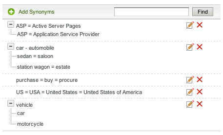

# Om ordlistor{#about-dictionaries}

Du kan använda ordlistor för att hantera en samling ordlistor och tillhörande synonymer och hyponymer.

## Använda ordlistor {#concept_B8028B71EC8144669614C64578EDB034}

Synonymer är ord som har samma eller liknande innebörd, t.ex. byxor, jeans, byxor och svärta, eller köp, köp, köp och beställning.

Hyponymer är envägssynonymer och ger en lösning när synonymer skulle vara olämpliga. En modebutiksplats bästa sökterm är till exempel &quot;byxor&quot;. Juber visas dock inte i sökresultaten. I så fall kan du använda en hyponym för att associera jeans med byxor, men för att tillåta en sökning efter jeans att endast returnera jeans. Använd hyponymer för att även matcha uteblivna produkter eller konkurrensvillkor. Denna strategi ger minimal effekt på andra sökresultat. Om t.ex. produkten&quot;S2000&quot; avbryts och&quot;S3000&quot; är dess efterföljare, ska du använda en hyponym i stället för en synonym för att se till att sökresultaten för&quot;S3000&quot; inte innehåller några resultat av typen&quot;S2000&quot;.

Synonymer och hyponymer hjälper kunderna att hitta relevanta sökresultat när de anger icke-exakta matchande termer som inte finns på webbsidorna. Om ordet &quot;byxor&quot; till exempel används på hela webbplatsen kan du skapa en synonym som binder ihop &quot;byxor&quot; och &quot;byxor&quot;. När kunderna söker efter&quot;trousers&quot; returneras i sin tur sökresultat som är relaterade till byxor.

Synonymer och hyponymer grupperas tillsammans som Domänordlistor. Det här är särskilda ordlistor som du skapar för ett specifikt tema eller syfte.

På sidan Ordlista-meny visas alla domänordlistor som ditt konto har definierat. Från den här huvudsidan kan du ändra namn på, redigera, ta bort eller aktivera och inaktivera domänordlistor.

## Synonym och hyponynotation {#section_B459CCB850974F4FB16A14E489BBBEC0}

Följande bild är ett exempel på en grupp termer med både synonym- och hyponyrelationer.

Sex huvudsakliga synonymrelationer definieras uttryckligen. Varje term avgränsas med likhetstecken (=).

* &quot;Car&quot; är en synonym till bilar.
* &quot;Sedan&quot; är en synonym till saloon.
* &quot;Stationsvagn&quot; är en synonym till egendom.
* &quot;ASP&quot; är en synonym till Active Server Pages och Application Service Provider.
* &quot;Purchase&quot;, &quot;buy&quot; och &quot;Procure&quot; är synonymer till varandra.
* &quot;USA&quot;, &quot;USA&quot; och &quot;USA&quot; är synonymer till varandra.

Rader som innehåller ett enda ord är oformaterade synonymer. Rader med expanderbara träd utgör hyponyrelationer. I det andra trädet definieras sedan, sedan, sedan, stationsvagn och gods som hyponymer för bil och bil. Omvänt är bil och bilar hypernymer av resten av termerna i trädet.

Det tredje trädet definierar bil och motorcykel som hyponymer av fordon.

Du kan inkludera mer än en akronym och/eller utökning med flera ord i varje synonym, vilket visas i synonymexemplet&quot;US&quot; ovan. När ett ord eller en akronym har flera betydelser skapar du en synonym för varje betydelse, som i&quot;ASP&quot;-exemplet ovan. Genom att lägga till flera synonymer försäkrar du dig om att en sökning efter&quot;Application Service Provider&quot; till exempel inte returnerar sökresultat för&quot;Active Server Pages&quot;.

Hyponymer utökas inte med andra hyponymer. Hyponymer utökas på högst en nivå med sina synonymer. Om du till exempel söker efter &quot;fordon&quot; returneras resultatet för &quot;bil&quot; och &quot;bil&quot;, men resultatet returneras inte för &quot;sedan&quot; och &quot;stationsvagn&quot;.

## Om sökning efter termer i olika ordlistor {#section_28E7F80CE68D4481BBF4F51EED237C67}

Du kan söka efter hyponymer och synonymer i alla ordlistor som du lägger till. Den här funktionen är användbar om du vill redigera eller ta bort en viss term som kan finnas i flera ordlistor. Alla lexikon med matchande resultat visas med sina matchande orduppsättningar. Om frågan returnerar fler än 1 000 uppsättningar, eller träd, visas bara de första 1 000.

Se [Söka i ordlistor](../c-about-linguistics-menu/c-about-dictionaries.md#task_8D2BACC6F9B4487FA82367CBEDEE306F).

Se [Redigera en ordlista](../c-about-linguistics-menu/c-about-dictionaries.md#task_7B349B2D385048D7A06E754FAB75316A).

## Konfigurera en ordlista som en ordlista {#section_B859E2E957674F558AC6F8D05A0ED190}

Stemming, som är en funktion av att söka i roten på ett ord som kan ha flera ändar, kan fungera i ett av tre lägen: Domänordlistor, alternativt Word Forms som standard och Ingen.

Se [Om ord och språk](../c-about-linguistics-menu/c-about-words-and-language.md#concept_CEB4B9576F3C4E2EB87B352EEC738D79).

Följande information förutsätter att ditt konto har **[!UICONTROL Alternative Word Forms]** inställt på **[!UICONTROL Domain Dictionaries]**, så att du kan konfigurera specifika domänordlistor som din datakälla.

Du kan göra om vilken domänordlista som helst till en ordlista för ordstamning. Synonymer och hyponymer fortsätter att växa som förväntat, men med ytterligare biverkningar. Om några termer finns gemensamt i en annan ordlista, eller till och med i sig själv, sammanfogas ordgruppen med dessa synonymer eller hyponymer. Du kan tänka dig detta som en annan nivå av ordexpansion.

Utan ordstam måste synonymer och hyponymer vara detaljerade och fullständiga, och alla relevanta ord ska anges som medlemmar.

Följande är ett exempel på synonymer och ingen ordstam:

* Synonymer: jog = löpande
* När du frågar efter &quot;jog&quot; skapas dokument med orden &quot;running&quot; och &quot;jog&quot;.
* En fråga för &quot;kör&quot; ger samma dokument som &quot;jog&quot;.
* Webbsidor utan &quot;jog&quot; och &quot;running&quot;, men med andra ordformer som &quot;run&quot; och &quot;run&quot; saknas i frågeresultatet.

I det här exemplet utökas inte ett frågeord om det inte är medlem av en viss synonym eller hyponym.

Följande är ett exempel på synonymer och ordstam:

* Synonymer: jog = löpande
* Synonym från ordlista: running = running = run
* En fråga för &quot;jog&quot; eller &quot;running&quot; returnerar alla webbsidor med orden &quot;running&quot;, &quot;running&quot;, &quot;run&quot; och &quot;jog&quot;.
* En fråga för&quot;kör&quot; och&quot;kör&quot; returnerar samma eller liknande resultat.

I det här exemplet kan en synonym från en ordlista sammanfoga sin grupp med andra synonymer eller hyponymer i andra ordlistor som har minst en gemensam term.

Om du anger för många lexikon med för många ord kan det få prestandaförändringar. Du bör vara sparsam med att ange domänordlistor som ordlistor för ordlistan. Stemming kan också skapa oväntade ordutökningar under sökningen och försvåra felsökningen och spårningen av ordexpansion.

Se [Konfigurera en ordlista som en ordlista](../c-about-linguistics-menu/c-about-dictionaries.md#task_541E8453A12F4A8E89CF6F595469F074).

## Lägga till en ny ordlista {#task_F31AC6723E894C4F91D12AB2A4CEE9FB}

Du kan lägga till en ny ordlista med synonymer och hyponymer som hjälper dina kunder att hitta relevanta sökresultat. Den här funktionen är särskilt användbar när kunderna anger icke-exakta matchande termer som kanske inte finns på dina webbsidor.

Se även [Lägga till en ny affärsregel](../c-about-rules-menu/c-about-business-rules.md#task_BD3B31ED48BB4B1B8F1DCD3BFA2528E7).

**Lägga till en ny ordlista**

1. Klicka på **[!UICONTROL Linguistics]** > **[!UICONTROL Dictionaries]** på produktmenyn.
1. Klicka på **[!UICONTROL Add New Dictionary]** på sidan **[!UICONTROL Dictionary Menu]**.
1. På sidan **[!UICONTROL Dictionary]** anger du namnet på den nya ordlistan i fältet **[!UICONTROL Name]**.
1. Klicka på **[!UICONTROL Add Synonyms]**.
1. Gör något av följande i dialogrutan **[!UICONTROL Add Terms]**:

   * Om du vill lägga till synonymer anger du två eller flera termer i huvudtextfältet, där varje ord eller fras avgränsas med ett likhetstecken (=). Till exempel byxor = byxor = slacks.
   * Om du vill lägga till hyponymer anger du en hypernyterm i huvudtextfältet. Klicka på **[!UICONTROL Add Hyponym]** och ange sedan en hyponym som relaterar till hypernymet som du angav. Till exempel kan &quot;sedan&quot;, &quot;sedan&quot;, &quot;stationsvagn&quot; och &quot;fastighet&quot; vara hyponymer av &quot;bil&quot; och &quot;bil&quot; (båda hypernymerna) enligt nedan.

      

      Hyponyma poster kan också bilda synonymer som &quot;sedan&quot; och &quot;saloon&quot;.

1. Klicka på **[!UICONTROL Save]**.
1. Gör något av följande:

   * Upprepa steg 4-6 för att lägga till fler synonymer och hyponymer.
   * Fortsätt till nästa steg.

1. Om du vill förhandsgranska resultatet av ändringarna klickar du på **[!UICONTROL regenerate your staged site index]** för att återskapa indexet för den mellanlagrade webbplatsen.

   Se [Köra ett fullständigt index för en aktiv eller mellanlagrad webbplats..](../c-about-index-menu/c-about-full-index.md#task_F7FE04D8A1654A7787FCCA31B45EB42D).

   Se [Köra ett inkrementellt index för en aktiv eller mellanlagrad webbplats...](../c-about-index-menu/c-about-incremental-index.md#task_9BFB6157F3884B2FAECB7E0E9CA318CB).
1. (Valfritt) Klicka på **[!UICONTROL Linguistics]** > **[!UICONTROL Dictionaries]** på produktmenyn och gör sedan något av följande:

   * Klicka på **[!UICONTROL History]** om du vill återställa ändringar som du har gjort.

      Se [Använda alternativet Historik](../t-using-the-history-option.md#task_70DD3F87A67242BBBD2CB27156F43002).

   * Klicka på **[!UICONTROL Live]**.

      Se [Visa Live-inställningar](../c-about-staging.md#task_401A0EBDB5DB4D4CA933CBA7BECDC10F).

   * Klicka på **[!UICONTROL Push Live]**.

      Se [Publicera sceninställningar live](../c-about-staging.md#task_44306783B4C0408AAA58B471DAF2D9A4).

## Aktivera eller inaktivera en ordlista {#task_EC282EA0846942F6913918EA8218220B}

Förhållandena för varje ord genereras när du indexerar webbplatsen. Före nästa indexeringsåtgärd kan du aktivera och inaktivera ordlistor som du har lagt till.

**Aktivera eller inaktivera ett lexikon**

1. Klicka på **[!UICONTROL Linguistics]** > **[!UICONTROL Dictionaries]** på produktmenyn.
1. Gör något av följande på sidan **[!UICONTROL Dictionary Menu]**, under kolumnen **[!UICONTROL Enabled]** i tabellen:

   * Markera rutan för ett lexikon som du vill aktivera och ha indexerat.
   * Avmarkera rutan för ett lexikon som du vill inaktivera och som inte har indexerats.

1. Klicka på **[!UICONTROL Save Changes]**.
1. Om du vill förhandsgranska resultatet av ändringarna klickar du på **[!UICONTROL regenerate your staged site index]** för att återskapa indexet för den mellanlagrade webbplatsen.

   Se [Köra ett fullständigt index för en aktiv eller mellanlagrad webbplats..](../c-about-index-menu/c-about-full-index.md#task_F7FE04D8A1654A7787FCCA31B45EB42D).

   Se [Köra ett inkrementellt index för en aktiv eller mellanlagrad webbplats...](../c-about-index-menu/c-about-incremental-index.md#task_9BFB6157F3884B2FAECB7E0E9CA318CB).
1. (Valfritt) Klicka på **[!UICONTROL Linguistics]** > **[!UICONTROL Dictionaries]** på produktmenyn och gör sedan något av följande:

   * Klicka på **[!UICONTROL History]** om du vill återställa ändringar som du har gjort.

      Se [Använda alternativet Historik](../t-using-the-history-option.md#task_70DD3F87A67242BBBD2CB27156F43002).

   * Klicka på **[!UICONTROL Live]**.

      Se [Visa Live-inställningar](../c-about-staging.md#task_401A0EBDB5DB4D4CA933CBA7BECDC10F).

   * Klicka på **[!UICONTROL Push Live]**.

      Se [Publicera sceninställningar live](../c-about-staging.md#task_44306783B4C0408AAA58B471DAF2D9A4).

## Redigera en ordlista {#task_7B349B2D385048D7A06E754FAB75316A}

Du kan redigera eller ta bort synonym- och hyponygrupper som utgör en viss ordlista.

<!-- 

t_editing_a_dictionary.xml

 -->

Du kan också använda **[!UICONTROL Find]** för att hitta specifika synonymer och hyponymer som du vill redigera eller ta bort i alla dina ordlistor.

**Redigera en ordlista**

1. Klicka på **[!UICONTROL Linguistics]** > **[!UICONTROL Dictionaries]** på produktmenyn.
1. Gör något av följande:

   * På sidan [!DNL Dictionary Menu] i tabellen klickar du på det hyperlänkade namnet på en ordlista vars termer du vill redigera eller ta bort.
   * På sidan [!DNL Dictionary Menu] skriver du en term som du vill söka efter i alla ordlistor i textfältet **[!UICONTROL Find]**. Klicka sedan på **[!UICONTROL Find]**.

      Använd de medföljande listrutorna för att ange vilka förfiningsalternativ du vill använda på sidan [!DNL Find in Dictionaries].

      <table> 
      <thead> 
        <tr> 
        <th colname="col1" class="entry"> 
Alternativ 
 </th> 
        <th colname="col2" class="entry"> 
Beskrivning 
 </th> 
        </tr> 
      </thead>
      <tbody> 
        <tr> 
        <td colname="col1"> 
Sök 
 </td> 
        <td colname="col2"> 
Här kan du ange den term som du vill söka efter i alla ordlistor. 
 </td> 
        </tr> 
        <tr> 
        <td colname="col1"> 
Listrutan Matcha 
 </td> 
        <td colname="col2"> 
Här kan du välja mellan följande fyra typer av matchning: 
        <ul id="ul_D656F159677946938050115F610EEF4B"> 
        <li id="li_2D6B302E021A4CE7A47F028812633EDC">  Exakt matchning   
Frågan måste ha en exakt matchning med en hyponym eller synonym. 
 </li> 
        <li id="li_30AD5976E43041E98190F4757E821092">  Innehåller text   
Frågan behöver bara en delsträngsmatchning; en matchning inuti en hyponym eller synonym. 
 </li> 
        <li id="li_9BF911EFB54345BB82679BDE51DDF8AF">  Börjar med   
Frågan matchas bara mot början av varje hyponym och synonym. 
 </li> 
        <li id="li_CB791C7F5B5A4496B329ED505E7D97BC">  Word Match   
Frågan jämförs med varje ord från en synonym eller hyponym, men ordet måste matcha exakt. 
 </li> 
        </ul> 
 </td> 
        </tr> 
        <tr> 
        <td colname="col1"> 
Listruta för aktiverad/inaktiverad ordlista 
 </td> 
        <td colname="col2"> 
Här kan du välja bland följande alternativ: 
        <ul id="ul_EBBD3F3A2D854952A35CBDDBECB40958"> 
        <li id="li_7F5654C284BE485EAC9B000A663C6C60">  Aktiverade och inaktiverade ordlistor   
Sök efter den angivna termen i både aktiverade och inaktiverade ordlistor. 
 </li> 
        <li id="li_4A83EECF38044287A923EC0AAF639079">  Endast aktiverade ordlistor   
Det är bara praktiskt att söka i aktiverade ordlistor om du vill felsöka det aktuella indexet. 
 </li> 
        </ul> 
 
Se <a href="../c-about-linguistics-menu/c-about-dictionaries.md#task_EC282EA0846942F6913918EA8218220B" type="task" format="dita" scope="local"> Aktivera eller inaktivera ett lexikon </a>. 
 </td> 
        </tr> 
        <tr> 
        <td colname="col1"> 
Listrutan Mellanlagrad/Live 
 </td> 
        <td colname="col2"> 
Här kan du välja bland följande alternativ: 
        <ul id="ul_BD0733A30E6B470E942B21F499A4373B"> 
        <li id="li_F9A8C39C22EA4FBF86536F5924ED973C">  Mellanlagrade/dynamiska ordlistor   
Söker efter den angivna termen i mellanlagrade och liveordlistor. Den söker dock bara i den mellanlagrade versionen av ordlistan om den finns. Om den mellanlagrade versionen inte finns söker den i lexikonets liveversion. 
 </li> 
        <li id="li_DB0944DB18564269AA10676BDFDB0460">  Live-ordlistor   
Sök bara efter den angivna termen i de aktiva ordlistorna. 
 </li> 
        </ul> 
 </td> 
        </tr> 
      </tbody> 
      </table>

1. Gör något av följande i tabellen:

   * Klicka på  som är associerad med den term som du vill uppdatera. Ändra de termer du vill använda i dialogrutan **[!UICONTROL Edit Terms]**. Klicka på **[!UICONTROL Save]** när du är klar.

   * Klicka på  som är associerad med den term som du vill ta bort. Klicka på **[!UICONTROL Delete]** i dialogrutan **[!UICONTROL Delete Terms]**. Se till att du tar bort rätt term. det inte finns någon bekräftelsedialogruta för borttagning.

1. Om du vill förhandsgranska resultatet av ändringarna klickar du på **[!UICONTROL regenerate your staged site index]** för att återskapa indexet för den mellanlagrade webbplatsen.

   Se [Köra ett fullständigt index för en aktiv eller mellanlagrad webbplats..](../c-about-index-menu/c-about-full-index.md#task_F7FE04D8A1654A7787FCCA31B45EB42D).

   Se [Köra ett inkrementellt index för en aktiv eller mellanlagrad webbplats...](../c-about-index-menu/c-about-incremental-index.md#task_9BFB6157F3884B2FAECB7E0E9CA318CB).
1. (Valfritt) Klicka på **[!UICONTROL Linguistics]** > **[!UICONTROL Dictionaries]** på produktmenyn och gör sedan något av följande:

   * Klicka på **[!UICONTROL History]** om du vill återställa ändringar som du har gjort.

      Se [Använda alternativet Historik](../t-using-the-history-option.md#task_70DD3F87A67242BBBD2CB27156F43002).

   * Klicka på **[!UICONTROL Live]**.

      Se [Visa Live-inställningar](../c-about-staging.md#task_401A0EBDB5DB4D4CA933CBA7BECDC10F).

   * Klicka på **[!UICONTROL Push Live]**.

      Se [Publicera sceninställningar live](../c-about-staging.md#task_44306783B4C0408AAA58B471DAF2D9A4).

## Byta namn på en ordlista {#task_7F1F372B337B4853BFA2A60AD267B092}

Du kan ändra namnet på ett lexikon som du har lagt till.

<!-- 

t_renaming_a_dictionary.xml

 -->

Om du anger **[!UICONTROL Alternate Word Forms]** som **[!UICONTROL Domain Dictionaries]** i **[!UICONTROL Words & Language]** används alternativet **[!UICONTROL Configure]** i stället för **[!UICONTROL Rename]**.

Se [Om ord och språk](../c-about-linguistics-menu/c-about-words-and-language.md#concept_CEB4B9576F3C4E2EB87B352EEC738D79).

**Byta namn på en ordlista**

1. Klicka på **[!UICONTROL Linguistics]** > **[!UICONTROL Dictionaries]** på produktmenyn.
1. Gör något av följande på sidan **[!UICONTROL Dictionary Menu]**, under kolumnen **[!UICONTROL Actions]** i tabellen:

   * Klicka på **[!UICONTROL Rename]** för den tillhörande ordlista vars namn du vill ändra.

      I dialogrutan **[!UICONTROL Rename Dictionary]**. i fältet **[!UICONTROL Name]** anger du det nya namnet på ordlistan.

      Klicka på **[!UICONTROL Rename File]**.

   * Klicka på **[!UICONTROL Configure]** för den tillhörande ordlista vars namn du vill ändra.

      I dialogrutan **[!UICONTROL Configure Dictionary]**. i fältet **[!UICONTROL Name]** anger du det nya namnet på ordlistan.

      Klicka på **[!UICONTROL Save Configuration]**.

1. (Valfritt) Gör något av följande:

   * Klicka på **[!UICONTROL History]** om du vill återställa ändringar som du har gjort.

      Se [Använda alternativet Historik](../t-using-the-history-option.md#task_70DD3F87A67242BBBD2CB27156F43002).

   * Klicka på **[!UICONTROL Live]**.

      Se [Visa Live-inställningar](../c-about-staging.md#task_401A0EBDB5DB4D4CA933CBA7BECDC10F).

   * Klicka på **[!UICONTROL Push Live]**.

      Se [Publicera sceninställningar live](../c-about-staging.md#task_44306783B4C0408AAA58B471DAF2D9A4).

## Konfigurera en ordlista som en ordlista {#task_541E8453A12F4A8E89CF6F595469F074}

Du kan ställa in ett lexikon på avancerat ordstam-läge för att dra nytta av ordstam i sökningar.

<!-- 

t_configuring_a_dictionary_as_a_stemming_dictionary.xml

 -->

Ett sådant läge returnerar webbsidor som matchar olika varianter av det kunderna söker efter.

Se [Om ordlistor](../c-about-linguistics-menu/c-about-dictionaries.md#concept_B8028B71EC8144669614C64578EDB034).

Se [Om ord och språk](../c-about-linguistics-menu/c-about-words-and-language.md#concept_CEB4B9576F3C4E2EB87B352EEC738D79).

**Konfigurera en ordlista som en ordlista**

1. Klicka på **[!UICONTROL Linguistics]** > **[!UICONTROL Words & Language]** på produktmenyn.
1. På sidan [!DNL Words & Languages] väljer du **[!UICONTROL Domain Dictionaries]** i listrutan **[!UICONTROL Alternate Words Forms]**.

   Alla domänordlistor som anges som ordlistor (se steg 7 nedan) används som en källa med alternativa ordformer.

1. Klicka på **[!UICONTROL Save Changes]**.
1. Klicka på **[!UICONTROL Linguistics]** > **[!UICONTROL Dictionaries]** på produktmenyn.
1. På sidan [!DNL Dictionaries Menu], under kolumnen **[!UICONTROL Actions]** i tabellen, klickar du på **[!UICONTROL Configure]** för en associerad ordlista som du vill ange som ordlista.
1. I dialogrutan **[!UICONTROL Configure Dictionary]** väljer du **[!UICONTROL Yes]** i listrutan **[!UICONTROL Advanced Stemming Mode]**.
1. Klicka på **[!UICONTROL Save Configuration]**.
1. Klicka på **[!UICONTROL regenerate your staged site index]** för att återskapa indexet för den mellanlagrade webbplatsen.

   Se [Köra ett fullständigt index för en aktiv eller mellanlagrad webbplats..](../c-about-index-menu/c-about-full-index.md#task_F7FE04D8A1654A7787FCCA31B45EB42D).

   Se [Köra ett inkrementellt index för en aktiv eller mellanlagrad webbplats...](../c-about-index-menu/c-about-incremental-index.md#task_9BFB6157F3884B2FAECB7E0E9CA318CB).
1. (Valfritt) Klicka på **[!UICONTROL Linguistics]** > **[!UICONTROL Dictionaries]** på produktmenyn och gör sedan något av följande:

   * Klicka på **[!UICONTROL History]** om du vill återställa ändringar som du har gjort.

      Se [Använda alternativet Historik](../t-using-the-history-option.md#task_70DD3F87A67242BBBD2CB27156F43002).

   * Klicka på **[!UICONTROL Live]**.

      Se [Visa Live-inställningar](../c-about-staging.md#task_401A0EBDB5DB4D4CA933CBA7BECDC10F).

   * Klicka på **[!UICONTROL Push Live]**.

      Se [Publicera sceninställningar live](../c-about-staging.md#task_44306783B4C0408AAA58B471DAF2D9A4).

## Söka i ordlistor {#task_8D2BACC6F9B4487FA82367CBEDEE306F}

Du kan söka efter hyponymer och synonymer i alla ordlistor som läggs till i webbplatssökningar/-marknadsföring.

<!-- 

t_searching_across_dictionaries.xml

 -->

Den här funktionen är användbar om du vill redigera eller ta bort en viss term som kan finnas i flera ordlistor. Alla lexikon med matchande resultat visas med sina matchande orduppsättningar. Om frågan returnerar fler än 1 000 uppsättningar, eller träd, visas bara de första 1 000.

Se [Redigera en ordlista](../c-about-linguistics-menu/c-about-dictionaries.md#task_7B349B2D385048D7A06E754FAB75316A).

**Söka mellan ordlistor**

1. Klicka på **[!UICONTROL Linguistics]** > **[!UICONTROL Dictionaries]** på produktmenyn.
1. På sidan [!DNL Dictionary Menu] skriver du en term som du vill söka efter i alla ordlistor i textfältet **[!UICONTROL Find]**. Klicka sedan på **[!UICONTROL Find]**.
1. På sidan [!DNL Find in Dictionaries] använder du de medföljande listrutorna för att ange vilka förfiningsalternativ du vill ha.

   Se [Redigera en ordlista](../c-about-linguistics-menu/c-about-dictionaries.md#task_7B349B2D385048D7A06E754FAB75316A).
1. (Valfritt) Använd listrutan **[!UICONTROL Show]** för att ange det maximala antal resultat som du vill visa per sida.

## Ta bort en ordlista {#task_DBAAEE624BC14D2590444B0B7869ECCA}

Du kan ta bort ordlistor som du inte längre behöver eller använder.

<!-- 

t_deleting_a_dictionary.xml

 -->

Om du tar bort ett lexikon som är live, mellanlagras det för borttagning. Om du tar bort ett mellanlagrat lexikon tas det bort omedelbart.

Se till att du tar bort ett lexikon som du vet längre behövs. det finns ingen historikfunktion tillgänglig för att återställa borttagningen.

**Ta bort en ordlista**

1. Klicka på **[!UICONTROL Linguistics]** > **[!UICONTROL Dictionaries]** på produktmenyn.
1. På sidan [!DNL Dictionary Menu], under kolumnen **[!UICONTROL Actions]** i tabellen, klickar du på **[!UICONTROL Delete]** för den tillhörande ordlista som du vill ta bort.
1. I dialogrutan **[!UICONTROL Delete Dictionary]**. klicka på **[!UICONTROL Yes]** för att bekräfta borttagningen.
1. (Valfritt) Gör något av följande om du har tagit bort en aktiv ordlista:

   * Klicka på **[!UICONTROL Live]**.

      Se [Visa Live-inställningar](../c-about-staging.md#task_401A0EBDB5DB4D4CA933CBA7BECDC10F).

   * Klicka på **[!UICONTROL Push Live]**.

      Se [Publicera sceninställningar live](../c-about-staging.md#task_44306783B4C0408AAA58B471DAF2D9A4).

