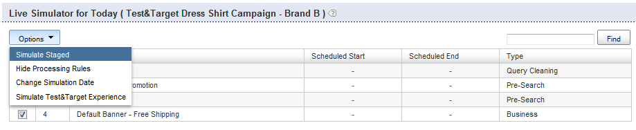

# Om affärsregler{#about-business-rules}

Du kan använda affärsregler för att sälja sökningen.

## Använda affärsregler {#concept_2A93D76216754D3D8412CDEA00BD26BD}

Du kan till exempel konfigurera när banners ska visas eller vilka resultat som ska visas och i vilken ordning. Du kan också konfigurera positionen för ett objekt i din profil och vilken mall som används för en viss sökning. Reglerna körs i den ordning de definierats. Ju högre ordningsnummer en regel har, desto senare körs den i processen, vilket innebär att tidigare regler utlöses. Du kan dra och släppa reglerna för att ändra deras ordning, eller ändra ordning på dem genom att ange ett nytt nummer i textrutan Regelordning.

Varje affärsregel består av utlösare och åtgärder.

Utlösaren definierar när regeln körs. Om frågetermen till exempel är &quot;meningar&quot; eller när resultatet oftast är hattar. Utlösaren består av flera villkor som måste vara antingen alla eller något av dem är sant för att den övergripande utlösaren ska vara sann. Du kan ange prioriteten genom att ändra utlösaroperatorn.

Åtgärden definierar vad som händer när utlösarvillkoret uppfylls. Du kan till exempel ange att banderollen ska visa eller flytta ett givet resultat till position 1. Regeltabellen visar sammanfattningsinformation om regeln. Du kan klicka på ett regelnamn för att öppna det och visa ytterligare information.

Regeltabellen visar en lista över alla era affärsregler. Tabellen visar som standard de tio sista reglerna som lades till i fallande ordning. Du kan klicka på kolumnrubrikerna i tabellen om du vill sortera reglerna i stigande eller fallande ordning.

Affärsreglerna kan ha ett av tre lägen: Godkänd, pausad eller Pågående arbete (pågående arbete)

<table> 
 <thead> 
  <tr> 
   <th colname="col1" class="entry"> 
Affärsregelns status 
 </th> 
   <th colname="col2" class="entry"> 
Beskrivning 
 </th> 
  </tr> 
 </thead>
 <tbody> 
  <tr> 
   <td colname="col1"> 
Godkänd 
 </td> 
   <td colname="col2"> 
Godkända affärsregler kan köras i din miljö och i din testmiljö. Du godkänner en affärsregel i Advanced Rule Builder. 
 </td> 
  </tr> 
  <tr> 
   <td colname="col1"> 
Avbruten 
 </td> 
   <td colname="col2"> 
Uppskjutna affärsregler kan aldrig köras i din testmiljö eller i din livemiljö. 
 </td> 
  </tr> 
  <tr> 
   <td colname="col1"> 
PIA 
 </td> 
   <td colname="col2"> 
Pågående arbete är affärsregler som varken är godkända eller inaktiverade. Det innebär att du kanske fortfarande arbetar med dem eller vill testa dem innan du godkänner dem. Affärsregler i ett tillstånd av Pågående arbete körs bara i den mellanlagrade miljön. 
 </td> 
  </tr> 
 </tbody> 
</table>

Ni godkänner affärsreglerna och gör dem tillgängliga så att de kan köras i er aktiva miljö. För närvarande kan du bara skicka *alla* regler live. Du kan dock ändra en regels status så att du har kontroll över vilka regler som körs och inte körs i den aktiva miljön.

Som standard körs regler när deras associerade utlösare uppfylls. Du kan dock schemalägga en regel att köras för ett visst datum- och tidsintervall.

Regler körs som standard när deras associerade utlösare uppfylls för alla butiker. Om du vill att regeln endast ska gälla för vissa butiker kan du använda panelen Lager för att välja en eller flera butiker som regeln ska tillämpas på.

## Lägga till en ny affärsregel {#task_BD3B31ED48BB4B1B8F1DCD3BFA2528E7}

Du kan använda [!DNL Visual Rule Builder] eller [!DNL Advanced Rule Builder] för att lägga till affärsregler som anpassar kundens sökupplevelse.

**Lägga till en ny affärsregel**

Följande steg förutsätter att du använder Visual Rule Builder.

1. Gör något av följande:

   * Klicka på **[!UICONTROL Rules]** > **[!UICONTROL Business Rules]** på produktmenyn. Klicka på **[!UICONTROL Add New Rule]** på sidan [!DNL Business Rules].

   * Klicka på **[!UICONTROL Simulator]** på produktmenyn. På sidan **[!UICONTROL Simulator for Today]** klickar du på **[!UICONTROL Add New Rule]** till höger om listrutan **[!UICONTROL Options]**.

      Om alternativet **[!UICONTROL Add New Rule]** inte visas på sidan klickar du på **[!UICONTROL Simulate Staged]** i listrutan **[!UICONTROL Options]**.

      

1. Skriv det nya namnet på affärsregeln i textfältet **[!UICONTROL Name]**.

   Klicka inte på **[!UICONTROL Save Rule]** än.
1. (Valfritt) Om du hanterar ett stort antal affärsregler kan du tagga affärsregler med specifika etiketter. I fältet **[!UICONTROL Tags]** anger du en eller flera taggetiketter, Använd kommatecken, tabb eller Enter som avgränsare.

   Använd funktionen **[!UICONTROL Filter by tag]** på sidan [!DNL Business Rules] för att filtrera efter regler som matchar en viss etikett. 1. På sidan [!DNL Business Rule Builder] anger du vilka utlösare och åtgärder du vill använda.

   **Utlösaralternativ**

   Utlösare är de villkor som måste uppfyllas för att en affärsregel ska kunna köras. När en affärsregel har flera utlösare kan du konfigurera hur utlösare ska svara med någon av följande tre metoder:

   * Ett svar där alla utlösare måste vara true (standardinställningen) som i följande exempel:

      `if a AND b AND c then ...`

   * Ett svar där någon av utlösarna måste vara sann, som i följande exempel:

      `if a OR b OR c then ...`

   * Ett svar där en anpassad kombination av utlösare anges. Det innebär att du kombinerar enskilda utlösare eller&quot;villkor&quot; med operatorerna `AND` och `OR`.

      Du kan också ändra utvärderingsprioriteten genom att lägga till vänster- och högerparenteskombinationer, som i följande exempel:

      `if (a OR b) AND c then ...`

      >[!NOTE]
      >
      >Om du kombinerar operatorer för `AND` med operatorer för `OR` i en anpassad uppsättning med affärsregler måste du ange parenteser för att se till att utlösarna utvärderas i rätt ordning.

      Den här speciella funktionen att kunna anpassa en kombination av utlösare är inte aktiverad som standard. Kontakta teknisk support för att aktivera den här funktionen.
   <table> 
      <thead> 
      <tr> 
      <th colname="col1" class="entry"> 
Alternativet Utlösare 
 </th> 
      <th colname="col2" class="entry"> 
Beskrivning 
 </th> 
      </tr> 
    </thead>
    <tbody> 
      <tr> 
      <td colname="col1"> 
Nyckelordsmatchningar 
 </td> 
      <td colname="col2"> 
Utlösaren är true när söktermen matchar det angivna skiftlägeskänsliga nyckelordet. Utlösaren är true för både nyckelordet och alla dess synonymer, enligt definitionen i Linguistics-ordlistan. 
 </td> 
      </tr> 
      <tr> 
      <td colname="col1"> 
 Frågematchningar 
 </td> 
      <td colname="col2"> 
 Utlösaren är true när alla sökparametrar matchar. 
 </td> 
      </tr> 
      <tr> 
      <td colname="col1"> 
 Resultatgruppen är dominerande 
 </td> 
      <td colname="col2"> 
 Utlösaren är true när resultatgruppen som definieras av den angivna sökningen dominerar resultatmängden. 
 
Som standard är dominans satt till 50 %. Den här inställningen är en försäljningsinställning som du kan ange. 
 
 
        <!--See <xref href="t_Configuring_Merchandising_preferences.xml#task_7AC7B9F5D9F44E10AB5BC0B8CB31C37A" type="task" format="dita" scope="local">Configuring Merchandising preferences</xref>. --> 
 
Hela gruppen måste finnas i resultatuppsättningen för att den här utlösaren ska vara true. Resultatgruppen är dynamisk. De kan ändras efter indexåtgärder, beroende på vilka resultat som matchar de ursprungliga sökvillkoren. 
 </td> 
      </tr> 
      <tr> 
      <td colname="col1"> 
Resultatgrupp finns 
 </td> 
      <td colname="col2"> 
 Utlösaren är true när den resultatgrupp som definieras av den angivna sökningen finns i resultatmängden. Hela gruppen måste finnas i resultatuppsättningen för att den här utlösaren ska uppfyllas (resultaten kan finnas på alla sidor). Resultatgruppen är dynamisk och kan ändras efter indexåtgärder beroende på vilka resultat som matchar de ursprungliga sökvillkoren. 
 </td> 
      </tr> 
      <tr> 
      <td colname="col1"> 
 Resultat finns 
 </td> 
      <td colname="col2"> 
 Utlösaren är true när det enskilda resultatet hittas i resultatuppsättningen. Resultatet kan finnas var som helst i resultatuppsättningen, det behöver inte finnas på den sida som användaren visar just nu. 
 </td> 
      </tr> 
    </tbody> 
    </table>

   **Åtgärdsalternativ**

   När en affärsregels utlösare uppfylls utförs de åtgärder som är kopplade till regeln. Med Visual Rule Builder kan du skapa följande åtgärder, men du kan använda Advanced Rule Builder för att skapa ytterligare typer av åtgärder.

   Funktionerna Ta bort fasettobjekt, Visa ansiktsobjekt, Visa fasett, Ta bort fasett och Skjut penseldrag i följande tabell kräver en fasett. Gränssnittet för att välja en aspekt beror på hur ditt konto är konfigurerat. Ett vanligt konto använder till exempel en nedrullningsbar lista för att välja ansikten. Om ditt konto har skårade ansikten visas en textruta för automatisk komplettering där du kan ange namnet på alla ansikten. Komplettera automatiskt föreslår ansikten i en nedrullningsbar lista när du skriver namnet på ansiktet. Förslagen innehåller definierade aspekter. Om ditt konto har en kortplatskarta visas även kortslutna facets.

   <table> 
    <thead> 
      <tr> 
      <th colname="col1" class="entry"> 
Alternativet Åtgärder 
 </th> 
      <th colname="col2" class="entry"> 
Beskrivning 
 </th> 
      </tr> 
    </thead>
    <tbody> 
      <tr> 
      <td colname="col1"> 
Push-grupp 
 </td> 
      <td colname="col2"> 
 Flyttar gruppen med sökresultat enligt de angivna sökvillkoren till en viss plats. 
 
När du trycker på en grupp med sökresultat läggs gruppen inte till implicit. 
 </td> 
      </tr> 
      <tr> 
      <td colname="col1"> 
Lägg till grupp 
 </td> 
      <td colname="col2"> 
 Lägg till gruppen med sökresultat enligt de angivna sökvillkoren. 
 </td> 
      </tr> 
      <tr> 
      <td colname="col1"> 
Ta bort grupp 
 </td> 
      <td colname="col2"> 
 Ta bort gruppen med sökresultat som definieras av de angivna sökvillkoren. 
 </td> 
      </tr> 
      <tr> 
      <td colname="col1"> 
Skjut en 
 </td> 
      <td colname="col2"> 
 Flyttar det enskilda sökresultatet till den valda positionen. 
 </td> 
      </tr> 
      <tr> 
      <td colname="col1"> 
Lägg till en 
 </td> 
      <td colname="col2"> 
 Lägger till ett enskilt sökresultat till den valda positionen. 
 </td> 
      </tr> 
      <tr> 
      <td colname="col1"> 
Ta bort en 
 </td> 
      <td colname="col2"> 
 Tar bort ett enskilt sökresultat från sökresultatuppsättningen. 
 </td> 
      </tr> 
      <tr> 
      <td colname="col1"> 
Ta bort alla resultat 
 </td> 
      <td colname="col2"> 
Tar bort alla resultat från sökresultatuppsättningen. 
 
 
        <!-- Bug #3331637 The option is meant to be used in conjunction with other rule actions in order to create "canned landing pages" where we want to create a page's content solely by rule actions, and need to completely discard the "natural" results of the search. Given that the other options don't have any kind of "here's how/why you might use this", I don't see much point in breaking that precedent here.--> 
 </td> 
      </tr> 
      <tr> 
      <td colname="col1"> 
Välj en annan banderoll 
 </td> 
      <td colname="col2"> 
 Ändrar banderollen i det markerade banderollområdet. 
 
Det här alternativet är tillgängligt när du högerklickar på en banderoll i webbsidans visningsområde. 
 </td> 
      </tr> 
      <tr> 
      <td colname="col1"> 
Lägg till banderollkommandon 
 </td> 
      <td colname="col2"> 
Gäller endast Adobe Dynamic Media Classic-mallar. 
 
Gör att du kan ändra standardparametrarna som används i banderollmallen. 
 
Se tabellen med alternativ i <a scope="local" href="../c-about-design-menu/c-about-banners.md#task_AD1E0C00A9E04B1FA819EB93288786B3" type="reference" format="dita"> Lägga till en banderoll med Adobe Dynamic Media Classic </a>. 
 
Se även <a href="../c-about-design-menu/c-about-banners.md#task_C3E782477FBF428ABEA220751781ACA9" type="task" format="dita" scope="local"> Redigera en banderoll med Adobe Dynamic Media Classic </a>. 
 </td> 
      </tr> 
      <tr> 
      <td colname="col1"> 
Ta bort banderoll 
 </td> 
      <td colname="col2"> 
 Tar bort banderollen från det markerade banderollområdet; ingen banderoll visas såvida inte en annan regel som anger en banderoll åsidosätter den här regeln. 
 
Det här alternativet är tillgängligt när du högerklickar på en banderoll i webbsidans visningsområde. 
 </td> 
      </tr> 
      <tr> 
      <td colname="col1"> 
Push Facet Item 
 </td> 
      <td colname="col2"> 
 Flyttar ett objekt inom en yta till den valda positionen. 
 </td> 
      </tr> 
      <tr> 
      <td colname="col1"> 
Ta bort zon 
 </td> 
      <td colname="col2"> 
 Tar bort en zon från sökresultatsidan. 
 
Se även åtgärden Ta bort faktor nedan. 
 </td> 
      </tr> 
      <tr> 
      <td colname="col1"> 
Visa zon 
 </td> 
      <td colname="col2"> 
 Visar en zon på sökresultatsidan. 
 
Se även åtgärden Visa faktor nedan. 
 </td> 
      </tr> 
      <tr> 
      <td colname="col1"> 
Ta bort fasettobjekt 
 </td> 
      <td colname="col2"> 
 Tar bort ett ansiktsobjekt från en fasett. 
 </td> 
      </tr> 
      <tr> 
      <td colname="col1"> 
Visa ansiktsobjekt 
 </td> 
      <td colname="col2"> 
 Visar ett specifikt ansiktsobjekt. 
 </td> 
      </tr> 
      <tr> 
      <td colname="col1"> 
Visa Fasett 
 </td> 
      <td colname="col2"> 
 Visar en viss aspekt. Den här åtgärden är att föredra framför åtgärden Visa zon. 
 </td> 
      </tr> 
      <tr> 
      <td colname="col1"> 
Ta bort fasett 
 </td> 
      <td colname="col2"> 
 Tar bort en viss aspekt. Den här åtgärden är att föredra framför åtgärden Ta bort zon. 
 </td> 
      </tr> 
    </tbody> 
    </table>

   Beroende på vilken regelbyggarpanel som är aktiv (ofylld) kan du även göra följande för att ange utlösare och åtgärder.

   * När panelen **[!UICONTROL Triggers]** har tagits bort högerklickar du på ett sökresultat eller en sökfaktor i området för presentationsmallen på sidan Business Rule Builder och klickar sedan på **[!UICONTROL Add "result present" trigger]**.

      Klicka på&quot;X&quot; till vänster om en utlösare på utlösarpanelen för att ta bort den från listan med utlösare.

   * När panelen **[!UICONTROL Actions]** har tagits bort högerklickar du på ett sökresultat i området för presentationsmallen på sidan Business Rule Builder. Klicka på **[!UICONTROL Add Result]**, **[!UICONTROL Remove Result]**, **[!UICONTROL Push to bottom]** eller **[!UICONTROL Push to #`<n>`]** (där `<n>` är en siffra).

1. (Valfritt) Gör något av följande i någon av panelerna i Business Rule Builder ( [!DNL Triggers], [!DNL Actions] eller [!DNL Schedule]):

   * Högerklicka på en banderoll i området för presentationsmallen på sidan Business Rule Builder och klicka sedan på **[!UICONTROL Select different banner]**. På sidan **[!UICONTROL Pick Banner]** klickar du på **[!UICONTROL Pick this banner]** under miniatyrbilden för banderollen för att lägga till den i presentationsmallen. Det är bara banners som matchar storleken och området på den ursprungliga bannern i presentationsmallen som du kan välja mellan.

      Åtgärden Lägg till banderoll läggs till på panelen [!DNL Actions].

   * Högerklicka på en Adobe Dynamic Media Classic-mallbanderoll vars parametrar du vill ändra i området för presentationsmallen på sidan [!DNL Business Rule Builder] och klicka sedan på **[!UICONTROL Add banner commands]**. Ange de parameteralternativ som du vill använda i dialogrutan [!DNL Change Parameters].

      Se tabellen med alternativ i [Lägga till en banderoll med Adobe Dynamic Media Classic](../c-about-design-menu/c-about-banners.md#task_AD1E0C00A9E04B1FA819EB93288786B3).

      Klicka på **[!UICONTROL Save]**.

      Parameterändringarna läggs till på panelen [!DNL Actions].

      Se även [Redigera en banderoll med Adobe Dynamic Media Classic](../c-about-design-menu/c-about-banners.md#task_C3E782477FBF428ABEA220751781ACA9).

   * Högerklicka på en banderoll som du vill ta bort från sidan i området för presentationsmallen på sidan i Business Rule Builder och klicka sedan på **[!UICONTROL Remove banner]**. Borttagningsbanderollåtgärden läggs till på åtgärdspanelen.

1. (Valfritt) Gör något av följande på panelen **[!UICONTROL Schedule]**:

   * Klicka på **[!UICONTROL Run Indefinitely]** om du vill att regeln ska köras när dess associerade utlösare uppfylls. Det här alternativet är standard.
   * Klicka på **[!UICONTROL Fixed Schedule]** och ange sedan startdatum och -tid samt slutdatum och sluttid för regeln som ska köras när dess associerade utlösare uppfylls.

1. Klicka på **[!UICONTROL Save Rule]**.
1. (Valfritt) Gör något av följande på sidan [!DNL Business Rules]:

   * Klicka på **[!UICONTROL History]** om du vill återställa ändringar som du har gjort.

      Se [Använda alternativet Historik](../t-using-the-history-option.md#task_70DD3F87A67242BBBD2CB27156F43002).

   * Klicka på **[!UICONTROL Live]**.

      Se [Visa Live-inställningar](../c-about-staging.md#task_401A0EBDB5DB4D4CA933CBA7BECDC10F).

   * Klicka på **[!UICONTROL Push Live]**.

      Se [Publicera sceninställningar live](../c-about-staging.md#task_44306783B4C0408AAA58B471DAF2D9A4).

## Redigera en affärsregel {#task_375CFA75D1D94D9E92A35DE1228E5087}

Du kan använda Visual Rule Builder eller Advanced Rule Builder för att redigera affärsregler som du har lagt till.

**Redigera en ny affärsregel**

1. Klicka på **[!UICONTROL Rules]** > **[!UICONTROL Business Rules]** på produktmenyn.
1. Gör något av följande på sidan [!DNL Business Rules]:

   * Klicka på namnet på en affärsregel som du vill ändra i kolumnen [!DNL Name].

      Affärsregeln öppnas i det standardgränssnitt som anges i **[!UICONTROL Settings]** > **[!UICONTROL My Profile]** > **[!UICONTROL My Preferences]**.

   * I listrutan klickar du på **[!UICONTROL Edit in advanced mode]** eller **[!UICONTROL Edit in visual mode]** bredvid ett affärsregelnamn som du vill redigera.

1. Skriv det nya namnet på affärsregeln i textfältet [!DNL Name].

   Klicka inte på **[!UICONTROL Save Rule]** än. 1. På sidan [!DNL Business Rule Builder] anger du vilka utlösare och åtgärder du vill använda.

   Se tabellen med alternativ under [Lägga till en ny affärsregel](../c-about-rules-menu/c-about-business-rules.md#task_BD3B31ED48BB4B1B8F1DCD3BFA2528E7).
1. (Valfritt) Gör något av följande på en **[!UICONTROL Business Rule Builder]**-panel ( [!DNL Triggers], [!DNL Actions] eller [!DNL Schedule]:

   * Högerklicka på en banderoll i området för presentationsmallen på sidan [!DNL Business Rule Builder] och klicka sedan på **[!UICONTROL Select different banner]**. På [!DNL Pick Banner page] klickar du på **[!UICONTROL Pick this banner]** under miniatyrbilden för banderollen för att lägga till den i presentationsmallen. Det är bara banners som matchar storleken och området på den ursprungliga bannern i presentationsmallen som du kan välja mellan.

      Åtgärden Lägg till banderoll läggs till på panelen [!DNL Actions].

   * Högerklicka på en Adobe Dynamic Media Classic-mallbanderoll vars parametrar du vill ändra i området för presentationsmallen på sidan [!DNL Business Rule Builder] och klicka sedan på **[!UICONTROL Add banner commands]**. Ange de parameteralternativ som du vill använda i dialogrutan [!DNL Change Parameters].

      Se tabellen med alternativ i [Lägga till en banderoll med Adobe Dynamic Media Classic](../c-about-design-menu/c-about-banners.md#task_AD1E0C00A9E04B1FA819EB93288786B3).

      Klicka på **[!UICONTROL Save]**.

      Parameterändringarna läggs till på panelen [!DNL Actions].

      Se även [Redigera en banderoll med Adobe Dynamic Media Classic](../c-about-design-menu/c-about-banners.md#task_C3E782477FBF428ABEA220751781ACA9).

   * Högerklicka på en banderoll som du vill ta bort från sidan i området för presentationsmallen på [!DNL Business Rule Builder]-sidan och klicka sedan på **[!UICONTROL Remove banner]**. Borttagningsbanderollåtgärden läggs till på panelen [!DNL Actions].

1. (Valfritt) Gör något av följande på panelen [!DNL Schedule]:

   * Klicka på **[!UICONTROL Run Indefinitely]** om du vill att regeln ska köras när dess associerade utlösare uppfylls. Det här alternativet är standard.
   * Klicka på **[!UICONTROL Fixed Schedule]** och ange sedan startdatum och -tid samt slutdatum och sluttid för regeln som ska köras när dess associerade utlösare uppfylls.

1. Klicka på **[!UICONTROL Save Rule]**.

   Sidan [!DNL Business Rule Builder] stängs och du återgår till sidan **[!UICONTROL Business Rule]**. Reglerna visas i tabellen. Klicka på kolumnrubriken **[!UICONTROL Modified]** för att sortera reglerna efter redigeringsdatum. 1. (Valfritt) Gör något av följande:

   * Klicka på **[!UICONTROL History]** om du vill återställa ändringar som du har gjort.

      Se [Använda alternativet Historik](../t-using-the-history-option.md#task_70DD3F87A67242BBBD2CB27156F43002).

   * Klicka på **[!UICONTROL Live]**.

      Se [Visa Live-inställningar](../c-about-staging.md#task_401A0EBDB5DB4D4CA933CBA7BECDC10F).

   * Klicka på **[!UICONTROL Push Live]**.

      Se [Publicera sceninställningar live](../c-about-staging.md#task_44306783B4C0408AAA58B471DAF2D9A4).

## Kopiera en affärsregel {#task_89F1879C71A54EE9B7454439302C03EC}

Du kan kopiera en befintlig affärsregel som ska användas som grund för en ny affärsregel som du vill skapa.

**Så här kopierar du en affärsregel**

1. Klicka på **[!UICONTROL Rules]** > **[!UICONTROL Business Rules]** på produktmenyn.
1. På sidan **[!UICONTROL Business Rules]** klickar du på **[!UICONTROL Copy rule]** i listrutan bredvid ett namn på en affärsregel som du vill kopiera.
1. Redigera den kopierade affärsregeln som vanligt.

   Se [Redigera en affärsregel](../c-about-rules-menu/c-about-business-rules.md#task_375CFA75D1D94D9E92A35DE1228E5087).

## Godkänner affärsregler {#task_BD569D18BF664272B8692294C162E2C1}

Du kan aktivera affärsregler som antingen har statusen Pågående arbete eller inaktiverat.

**Godkänna affärsregler**

1. Klicka på **[!UICONTROL Rule]** > **[!UICONTROL Business Rules]** på produktmenyn.
1. På sidan [!DNL Business Rules] sorterar du de regler som har statusen **[!UICONTROL WIP]** eller **[!UICONTROL suspended]** med kolumnrubriken för statuskolumnen i kolumnen [!DNL Status] i affärsregeltabellen.

   Använd kryssrutans kolumnrubrik till vänster i tabellen för att kontrollera alla regler som visas på sidan eller endast de som har statusen **[!UICONTROL WIP]** eller **[!UICONTROL suspended]**. 1. Klicka på **[!UICONTROL Approve]** på menyraden nära sidans överkant.
1. Klicka på **[!UICONTROL OK]** i dialogrutan **[!UICONTROL Confirm Action]**.
1. (Valfritt) Gör något av följande:

   * Klicka på **[!UICONTROL History]** om du vill återställa ändringar som du har gjort.

      Se [Använda alternativet Historik](../t-using-the-history-option.md#task_70DD3F87A67242BBBD2CB27156F43002).

   * Klicka på **[!UICONTROL Live]**.

      Se [Visa Live-inställningar](../c-about-staging.md#task_401A0EBDB5DB4D4CA933CBA7BECDC10F).

   * Klicka på **[!UICONTROL Push Live]**.

      Se [Publicera sceninställningar live](../c-about-staging.md#task_44306783B4C0408AAA58B471DAF2D9A4).

## Pausar affärsregler {#task_364E1FFB905141C08E306C8F1794A20E}

Du kan göra uppehåll i affärsregler som har statusen Pågående arbete eller godkänt.

När du har gjort uppehåll för en regel anger du i användargränssnittet att du tillfälligt har gjort den inaktiv och du skjuter upp arbetet med den en annan gång. Du kan dock fortfarande redigera en inaktiverad regel.

**Så här gör du för att pausa affärsregler**

1. Klicka på **[!UICONTROL Rule]** > **[!UICONTROL Business Rules]** på produktmenyn.
1. På sidan [!DNL Business Rules], med hjälp av statusen i kolumnen Status i tabellen för affärsregler, i kolumnen längst till vänster i tabellen, kontrollerar du reglerna som har statusen **[!UICONTROL WIP]** eller **[!UICONTROL approved]**.
1. Klicka på **[!UICONTROL Suspend]** på menyraden nära sidans överkant.
1. Klicka på **[!UICONTROL OK]** i dialogrutan **[!UICONTROL Confirm Action]**.
1. (Valfritt) Gör något av följande:

   * Klicka på **[!UICONTROL History]** om du vill återställa ändringar som du har gjort.

      Se [Använda alternativet Historik](../t-using-the-history-option.md#task_70DD3F87A67242BBBD2CB27156F43002).

   * Klicka på **[!UICONTROL Live]**.

      Se [Visa Live-inställningar](../c-about-staging.md#task_401A0EBDB5DB4D4CA933CBA7BECDC10F).

   * Klicka på **[!UICONTROL Push Live]**.

      Se [Publicera sceninställningar live](../c-about-staging.md#task_44306783B4C0408AAA58B471DAF2D9A4).

## Återuppta affärsregler {#task_E67D678C765B436EA2A3D6ADD7A49ABA}

Du kan återuppta affärsregler för att återaktivera en uppskjuten regel. När du har återupptagit affärsregeln anges dess status till Pågående arbete.

**Så här återupptar du affärsregler**

1. Klicka på **[!UICONTROL Rule]** > **[!UICONTROL Business Rules]** på produktmenyn.
1. På sidan [!DNL Business Rules], med hjälp av statusen i kolumnen Status i tabellen för affärsregler, i kolumnen längst till vänster i tabellen, kontrollerar du reglerna som har statusen **[!UICONTROL suspended]**.
1. Klicka på **[!UICONTROL Resume]** på menyraden nära sidans överkant.
1. Klicka på **[!UICONTROL OK]** i dialogrutan [!DNL Confirm Action].
1. (Valfritt) Gör något av följande:

   * Klicka på **[!UICONTROL History]** om du vill återställa ändringar som du har gjort.

      Se [Använda alternativet Historik](../t-using-the-history-option.md#task_70DD3F87A67242BBBD2CB27156F43002).

   * Klicka på **[!UICONTROL Live]**.

      Se [Visa Live-inställningar](../c-about-staging.md#task_401A0EBDB5DB4D4CA933CBA7BECDC10F).

   * Klicka på **[!UICONTROL Push Live]**.

      Se [Publicera sceninställningar live](../c-about-staging.md#task_44306783B4C0408AAA58B471DAF2D9A4).

## Ändra ordningen som affärsreglerna körs i {#task_FE3B1C17307F49B49050C2EC5A063991}

Du kan ändra ordningen på affärsreglerna om du vill ändra i vilken ordning de körs på presentationsmallar.

Affärsreglerna körs i den ordning de har definierats. Ju högre ordningsnummer en regel har, desto senare körs den i processen, vilket innebär att tidigare regler utlöses. Du ändrar ordning på reglerna genom att ange ett nytt nummer i kolumnen Ordning i tabellen på sidan [!DNL Business Rules]. Du kan också använda dra-och-släpp-regler för att ändra deras körningsordning.

**Ändra ordningen som affärsreglerna körs i**

1. Klicka på **[!UICONTROL Rule]** > **[!UICONTROL Business Rules]** på produktmenyn.
1. Gör något av följande på sidan [!DNL Business Rules] i tabellen:

   * Klicka på kolumnrubriken **[!UICONTROL Order]** om du vill sortera reglerna i stigande eller fallande ordning.
   * I kolumnen **[!UICONTROL Order]** skriver du det ordningsnummer som du vill att regeln ska köras i textfältet till vänster om namnet på en affärsregel.
   * Dra och släpp en tabellrad till den position där du vill att linjen ska köras. Alla ordernummer uppdateras för att återspegla den nya ordningen som reglerna körs i.

1. Klicka på **[!UICONTROL Save Changes]**.

   Dina affärsregler kommer nu att köras i den ordning som du har angett. Undantaget är om en omdirigeringsregel har angetts. Om och när omdirigeringsregeln utlöses eller träffas, avbryts bearbetningen av affärsregler så att omdirigeringen tillåts.
1. (Valfritt) Gör något av följande:

   * Klicka på **[!UICONTROL History]** om du vill återställa ändringar som du har gjort.

      Se [Använda alternativet Historik](../t-using-the-history-option.md#task_70DD3F87A67242BBBD2CB27156F43002).

   * Klicka på **[!UICONTROL Live]**.

      Se [Visa Live-inställningar](../c-about-staging.md#task_401A0EBDB5DB4D4CA933CBA7BECDC10F).

   * Klicka på **[!UICONTROL Push Live]**.

      Se [Publicera sceninställningar live](../c-about-staging.md#task_44306783B4C0408AAA58B471DAF2D9A4).

## Tar bort affärsregler {#task_AE37B42412044541BCC6D46CF8793DFF}

Du kan ta bort affärsregler vars status är Pågående arbete, Pausad eller godkänd med hjälp av den nedrullningsbara menyn Massåtgärder.

**Ta bort affärsregler**

1. Klicka på **[!UICONTROL Rules]** > **[!UICONTROL Business Rules]** på produktmenyn.
1. Gör något av följande på sidan [!DNL Business Rules]:

   * Använd kryssrutans kolumnrubrik för att kontrollera alla regler som visas på sidan.
   * Markera bara de affärsregler som du vill ta bort, baserat på statusen i tabellens statuskolumn.

1. Klicka på **[!UICONTROL Delete]** i listrutan [!DNL Bulk Actions].
1. Klicka på **[!UICONTROL OK]** i dialogrutan [!DNL Confirm Action].
1. (Valfritt) Gör något av följande:

   * Klicka på **[!UICONTROL History]** om du vill återställa ändringar som du har gjort.

      Se [Använda alternativet Historik](../t-using-the-history-option.md#task_70DD3F87A67242BBBD2CB27156F43002).

   * Klicka på **[!UICONTROL Live]**.

      Se [Visa Live-inställningar](../c-about-staging.md#task_401A0EBDB5DB4D4CA933CBA7BECDC10F).

   * Klicka på **[!UICONTROL Push Live]**.

      Se [Publicera sceninställningar live](../c-about-staging.md#task_44306783B4C0408AAA58B471DAF2D9A4).
