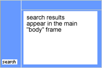

# Sök i formulär{#search-forms}

## Använda samlingar i sökformulär {#reference_5A079AEEEFB84457892EF0870D0605C3}

Med samlingar kan kunderna söka efter specifika delar av webbplatsen. Beroende på om du implementerar en nedrullningsbar lista eller en lista med kryssrutor kan du låta kunderna söka i en eller flera samlingar.

Se även [Om samlingar](../c-about-settings-menu/c-about-searching-menu.md#concept_62E42ACE53D54EEE9273433B86259127).

I följande exempel visas fyra olika samlingsnamn och de associerade områdena på webbplatsen som de omfattar:

<table> 
 <thead> 
  <tr> 
   <th colname="col1" class="entry"> <p>Samlingsnamn </p> </th> 
   <th colname="col2" class="entry"> <p> </p> </th> 
  </tr> 
 </thead>
 <tbody> 
  <tr> 
   <td colname="col1"> <p>Produkter </p> </td> 
   <td colname="col2"> <p> 
     <ul id="ul_7AE70789C0914EBFBCCC7695C6F53B9E"> 
      <li id="li_72525BAA34E2442D86152F2FD8CA83D5"> https://www.mycompany.com/products.htm </li> 
      <li id="li_5CA4152239124BDBB251E6C94B15D45B"> https://www.mycompany.com/publish/ </li> 
      <li id="li_6E266736B3494696A3AFD841C4AFEC57"> https://www.mycompany.com/search/ </li> 
     </ul> </p> </td> 
  </tr> 
  <tr> 
   <td colname="col1"> <p>Kunder </p> </td> 
   <td colname="col2"> <p>https://www.mycompany.com/customers/ </p> </td> 
  </tr> 
  <tr> 
   <td colname="col1"> <p>Nyheter </p> </td> 
   <td colname="col2"> <p>https://www.mycompany.com/news/ </p> </td> 
  </tr> 
  <tr> 
   <td colname="col1"> <p>Om Adobe </p> </td> 
   <td colname="col2"> <p>https://www.mycompany.com/company/ </p> </td> 
  </tr> 
 </tbody> 
</table>

Med det nedrullningsbara gränssnittet för sökformulär kan användarna välja en samling och se ut så här:


Det nedrullningsbara sökformuläret genereras med följande HTML-kod:

```
<select name="sp_k"> 
<option value="">All of Adobe</option> 
<option value="Products">Products</option> 
<option value="Customers">Customers</option> 
<option value="News">News</option> 
<option value="About Adobe">About Adobe</option> 
</select>
```

Du kan också använda en grupp kryssrutor i sökformuläret så att besökarna kan markera flera samlingar:


Kryssrutans sökformulär genereras med följande HTML-kod:

```
<input type="checkbox" name="sp_k" value="">All of Adobe<br> 
<input type="checkbox" name="sp_k" value="Products">Products<br> 
<input type="checkbox" name="sp_k" value="Customers">Customers<br> 
<input type="checkbox" name="sp_k" value="News">News<br> 
<input type="checkbox" name="sp_k" value="About Adobe">About Adobe<br>
```

## Sökresultat {#section_BBDD5B44E2B349BC88D937F44583D350}

Sökmallstaggen `<search-input-collections>` genererar samlingslistrutans HTML-kod i sökresultaten och väljer automatiskt den samling som har angetts i sökningen. Om du vill generera kryssrutor i stället använder du taggen `<search-input>` i stället för taggen `<input>` enligt följande:

```
<search-input type="checkbox" name="sp_k" value="">All of Adobe<br> 
<search-input type="checkbox" name="sp_k" value="Products">Products<br> 
<search-input type="checkbox" name="sp_k" value="Customers">Customers<br> 
<search-input type="checkbox" name="sp_k" value="News">News<br> 
<search-input type="checkbox" name="sp_k" value="About Adobe">About Adobe<br>
```

Taggen `<search-input>` returnerar taggen `<input>` och innehåller attributet `checked` om samlingen angavs i sökningen.

## Använda ramar med formulär {#reference_82CDDDA1E37042E4849EBF7EA05407C5}

Du kan konfigurera ramuppsättningarna så att de fungerar med webbplatssökning/försäljning.

Mer information om HTML-ramar och HTML-ramuppsättningselementet finns i följande URL:

[https://www.w3schools.com/html/html_frames.asp](https://www.w3schools.com/html/html_frames.asp)

Om ramar används på webbplatsen kan du ange en målram för sökresultatlänkar. Standardmålet är _self, som öppnar länkar i den aktuella ramen eller webbläsarfönstret. Du kan i stället ange webbplatsspecifika eller webbläsarreserverade mål:

* _top (webbläsarreserverad) resultat öppnas i det aktuella webbläsarfönstret och ersätter alla aktuella ramar.
* _blank (webbläsarreserverad) resultat öppnas i ett nytt webbläsarfönster.
* _parent (webbläsarreserverat) resultat öppnas i den aktuella bildrutans överordnade bildruta.
* bildruta2 (platsspecifika) resultat öppnas i en bildruta med namnet&quot;bildruta2&quot;. Du kan ange namnet på valfri bildruta som ett värde (till exempel huvud eller innehåll).

Om du inte använder ramar på webbplatsen bör du troligtvis inte ändra standardmålnamnet.

Om du skapar en anpassad sökresultatmall för webbplatsen kan du åsidosätta den angivna inställningen genom att använda attributet `target` för taggen `<search-link>`.

Så här konfigurerar du ramuppsättningar:

<table> 
 <thead> 
  <tr> 
   <th colname="col1" class="entry"> <p>Processsteg </p> </th> 
   <th colname="col02" class="entry"> <p>Processbeskrivning </p> </th> 
   <th colname="col2" class="entry"> <p>Länk </p> </th> 
  </tr> 
 </thead>
 <tbody> 
  <tr> 
   <td colname="col1"> <p>1 </p> </td> 
   <td colname="col02"> <p>Lägg till formuläret i önskad ram på webbsidan. </p> </td> 
   <td colname="col2"> <p> <a href="#section_BAA8A502BB2243F8B5FF9783CDF2BFFD" type="section" format="dita" scope="local"> Lägger till sökformulärkoden i en ram i ...  </a> </p> </td> 
  </tr> 
  <tr> 
   <td colname="col1"> <p>2 </p> </td> 
   <td colname="col02"> <p>Ange målramen för sökresultatsidan. </p> </td> 
   <td colname="col2"> <p> <a scope="local" href="#section_532CACB90888467093D95EACB64FDFA1" type="section" format="dita"> Ange målramen för sökresultatsidan  </a> </p> </td> 
  </tr> 
  <tr> 
   <td colname="col1"> <p>3 </p> </td> 
   <td colname="col02"> <p>Ange målet för länkar som skapats från sökresultatsidan. </p> </td> 
   <td colname="col2"> <p> <a scope="local" href="#section_523248C5AC424D878321C21A23A5CD66" type="section" format="dita"> Anger målet för länkar som skapats från sökresultaten..  </a> </p> </td> 
  </tr> 
  <tr> 
   <td colname="col1"> <p>4 </p> </td> 
   <td colname="col02"> <p>Redigera sidorna i navigeringsramen för att förhindra att de indexeras. </p> </td> 
   <td colname="col2"> <p> <a scope="local" href="#section_C62E5F0EE1294D5EBD97E123E54433FC" type="section" format="dita"> Redigerar sidor i navigeringsramen för att förhindra att de..  </a> </p> </td> 
  </tr> 
  <tr> 
   <td colname="col1"> <p>5 </p> </td> 
   <td colname="col02"> <p>Testa sökformuläret. </p> </td> 
   <td colname="col2"> <p> <a scope="local" href="#section_43D8D4A7BF524DC480DFE5442F6A2E3C" type="section" format="dita"> Testa sökformuläret  </a> </p> </td> 
  </tr> 
 </tbody> 
</table>

## Lägga till sökformulärskoden i en ram på webbsidan {#section_BAA8A502BB2243F8B5FF9783CDF2BFFD}

1. Klicka på **[!UICONTROL Design]** > **[!UICONTROL Auto-Complete]** > **[!UICONTROL Form Source]** på produktmenyn.

   Koden för HTML-sökformuläret ser ut ungefär så här:

   ```
   <!-- Adobe Target HTML for [your customer name] --> 
   <form method="get" action="https://search.atomz.com/search/"> 
   <input size=15 name="sp_q"><br> 
   <input type=submit value="Search"> 
   <input type=hidden name="sp_a" value="[your account number]"> 
   </form>
   ```

1. På sidan [!DNL Standard Form Source] markerar och kopierar du HTML-sökformulärskoden som visas i textfältet.
1. Klistra in koden i sökformuläret i den ram du vill ha i ramuppsättningen.

   I exemplet nedan klistras koden i sökformuläret in i navigeringsramen, den smala lodräta ramen till vänster på skärmen.

   

## Ange målbildrutan för sökresultatsidan {#section_532CACB90888467093D95EACB64FDFA1}

Om du placerade din sökformulärkod i den lodräta navigeringsramen som ovan kan du visa sökresultaten i den större, huvudsakliga ramen. I det här exemplet anropar du huvudbildrutan &quot;body&quot; och anger den som målbildruta.



1. Om du vill ange målramen för resultatsidan lägger du till ett mål och värde i formuläret genom att ändra följande rad i sökformulärskoden:

   `<form method="get" action="https://search.atomz.com/search/">`

   till följande:

   `<form target="body" method="get" action="https://search.atomz.com/search/">`

   Se till att du sätter citattecken runt formulärets målvärde.

När en kund gör en sökning på webbplatsen visas sökresultaten i textramen på webbsidan.

## Ange målet för länkar som skapats från sökresultatsidan {#section_523248C5AC424D878321C21A23A5CD66}

Du kan ange målramen genom att redigera mallen direkt.

Om sökresultaten visas i textramen vill du antagligen att länkarna även ska öppnas i textramen. Eftersom detta är samma bildruta, målvärdet `"_self"` som är standardinställningen, behöver du inte göra några ändringar.

Du kan också ange målramen för resultatlänkarna. Här följer några exempel på vad du kan göra:

* Ange olika bildrutor för sökresultaten och deras länkar så att sökresultaten förblir aktiva i sina egna bildrutor när varje klickat resultat öppnas i en separat bildruta.
* Ange att sökresultaten ska öppnas i ett nytt tomt fönster, så att det gamla fönstret förblir aktivt med det ursprungliga innehållet, vilket även bevarar sökresultaten.

Målnamnet kan antingen vara namnet på en bildruta som anges i HTML-koden eller ett av flera av följande HTML-standardvärden:

* `target="_blank"` Öppna länkar i ett nytt, tomt, namnlöst fönster.

* `target="_self"` Standard. Öppna länkar i det fönster där sökresultaten finns. I det här fallet det ursprungliga fönstret för sökresultat. Använd det här alternativet om du vill åsidosätta ett globalt tilldelat basmål.

* `target="_parent"` Öppna länkar i den överordnade ramuppsättningen för länksidan. Om dokumentet inte har någon överordnad funktion fungerar detta som `"_self"` som standard.

* `target="_top"` Öppna länkar i hela fönstret. Om dokumentet redan finns överst fungerar det som standard som `"_self"`. Använd det här alternativet om du vill bryta ut ur en godtyckligt djup kapsling av bildrutor.

Om du till exempel vill ange målramen `_blank` kan du redigera mallen på följande sätt:

1. Klicka på **[!UICONTROL Design]** > **[!UICONTROL Templates]** på produktmenyn.

1. På sidan [!DNL Staged Templates] i tabellen klickar du på namnet på mallen med målmålramen.
1. Leta reda på taggen `<search-link>`. Standardtaggen `<search-link>` ska se ut ungefär så här:

   `<search-link><search-title length=100></search-link>`

1. Lägg till rammålet i taggen `<search-link>`. I exemplet ovan anger du `target="_blank"`. Se till att du tar med understrecket och citattecknen runt målvärdet.

   Taggen `<search-link>` ser nu ut så här:

   `<search-link target="_blank"><search-title length=100></search-link>`

När en besökare väljer en sökresultatlänk öppnas nu den länkade sidan i ett nytt, tomt fönster.

## Redigera sidor i navigeringsramen för att förhindra att de indexeras {#section_C62E5F0EE1294D5EBD97E123E54433FC}

Vanligtvis vill du utesluta navigeringsbildrutor från indexering med sökresultaten. Om du vill använda den här funktionen kan du lägga till metataggen `noindex` på dessa sidor.

1. Öppna HTML-sidans källa för navigeringsramen.
1. Lägg till följande meta-tagg i `<head>`-avsnittet i HTML-koden:

   `<meta name="robots" content="noindex">`

   Exempel:

   ```
   <html> 
   <head> 
   <title>This page is a frameset that I do not want indexed</title> 
   <meta http-equiv="Content-Type" content="text/html; charset=iso-8859-1"> 
   <meta name="robots" content="noindex"> 
   </head>
   ```

## Testa sökformuläret {#section_43D8D4A7BF524DC480DFE5442F6A2E3C}

1. Gå till webbplatsen och navigera till ett formulär.
1. Ange några sökord i sökfältet och klicka sedan på **[!UICONTROL Search]**.

   Följande är sant:

   * Sökresultatsidan visas i den angivna målramen.
   * Länkar från sökresultaten finns i den angivna målbildrutan.
   * Resultatet för navigeringsramen visas inte.

   Om du får problem med ramar efter att du har testat sökformuläret kontaktar du kundsupport.

## Exempel på avancerat sökformulär {#reference_82E1051918744EBA88A01E9E6AE42C4A}

Du kan redigera den avancerade formulärkoden så att den passar dina design- och innehållsbehov eller lägga till eller ta bort ytterligare sökparametrar.

Hemsidan är en bra plats att infoga ett avancerat sökformulär eftersom många kunder förväntar sig sökfunktioner där. Du kan också skapa en HTML-sida som innehåller sökformuläret och annan användbar information, och sedan länka till sidan på hela webbplatsen.

Om du indexerar säkert innehåll kan du få sökresultaten från säkra webbservrar för sökning. Ändra URL:en i åtgärdsattributet för sökformulär till: action=&quot;https://search.atomz.com/search/&quot; för att göra detta.

>[!NOTE]
>
>Vissa HTML-redigerare har problem med att klistra in HTML-kod från andra program. Om HTML-koden visas som text på din webbsida kopierar och klistrar du in sökkoden i en enkel textredigerare, till exempel Anteckningar i Windows eller Simple Text på Mac, och kopierar och klistrar sedan in igen från den enkla textredigeraren i HTML-redigeraren.

Sökparametrar används i avancerad kod för sökformulär för att skapa alternativknappar, kryssrutor och listrutor som kunderna kan använda för att anpassa enskilda sökningar. Kunderna kan ange antalet visade sökresultat, till exempel, eller ett datumintervall, eller om sammanfattningar visas med sökresultat - alla alternativ som visas i de avancerade sökformulären.

Med hjälp av följande exempelformulär för avancerad sökning visar resten av det här avsnittet hur varje alternativ i formuläret skapas med hjälp av sökparametrar.


Du kan visa hela HTML-koden för det avancerade sökformuläret i exemplet ovan.

Se [Avancerad HTML-kod för sökformulär](#reference_9AAD4A46B68D4D48865508982CB86DB9).

Se [Konfigurera Komplettera CSS automatiskt](../c-about-auto-complete.md#task_EECE35DEB6C94F4A8A5B42B4DED76D96).

Se [Kopiera HTML-koden för sökformuläret till ...](../c-about-auto-complete.md#task_A3A01EA800F24C0AA33902387E0362C7).

<table> 
 <thead> 
  <tr> 
   <th colname="col2" class="entry"> <p>Plats på formulär </p> </th> 
   <th colname="col1" class="entry"> <p>Parameter </p> </th> 
   <th colname="col3" class="entry"> <p>HTML-kod </p> </th> 
   <th colname="col4" class="entry"> <p>Beskrivning </p> </th> 
  </tr> 
 </thead>
 <tbody> 
  <tr> 
   <td colname="col2"> <p>Aktivera avancerade alternativ för sökformulär (dolt fält) </p> </td> 
   <td colname="col1"> <p> <span class="codeph"> sp_advanced  </span> </p> </td> 
   <td colname="col3"> <p> <span class="syntax html codeph"> &lt;input type="hidden" name="sp_advanced" value="1"&gt; </span> </p> </td> 
   <td colname="col4"> <p>Aktivera eller inaktivera avancerade sökalternativ. Du kan t.ex. placera ett standardsökformulär på din hemsida med en länk till en andra sida som innehåller ett avancerat formulär. I det här fallet placerar du en kopia av standardformuläret i <span class="codeph"> &lt;search-if-not-advanced&gt;...&lt;/search-if-not-advanced&gt; </span> malltaggar. </p> <p>En kund som utför en sökning från standardformuläret ser ett standardsökformulär när sökresultaten visas. På den avancerade sökformulärsskärmen inkluderar du taggen <span class="codeph"> &lt;input type=hidden name="sp_advanced" value=1&gt; </span> med de andra avancerade formuläralternativen. </p> <p>Du kan även inkludera en kopia av det avancerade sökformuläret i &lt;search-if-advanced&gt;... &lt;/search-if-advanced&gt;-malltaggar. En kund som utför en sökning från ditt avancerade sökformulär ser ett avancerat sökformulär när sökresultaten visas. </p> </td> 
  </tr> 
  <tr> 
   <td colname="col2"> <p> Matcha alla, alla eller fraser </p> </td> 
   <td colname="col1"> <p> <span class="codeph"> sp_p  </span> </p> <p> </p> </td> 
   <td colname="col3"> <p> <code class="syntax html"> &lt;!--&nbsp;Allow&nbsp;"any,"&nbsp;"all,"&nbsp;or&nbsp;"phrase"&nbsp;--&gt; 
      &lt;input&nbsp;type=radio&nbsp;name="sp_p"&nbsp;value="any"&gt;Any&nbsp;word 
      &lt;input&nbsp;type=radio&nbsp;name="sp_p"&nbsp;value="all"&nbsp;checked&gt;All&nbsp;words 
      &lt;input&nbsp;type=radio&nbsp;name="sp_p"&nbsp;value="phrase"&gt;Exact&nbsp;phrase </code> </p> </td> 
   <td colname="col4"> <p>Låt kunden ange att"alla ord","alla ord" eller"den exakta frasen" måste finnas för att ett dokument ska matcha. När parametern <span class="codeph"> sp_p </span> anges behöver kunderna inte använda"+","-" eller båda i sökfrågan. </p> <p> Om parametern <span class="codeph"> sp_p </span> utelämnas, eller om den är inställd på "" eller "any", kan kunderna fortfarande använda specificerarna "+" och "-". Om parametern <span class="codeph"> sp_p </span> är inställd på "all" eller "phrase" ignoreras de angivna "+" och "-". </p> <p>Du kan lära dig mer om hur du använder"+" och"-" i en sökning. </p> <p>Se <a href="../c-about-settings-menu/c-about-searching-menu.md#concept_207105CF26B1448F8A3D223787C56AB8" type="concept" format="dita" scope="local"> Om sökningar </a>. </p> </td> 
  </tr> 
  <tr> 
   <td colname="col2"> <p> Ljudliknande matchning </p> </td> 
   <td colname="col1"> <p> <span class="codeph"> sp_w  </span> </p> <p>och </p> <p> <span class="codeph"> sp_w_control  </span> </p> <p> </p> </td> 
   <td colname="col3"> <p> <code class="syntax html"> &lt;!--&nbsp;Checkbox&nbsp;enables&nbsp;sound-alike&nbsp;matching&nbsp;--&gt; 
      &lt;input&nbsp;type=hidden&nbsp;name="sp_w_control"&nbsp;value=1&gt; 
      &lt;input&nbsp;type=checkbox&nbsp;name="sp_w"&nbsp;value="alike"&gt;&nbsp;Sound-alike&nbsp;matching </code> </p> </td> 
   <td colname="col4"> <p>Låter kunderna aktivera eller inaktivera matchning av ljud. Matchning med lika ljud gör att felstavade sökfrågor matchar ord som "låter lika" i dina dokument. </p> <p>När parametern <span class="codeph"> sp_w_control </span> är inställd på 1 och parametern <span class="codeph"> sp_w </span> är inställd på "alike", markeras den genererade kryssrutan och ljudmatchning aktiveras som standard. </p> <p>Om parametern <span class="codeph"> sp_w </span> är inställd på "" markeras inte kryssrutan. </p> <p>Om du inte aktiverade ljudmatchning under den senaste indexeringsåtgärden, går det inte att matcha ljud lika och parametern <span class="codeph"> sp_w </span> ignoreras. Om du vill aktivera ljudmatchning klickar du på <span class="uicontrol"> Linguistics </span> &gt; <span class="uicontrol"> Words &amp; Language </span> &gt; <span class="uicontrol"> Sound-Alike Matching </span> på produktmenyn. </p> <p>Du kan också tilldela parametrarna <span class="codeph"> sp_w </span> och <span class="codeph"> sp_w_control </span> på följande sätt: </p> <p> <code class="syntax html"> &lt;!--&nbsp;Checkbox&nbsp;disables&nbsp;sound-alike&nbsp;matching&nbsp;--&gt; 
      &lt;input&nbsp;type=hidden&nbsp;name="sp_w_control"&nbsp;value=0&gt; 
      &lt;input&nbsp;type=checkbox&nbsp;name="sp_w"&nbsp;value="exact"&gt; 
      No&nbsp;sound-alike&nbsp;matching </code> </p> <p>När parametern <span class="codeph"> sp_w_control </span> är inställd på 0 och parametern <span class="codeph"> sp_w </span> är inställd på "exact" inaktiveras matchning av ljud som standard. Om parametern <span class="codeph"> sp_w </span> är inställd på "" aktiveras matchning av ljud. </p> </td> 
  </tr> 
  <tr> 
   <td colname="col2"> <p>Datumintervallmatchning </p> </td> 
   <td colname="col1"> <p> <span class="codeph"> sp_d  </span> </p> <p> </p> </td> 
   <td colname="col3"> <p> <code class="syntax html"> &lt;!--Specifies&nbsp;type&nbsp;of&nbsp;date&nbsp;range&nbsp;searching&nbsp;to&nbsp;perform.--&gt; 
      &lt;input&nbsp;type=radio&nbsp;name="sp_d"&nbsp;value="custom"&nbsp;checked&gt; 
      &lt;input&nbsp;type=radio&nbsp;name="sp_d"&nbsp;value="specific"&gt; </code> </p> </td> 
   <td colname="col4"> <p>Parametern <span class="codeph"> sp_d </span> anger ett anpassat dataområdesmatchning som ska utföras eller en specifik datumintervallmatchning som ska utföras. </p> <p>I standardformuläret för avancerad sökning visas det här alternativet som en alternativknappsgrupp med en listruta med"anpassade" datumintervall som genererats med parametern <span class="codeph"> sp_date_range </span>. Den innehåller också och en grupp"specifika" start- och slutdatum som genereras med <span class="codeph"> sp_start_day </span>, <span class="codeph"> sp_start_month </span>, <span class="codeph"> sp_start_year </span>, <span class="codeph"> sp_end_day </span>, <span class="codeph"> sp_end_month </span> och <span class="codeph"> sp_end_year </span>-parametrar. </p> <p>Ett anpassat datumintervall är ett namngivet datumintervall som ska sökas igenom. Till exempel"Anytime","Today","Within the last year" och så vidare. </p> <p>Ett"specifikt" datumintervall består av ett startdatum och ett slutdatum. Exempel: från "8 september 2009 till 18 oktober 2011." </p> </td> 
  </tr> 
  <tr> 
   <td colname="col2"> <p>Matchning av datumintervall: anpassat datumintervall </p> </td> 
   <td colname="col1"> <p> <span class="codeph"> sp_date_range  </span> </p> <p> </p> </td> 
   <td colname="col3"> <p> <code class="syntax html"> &lt;!--Selection&nbsp;list&nbsp;for&nbsp;custom&nbsp;date&nbsp;range.--&gt; 
      &lt;select&nbsp;name="sp_date_range"&nbsp;size=1&gt; 
      &lt;option&nbsp;value=-1&nbsp;selected&gt;Anytime&lt;/option&gt; 
      &lt;option&nbsp;value=7&gt;Within&nbsp;the&nbsp;last&nbsp;week&lt;/option&gt; 
      &lt;option&nbsp;value=14&gt;Within&nbsp;the&nbsp;last&nbsp;2&nbsp;weeks&lt;/option&gt; 
      &lt;option&nbsp;value=30&gt;Within&nbsp;the&nbsp;last&nbsp;30&nbsp;days&lt;/option&gt; 
      &lt;option&nbsp;value=60&gt;Within&nbsp;the&nbsp;last&nbsp;60&nbsp;days&lt;/option&gt; 
      &lt;option&nbsp;value=90&gt;Within&nbsp;the&nbsp;last&nbsp;90&nbsp;days&lt;/option&gt; 
      &lt;option&nbsp;value=180&gt;Within&nbsp;the&nbsp;last&nbsp;180&nbsp;days&lt;/option&gt; 
      &lt;option&nbsp;value=365&gt;Within&nbsp;the&nbsp;last&nbsp;year&lt;/option&gt; 
      &lt;option&nbsp;value=730&gt;Within&nbsp;the&nbsp;last&nbsp;two&nbsp;years&lt;/option&gt; 
      &lt;/select&gt; </code> </p> </td> 
   <td colname="col4"> <p>Parametern <span class="codeph"> sp_date_range </span> används för att skapa ett anpassat datumintervall. Till exempel"Anytime","Today","Within the last year" och så vidare. </p> <p>Värden större än eller lika med noll anger antalet dagar som ska sökas före idag. Värdet 0 anger till exempel "Idag", värdet "1" anger "Idag och igår", värdet "30" anger "Inom de senaste 30 dagarna" och så vidare. Värden som är mindre än noll anger ett anpassat intervall enligt följande: </p> <p> 
     <ul id="ul_E65DDE33883F441F9730F315E485AD98"> 
      <li id="li_83E9466AB9D7438A8544001F6B007186"> <p>-1 = "Anytime," är detsamma som att ange inget datumintervall. </p> </li> 
      <li id="li_38AB8D97179A47F9B860A96EA09119BB"> <p>-2 = "Den här veckan", som söker från söndag till lördag den aktuella veckan. </p> </li> 
      <li id="li_F4C3A8658428418A8A06FBAAB4733C68"> <p>-3 = "Sista veckan", som söker från söndag till lördag i veckan före den aktuella veckan. </p> </li> 
      <li id="li_DF2D0B043A4E4DE9BE8D82E69A76E793"> <p>-4 = "Den här månaden", som söker efter datum inom den aktuella månaden. </p> </li> 
      <li id="li_76BC4C2CED574E2A81448158828BFF1B"> <p>-5 = "Sista månaden", som söker efter datum inom månaden före den aktuella månaden. </p> </li> 
      <li id="li_17FF849384FB46D58AF6FF1D3BC408C8"> <p>-6 = "Det här året", som söker efter datum under det aktuella året. </p> </li> 
      <li id="li_E2B8B4DFF3914BBDB86D0EB77F52B305"> <p>-7 = "Sista året", som söker efter datum under året före det aktuella året. </p> </li> 
     </ul> </p> </td> 
  </tr> 
  <tr> 
   <td colname="col2"> <p>Matchning av datumintervall: startdatum </p> </td> 
   <td colname="col1"> <p> <span class="codeph"> sp_start_day, sp_start_month, sp_start_year  </span> </p> <p> </p> </td> 
   <td colname="col3"> </td> 
   <td colname="col4"> <p>Den här trippeln med numeriska värden anger startdatumet för ett visst datumintervall som ska sökas igenom. Se till att du anger alla tre värdena eftersom ett delvis angivet datum ignoreras. </p> <p>Det är tillåtet att bara ange startdatum, bara slutdatum eller både startdatum och slutdatum. Om bara startdatumet anges innehåller sökningen matchande dokument som är daterade på eller efter startdatumet. Om bara slutdatumet anges innehåller sökningen matchande dokument på eller före slutdatumet. Om både startdatum och slutdatum anges innehåller sökningen matchande dokument från startdatumet till slutdatumet. </p> <p>Alla datum söks igenom i förhållande till Greenwich Mean Time. </p> </td> 
  </tr> 
  <tr> 
   <td colname="col2"> <p> Matchning av datumintervall: slutdatum </p> </td> 
   <td colname="col1"> <p> <span class="codeph"> sp_end_day, sp_end_month, sp_end_year  </span> </p> <p> </p> </td> 
   <td colname="col3"> </td> 
   <td colname="col4"> <p>Den här trippeln med numeriska värden anger slutdatumet för det specifika datumintervall som ska sökas igenom. Se till att du anger alla tre värdena eftersom ett delvis angivet datum ignoreras. </p> <p>Det är tillåtet att bara ange startdatum, bara slutdatum eller både start- och slutdatum. Om bara startdatumet anges innehåller sökningen matchande dokument som är daterade på eller efter startdatumet. Om bara slutdatumet anges innehåller sökningen matchande dokument på eller före slutdatumet. Om både start- och slutdatumet anges innehåller sökningen matchande dokument från startdatumet till slutdatumet. </p> <p>Alla datum söks igenom i förhållande till Greenwich Mean Time. </p> </td> 
  </tr> 
  <tr> 
   <td colname="col2"> <p>I sökfältet </p> </td> 
   <td colname="col1"> <p> <span class="codeph"> sp_x  </span> </p> </td> 
   <td colname="col3"> <p> <code class="syntax html"> &lt;!--&nbsp;List&nbsp;box&nbsp;selects&nbsp;the&nbsp;search&nbsp;field&nbsp;--&gt; 
      Within&nbsp;&lt;select&nbsp;name="sp_x"&nbsp;size=1&gt; 
      &lt;option&nbsp;value="any"&nbsp;selected&gt;Anywhere&lt;/option&gt; 
      &lt;option&nbsp;value="title"&gt;Title&lt;/option&gt; 
      &lt;option&nbsp;value="desc"&gt;Description&lt;/option&gt; 
      &lt;option&nbsp;value="keys"&gt;Keywords&lt;/option&gt; 
      &lt;option&nbsp;value="body"&gt;Body&lt;/option&gt; 
      &lt;option&nbsp;value="alt"&gt;Alternate&nbsp;text&lt;/option&gt; 
      &lt;option&nbsp;value="url"&gt;URL&lt;/option&gt; 
      &lt;option&nbsp;value="target"&gt;Target&lt;/option&gt; 
      &lt;option&nbsp;value="date"&gt;Date&lt;/option&gt;* 
      &lt;/select&gt; </code> </p> </td> 
   <td colname="col4"> <p>I listrutan <span class="codeph"> sp_x </span> kan dina kunder ange i vilket fält de ska söka efter frågesträngarna. </p> <p>Kunderna kan välja antingen alla fält, titel, dokumentbeskrivning, dokumentnyckelord, brödtext, alternativ text, dokumentets URL-adress, datum eller målnyckelord. </p> <p>När parametern <span class="codeph"> sp_x </span> används behöver kunderna inte ange "title:," "desc:," "keys:," "body:," "alt:," "url:," och "target:" i sökfrågesträngar. </p> <p>Om parametern <span class="codeph"> sp_x </span> utelämnas, eller om den är inställd på "" eller "any", kan kunderna fortfarande använda fältspecificeringssträngarna. Om parametern <span class="codeph"> sp_x </span> är inställd på ett specifikt fält ignoreras alla andra fältspecifikationssträngar. </p> <p>Se <a href="../c-about-settings-menu/c-about-searching-menu.md#concept_207105CF26B1448F8A3D223787C56AB8" type="concept" format="dita" scope="local"> Om sökningar </a>. </p> </td> 
  </tr> 
  <tr> 
   <td colname="col2"> <p>Visa resultatantal </p> </td> 
   <td colname="col1"> <p> <span class="codeph"> sp_c  </span> </p> </td> 
   <td colname="col3"> <p> <code class="syntax html"> &lt;!--&nbsp;List&nbsp;box&nbsp;selects&nbsp;number&nbsp;of&nbsp;results&nbsp;to&nbsp;show&nbsp;per&nbsp;page&nbsp;--&gt; 
      Show&nbsp;&lt;select&nbsp;name="sp_c"&nbsp;size=1&gt; 
      &lt;option&nbsp;value=5&gt;5&lt;/option&gt; 
      &lt;option&nbsp;value=10&nbsp;selected&gt;10&lt;/option&gt; 
      &lt;option&nbsp;value=25&gt;25&lt;/option&gt; 
      &lt;option&nbsp;value=50&gt;50&lt;/option&gt; 
      &lt;option&nbsp;value=100&gt;100&lt;/option&gt; 
      &lt;/select&gt;&nbsp;results </code> </p> </td> 
   <td colname="col4"> <p>Låter kunderna välja hur många sökresultat som ska visas på varje sökresultatsida. </p> <p>Du kan ha så många eller få alternativ i formuläret som du vill. Kontrollera att värdet "value=" matchar det värde som visas. </p> </td> 
  </tr> 
  <tr> 
   <td colname="col2"> <p>Visa eller dölj sammanfattningar </p> </td> 
   <td colname="col1"> <p> <span class="codeph"> sp_m  </span> </p> </td> 
   <td colname="col3"> <p> <code class="syntax html"> &lt;!--&nbsp;Show&nbsp;or&nbsp;hide&nbsp;summaries&nbsp;in&nbsp;search&nbsp;results&nbsp;--&gt; 
      &lt;select&nbsp;name="sp_m"&nbsp;size=1&gt; 
      &lt;option&nbsp;value=1&nbsp;selected&gt;with&lt;/option&gt; 
      &lt;option&nbsp;value=0&gt;without&lt;/option&gt; 
      &lt;/select&gt;&nbsp;summaries&nbsp; </code> </p> </td> 
   <td colname="col4"> <p>Låter kunderna välja om sammanfattande text ska visas för varje matchning. </p> <p>Ange värdet 1 om du vill visa sammanfattningar. Ange värdet 0 om du vill dölja sammanfattningar. Du kan också använda parametern med en uppsättning alternativknappar, som i följande exempel: </p> <p> <code class="syntax html"> &lt;!--&nbsp;Show&nbsp;or&nbsp;hide&nbsp;summaries&nbsp;in&nbsp;search&nbsp;results&nbsp;--&gt; 
      &lt;input&nbsp;type=radio&nbsp;name="sp_m"&nbsp;value=1&nbsp;selected&gt;Show&nbsp;summaries 
      &lt;input&nbsp;type=radio&nbsp;name="sp_m"&nbsp;value=0&gt;Hide&nbsp;summaries </code> </p> </td> 
  </tr> 
  <tr> 
   <td colname="col2"> <p>Sortera efter resultat </p> </td> 
   <td colname="col1"> <p> <span class="codeph"> sp_s  </span> </p> </td> 
   <td colname="col3"> <p> <code class="syntax html"> &lt;!--&nbsp;Sort&nbsp;results&nbsp;by&nbsp;relevance&nbsp;or&nbsp;by&nbsp;date&nbsp;--&gt; 
      Sort&nbsp;by&nbsp;&lt;select&nbsp;name="sp_s"&nbsp;size=1&gt; 
      &lt;option&nbsp;value=0&nbsp;selected&gt;relevance&lt;/option&gt; 
      &lt;option&nbsp;value=1&gt;date&lt;/option&gt; 
      &lt;/select&gt; </code> </p> </td> 
   <td colname="col4"> <p>Låter kunderna välja om resultaten är listade i relevans- eller datumordning. </p> <p>När värdet är 1 listas resultaten från det senast ändrade dokumentet till det senast ändrade dokumentet. När värdet är 0 listas resultaten från det mest relevanta till det minst relevanta. Du kan också använda den här parametern med alternativknappar som i följande exempel: </p> <p> <code class="syntax html"> &lt;!--&nbsp;Sort&nbsp;results&nbsp;by&nbsp;relevance&nbsp;or&nbsp;by&nbsp;date&nbsp;--&gt; 
      &lt;input&nbsp;type=radio&nbsp;name="sp_s"&nbsp;value=0&nbsp;selected&gt;Sort&nbsp;by&nbsp;relevance 
      &lt;input&nbsp;type=radio&nbsp;name="sp_s"&nbsp;value=1&gt;Sort&nbsp;by&nbsp;date </code> </p> </td> 
  </tr> 
 </tbody> 
</table>

## Avancerad HTML-kod för sökformulär {#reference_9AAD4A46B68D4D48865508982CB86DB9}

Den HTML-formulärkod som används för att skapa det avancerade sökformuläret som visas högst upp i det avancerade exempelsökformulärämnet.

Se [Exempel på avancerat sökformulär](#reference_82E1051918744EBA88A01E9E6AE42C4A).

Om du använder den här koden måste du komma ihåg att ersätta `sp_a`-värdet `sp99999999` med ditt faktiska kontonummer.

Om du vill hitta ditt kontonummer klickar du på **[!UICONTROL Settings]** > **[!UICONTROL Account Options]** > **[!UICONTROL Account Settings]** på produktmenyn.

```
<form method="get" action="https://search.atomz.com/search/"> 
<table cellspacing=0 cellpadding=0 border=0> 
<tr><td colspan=4> 
<b>Search For:</b><br> 
<input size=35 name="sp_q"> 
<!-- The "Search" button --> 
<input type=submit value="Search"> 
<input type=hidden name="sp_a" value="sp99999999"> 
<input type=hidden name="sp_f" value="ISO-8859-1"> 
</td></tr> 
<input type=hidden name="sp_advanced" value=1> 
<!-- Allow "any," "all," or "phrase" --> 
<tr><td valign=top> 
<b>Match: </b> 
</td><td colspan=4> 
<input type=radio name="sp_p" value="any">Any word 
<input type=radio name="sp_p" value="all" checked>All words 
<input type=radio name="sp_p" value="phrase">Exact phrase<br> 
<!-- Checkbox enables sound-alike matching --> 
<input type=hidden name="sp_w_control" value=1> 
<input type=checkbox name="sp_w" value="alike" checked> 
Sound-alike matching 
</td></tr> 
<!-- Date range criteria --> 
<tr><td><b>Dated:</b></td><td colspan=4> 
<input type=radio name="sp_d" value="custom" checked> 
<select name="sp_date_range" size=1> 
<option value=-1 selected>Anytime</option> 
<option value=7>Within the last week</option> 
<option value=14>Within the last 2 weeks</option> 
<option value=30>Within the last 30 days</option> 
<option value=60>Within the last 60 days</option> 
<option value=90>Within the last 90 days</option> 
<option value=180>Within the last 180 days</option> 
<option value=365>Within the last year</option> 
<option value=730>Within the last two years</option> 
</select> 
</td></tr> 
<tr><td></td><td rowspan=2> 
<input type=radio name="sp_d" value=specific> 
</td><td align=right>From:</td><td> 
<select name="sp_start_month" size=1> 
<option value=0 selected></option> 
<option value=1>January</option> 
<option value=2>February</option> 
<option value=3>March</option> 
<option value=4>April</option> 
<option value=5>May</option> 
<option value=6>June</option> 
<option value=7>July</option> 
<option value=8>August</option> 
<option value=9>September</option> 
<option value=10>October</option> 
<option value=11>November</option> 
<option value=12>December</option> 
</select> 
<select name="sp_start_day" size=1> 
<option value=0 selected></option> 
<option value=1>1</option> 
<option value=2>2</option> 
<option value=3>3</option> 
<option value=4>4</option> 
<option value=5>5</option> 
<option value=6>6</option> 
<option value=7>7</option> 
<option value=8>8</option> 
<option value=9>9</option> 
<option value=10>10</option> 
<option value=11>11</option> 
<option value=12>12</option> 
<option value=13>13</option> 
<option value=14>14</option> 
<option value=15>15</option> 
<option value=16>16</option> 
<option value=17>17</option> 
<option value=18>18</option> 
<option value=19>19</option> 
<option value=20>20</option> 
<option value=21>21</option> 
<option value=22>22</option> 
<option value=23>23</option> 
<option value=24>24</option> 
<option value=25>25</option> 
<option value=26>26</option> 
<option value=27>27</option> 
<option value=28>28</option> 
<option value=29>29</option> 
<option value=30>30</option> 
<option value=31>31</option> 
</select> 
<!--comma-->, 
<input size=4 name="sp_start_year"> 
</td></tr> 
<tr><td></td> 
<td align=right>To:</td><td> 
<select name="sp_end_month" size=1> 
<option value=0 selected></option> 
<option value=1>January</option> 
<option value=2>February</option> 
<option value=3>March</option> 
<option value=4>April</option> 
<option value=5>May</option> 
<option value=6>June</option> 
<option value=7>July</option> 
<option value=8>August</option> 
<option value=9>September</option> 
<option value=10>October</option> 
<option value=11>November</option> 
<option value=12>December</option> 
</select> 
<select name="sp_end_day" size=1> 
<option value=0 selected></option> 
<option value=1>1</option> 
<option value=2>2</option> 
<option value=3>3</option> 
<option value=4>4</option> 
<option value=5>5</option> 
<option value=6>6</option> 
<option value=7>7</option> 
<option value=8>8</option> 
<option value=9>9</option> 
<option value=10>10</option> 
<option value=11>11</option> 
<option value=12>12</option> 
<option value=13>13</option> 
<option value=14>14</option> 
<option value=15>15</option> 
<option value=16>16</option> 
<option value=17>17</option> 
<option value=18>18</option> 
<option value=19>19</option> 
<option value=20>20</option> 
<option value=21>21</option> 
<option value=22>22</option> 
<option value=23>23</option> 
<option value=24>24</option> 
<option value=25>25</option> 
<option value=26>26</option> 
<option value=27>27</option> 
<option value=28>28</option> 
<option value=29>29</option> 
<option value=30>30</option> 
<option value=31>31</option> 
</select> 
<!--comma-->, 
<input size=4 name="sp_end_year"> 
</td></tr> 
<!-- List box selects the search field --> 
<tr><td valign=top> 
<b>Within: </b> 
</td><td colspan=4><select name="sp_x" size=1> 
<option value="any" selected>Anywhere</option> 
<option value="title">Title</option> 
<option value="desc">Description</option> 
<option value="keys">Keywords</option> 
<option value="body">Body</option> 
<option value="alt">Alternate text</option> 
<option value="url">URL</option> 
<option value="target">Target</option> 
</select> 
</td></tr> 
<!-- List box selects number of results to show per page --> 
<tr><td valign=top> 
<b>Show: </b> 
</td><td colspan=4><select name="sp_c" size=1> 
<option value=5>5</option> 
<option value=10 selected>10</option> 
<option value=25>25</option> 
<option value=50>50</option> 
<option value=100>100</option> 
</select> results  
<!-- Show or hide summaries in search results --> 
<select name="sp_m" size=1> 
<option value=1 selected>with</option> 
<option value=0>without</option> 
</select> summaries<br> 
</td></tr> 
<!-- Sort results by relevance or by date --> 
<tr><td valign=top> 
<b>Sort by: </b> 
</td><td colspan=4><select name="sp_s" size=1> 
<option value=0 selected>relevance</option> 
<option value=1>date</option> 
</select> 
</td></tr> 
</table> 
</form>
```

## Avancerad kod för sökformulärsmall {#reference_D762C22E754E462DBEECD88D2C3FA579}

Du kan lägga till HTML-koden för det avancerade sökformuläret i mallen på ett sådant sätt att standardalternativet för alla parametrar är detsamma som för föregående sökning.

Det innebär att om en kund klickar på alternativknappen **[!UICONTROL Exact phrase]** kan du se till att alternativknappen är markerad som standard när sökresultaten visas.

Den här funktionaliteten uppnås genom att alla&quot;markerade&quot; eller&quot;markerade&quot; specifikationer tas bort från standard-HTML-taggarna och sedan ersätts följande HTML-taggar:

* `<input>`
* `<select>`
* `<option>`
* `</option>`
* `</select>`

med följande motsvarande malltaggar:

* `<search-input>`
* `<search-select>`
* `<search-option>`
* `</search-option>`
* `</search-select>`

Du gör detta genom att använda följande kod som `<form>`-tagg i sökmallen.

```
<!-- Adobe Target results section.--> 
 
<!-- Show heading and logo graphic. --> 
<SEARCH-IF-RESULTS> 
<b>SEARCH RESULTS <SEARCH-LOWER> - <SEARCH-UPPER></b> 
of <SEARCH-TOTAL> total results for <b><SEARCH-QUERY></b><br> 
</SEARCH-IF-RESULTS> 
<SEARCH-IF-NOT-RESULTS> 
<b>SEARCH RESULTS</b> for <b><SEARCH-QUERY></b><br> 
</SEARCH-IF-NOT-RESULTS> 
<SEARCH-LOGO><br> 
 
<!-- Display Results. --> 
<SEARCH-RESULTS LENGTH=160> 
<p><b><SEARCH-LINK><SEARCH-TITLE LENGTH=160></SEARCH-LINK></b><br> 
<SEARCH-IF-SHOW-SUMMARIES> 
<SEARCH-IF-CONTEXT LENGTH=240><SEARCH-CONTEXT><br></SEARCH-IF-CONTEXT> 
<font size="-1"><SEARCH-URL LENGTH=60></font><br> 
</SEARCH-IF-SHOW-SUMMARIES> 
</SEARCH-RESULTS> 
 
<!-- If no results, show a message. --> 
<SEARCH-IF-NOT-RESULTS><p> 
Sorry, no matches were found containing <b><SEARCH-QUERY>.</b> 
</SEARCH-IF-NOT-RESULTS> 
<!-- Show By Relevance, By Date links, Show/Hide Summaries links. --> 
<SEARCH-IF-RESULTS><p> 
<SEARCH-IF-SORT-BY-DATE> 
<b><SEARCH-SORT-BY-SCORE COUNT=10>Sort By Relevance</SEARCH-SORT-BY-SCORE></b> 
</SEARCH-IF-SORT-BY-DATE> 
<SEARCH-IF-SORT-BY-SCORE> 
<b><SEARCH-SORT-BY-DATE COUNT=10>Sort By Date</SEARCH-SORT-BY-DATE></b> 
</SEARCH-IF-SORT-BY-SCORE> 
| <b> 
<SEARCH-IF-SHOW-SUMMARIES> 
<SEARCH-HIDE-SUMMARIES COUNT=20>Hide Summaries</SEARCH-HIDE-SUMMARIES> 
</SEARCH-IF-SHOW-SUMMARIES> 
<SEARCH-IF-HIDE-SUMMARIES> 
<SEARCH-SHOW-SUMMARIES COUNT=10>Show Summaries</SEARCH-SHOW-SUMMARIES> 
</SEARCH-IF-HIDE-SUMMARIES> 
</b><br> 
</SEARCH-IF-RESULTS> 
 
<!-- Display Prev & Next links. --> 
<SEARCH-IF-RESULTS> 
<SEARCH-IF-PREV-COUNT> 
<b><SEARCH-PREV>Prev <SEARCH-PREV-COUNT></SEARCH-PREV></b> 
<SEARCH-IF-NEXT-COUNT> | </SEARCH-IF-NEXT-COUNT> 
</SEARCH-IF-PREV-COUNT> 
<SEARCH-IF-NEXT-COUNT> 
<b><SEARCH-NEXT>Next <SEARCH-NEXT-COUNT></SEARCH-NEXT></b><br> 
</SEARCH-IF-NEXT-COUNT><p> 
</SEARCH-IF-RESULTS> 
 
<!-- Put up the next form. --> 
<form method="get" action="https://search.atomz.com/search/"> 
<SEARCH-IF-NOT-ADVANCED> 
<SEARCH-INPUT-ACCOUNT> 
<SEARCH-INPUT-GALLERY> 
<SEARCH-INPUT-QUERY SIZE=25> 
<SEARCH-INPUT type=hidden name=sp_p> 
<input type=submit value="New Search"> 
<SEARCH-IF-INPUT-COLLECTIONS> 
<br><SEARCH-INPUT-COLLECTIONS> 
</SEARCH-IF-INPUT-COLLECTIONS> 
</SEARCH-IF-NOT-ADVANCED> 
<SEARCH-IF-ADVANCED> 
<table cellspacing=0 cellpadding=0 border=0> 
<tr><td colspan=4> 
<b>Search For:</b><br> 
<SEARCH-INPUT-QUERY SIZE=35> 
 
<!-- The "Search" button --> 
<input type=submit value="New Search"> 
<SEARCH-INPUT-ACCOUNT> 
<SEARCH-INPUT-GALLERY> 
</td></tr> 
<SEARCH-IF-INPUT-COLLECTIONS> 
<!-- Collections --> 
<tr><td> 
<b>In: </b> 
</td><td colspan=4> 
<SEARCH-INPUT-COLLECTIONS> 
</td></tr> 
</SEARCH-IF-INPUT-COLLECTIONS> 
<input type=hidden name="sp_advanced" value=1> 
 
<!-- Allow "any," "all," or "phrase" --> 
<tr><td valign=top> 
<b>Match: </b> 
</td><td colspan=4> 
<SEARCH-INPUT type=radio name="sp_p" value="any">Any word 
<SEARCH-INPUT type=radio name="sp_p" value="all">All words 
<SEARCH-INPUT type=radio name="sp_p" value="phrase">Exact phrase<br> 
<!-- Checkbox enables sound-alike matching --> 
<input type=hidden name="sp_w_control" value=1> 
<SEARCH-INPUT type=checkbox name="sp_w" value="alike">Sound-alike matching 
</td></tr> 
 
<!-- Date range section --> 
<tr> 
<td><b>Dated:</b></td> 
<td colspan=3> 
<SEARCH-INPUT type=radio name="sp_d" value="custom"> 
<SEARCH-SELECT name="sp_date_range" size=1> 
<SEARCH-OPTION value=-1>Anytime</SEARCH-OPTION> 
<SEARCH-OPTION value=7>Within the last week</SEARCH-OPTION> 
<SEARCH-OPTION value=14>Within the last 2 weeks</SEARCH-OPTION> 
<SEARCH-OPTION value=30>Within the last 30 days</SEARCH-OPTION> 
<SEARCH-OPTION value=60>Within the last 60 days</SEARCH-OPTION> 
<SEARCH-OPTION value=90>Within the last 90 days</SEARCH-OPTION> 
<SEARCH-OPTION value=180>Within the last 180 days</SEARCH-OPTION> 
<SEARCH-OPTION value=365>Within the last year</SEARCH-OPTION> 
<SEARCH-OPTION value=730>Within the last two years</SEARCH-OPTION> 
</SEARCH-SELECT> 
</td></tr> 
<tr><td></td><td rowspan=2> 
<SEARCH-INPUT type=radio name="sp_d" value=specific></td> 
<td align=right>From:</td><td> 
<SEARCH-SELECT name="sp_start_month" size=1> 
<SEARCH-OPTION value=0></SEARCH-OPTION> 
<SEARCH-OPTION value=1>January</SEARCH-OPTION> 
<SEARCH-OPTION value=2>February</SEARCH-OPTION> 
<SEARCH-OPTION value=3>March</SEARCH-OPTION> 
<SEARCH-OPTION value=4>April</SEARCH-OPTION> 
<SEARCH-OPTION value=5>May</SEARCH-OPTION> 
<SEARCH-OPTION value=6>June</SEARCH-OPTION> 
<SEARCH-OPTION value=7>July</SEARCH-OPTION> 
<SEARCH-OPTION value=8>August</SEARCH-OPTION> 
<SEARCH-OPTION value=9>September</SEARCH-OPTION> 
<SEARCH-OPTION value=10>October</SEARCH-OPTION> 
<SEARCH-OPTION value=11>November</SEARCH-OPTION> 
<SEARCH-OPTION value=12>December</SEARCH-OPTION> 
</SEARCH-SELECT> 
<SEARCH-SELECT name="sp_start_day" size=1> 
<SEARCH-OPTION value=0></SEARCH-OPTION> 
<SEARCH-OPTION value=1>1</SEARCH-OPTION> 
<SEARCH-OPTION value=2>2</SEARCH-OPTION> 
<SEARCH-OPTION value=3>3</SEARCH-OPTION> 
<SEARCH-OPTION value=4>4</SEARCH-OPTION> 
<SEARCH-OPTION value=5>5</SEARCH-OPTION> 
<SEARCH-OPTION value=6>6</SEARCH-OPTION> 
<SEARCH-OPTION value=7>7</SEARCH-OPTION> 
<SEARCH-OPTION value=8>8</SEARCH-OPTION> 
<SEARCH-OPTION value=9>9</SEARCH-OPTION> 
<SEARCH-OPTION value=10>10</SEARCH-OPTION> 
<SEARCH-OPTION value=11>11</SEARCH-OPTION> 
<SEARCH-OPTION value=12>12</SEARCH-OPTION> 
<SEARCH-OPTION value=13>13</SEARCH-OPTION> 
<SEARCH-OPTION value=14>14</SEARCH-OPTION> 
<SEARCH-OPTION value=15>15</SEARCH-OPTION> 
<SEARCH-OPTION value=16>16</SEARCH-OPTION> 
<SEARCH-OPTION value=17>17</SEARCH-OPTION> 
<SEARCH-OPTION value=18>18</SEARCH-OPTION> 
<SEARCH-OPTION value=19>19</SEARCH-OPTION> 
<SEARCH-OPTION value=20>20</SEARCH-OPTION> 
<SEARCH-OPTION value=21>21</SEARCH-OPTION> 
<SEARCH-OPTION value=22>22</SEARCH-OPTION> 
<SEARCH-OPTION value=23>23</SEARCH-OPTION> 
<SEARCH-OPTION value=24>24</SEARCH-OPTION> 
<SEARCH-OPTION value=25>25</SEARCH-OPTION> 
<SEARCH-OPTION value=26>26</SEARCH-OPTION> 
<SEARCH-OPTION value=27>27</SEARCH-OPTION> 
<SEARCH-OPTION value=28>28</SEARCH-OPTION> 
<SEARCH-OPTION value=29>29</SEARCH-OPTION> 
<SEARCH-OPTION value=30>30</SEARCH-OPTION> 
<SEARCH-OPTION value=31>31</SEARCH-OPTION> 
</SEARCH-SELECT><!--comma-->, 
<SEARCH-INPUT size=4 name="sp_start_year"> 
</td></tr> 
<tr><td></td> 
<td align=right>To:</td><td> 
<SEARCH-SELECT name="sp_end_month" size=1> 
<SEARCH-OPTION value=0></SEARCH-OPTION> 
<SEARCH-OPTION value=1>January</SEARCH-OPTION> 
<SEARCH-OPTION value=2>February</SEARCH-OPTION> 
<SEARCH-OPTION value=3>March</SEARCH-OPTION> 
<SEARCH-OPTION value=4>April</SEARCH-OPTION> 
<SEARCH-OPTION value=5>May</SEARCH-OPTION> 
<SEARCH-OPTION value=6>June</SEARCH-OPTION> 
<SEARCH-OPTION value=7>July</SEARCH-OPTION> 
<SEARCH-OPTION value=8>August</SEARCH-OPTION> 
<SEARCH-OPTION value=9>September</SEARCH-OPTION> 
<SEARCH-OPTION value=10>October</SEARCH-OPTION> 
<SEARCH-OPTION value=11>November</SEARCH-OPTION> 
<SEARCH-OPTION value=12>December</SEARCH-OPTION> 
</SEARCH-SELECT> 
<SEARCH-SELECT name="sp_end_day" size=1> 
<SEARCH-OPTION value=0></SEARCH-OPTION> 
<SEARCH-OPTION value=1>1</SEARCH-OPTION> 
<SEARCH-OPTION value=2>2</SEARCH-OPTION> 
<SEARCH-OPTION value=3>3</SEARCH-OPTION> 
<SEARCH-OPTION value=4>4</SEARCH-OPTION> 
<SEARCH-OPTION value=5>5</SEARCH-OPTION> 
<SEARCH-OPTION value=6>6</SEARCH-OPTION> 
<SEARCH-OPTION value=7>7</SEARCH-OPTION> 
<SEARCH-OPTION value=8>8</SEARCH-OPTION> 
<SEARCH-OPTION value=9>9</SEARCH-OPTION> 
<SEARCH-OPTION value=10>10</SEARCH-OPTION> 
<SEARCH-OPTION value=11>11</SEARCH-OPTION> 
<SEARCH-OPTION value=12>12</SEARCH-OPTION> 
<SEARCH-OPTION value=13>13</SEARCH-OPTION> 
<SEARCH-OPTION value=14>14</SEARCH-OPTION> 
<SEARCH-OPTION value=15>15</SEARCH-OPTION> 
<SEARCH-OPTION value=16>16</SEARCH-OPTION> 
<SEARCH-OPTION value=17>17</SEARCH-OPTION> 
<SEARCH-OPTION value=18>18</SEARCH-OPTION> 
<SEARCH-OPTION value=19>19</SEARCH-OPTION> 
<SEARCH-OPTION value=20>20</SEARCH-OPTION> 
<SEARCH-OPTION value=21>21</SEARCH-OPTION> 
<SEARCH-OPTION value=22>22</SEARCH-OPTION> 
<SEARCH-OPTION value=23>23</SEARCH-OPTION> 
<SEARCH-OPTION value=24>24</SEARCH-OPTION> 
<SEARCH-OPTION value=25>25</SEARCH-OPTION> 
<SEARCH-OPTION value=26>26</SEARCH-OPTION> 
<SEARCH-OPTION value=27>27</SEARCH-OPTION> 
<SEARCH-OPTION value=28>28</SEARCH-OPTION> 
<SEARCH-OPTION value=29>29</SEARCH-OPTION> 
<SEARCH-OPTION value=30>30</SEARCH-OPTION> 
<SEARCH-OPTION value=31>31</SEARCH-OPTION> 
</SEARCH-SELECT><!--comma-->, 
<SEARCH-INPUT size=4 name="sp_end_year"> 
</td></tr> 
<!-- List box selects the search field --> 
<tr><td valign=top> 
<b>Within: </b> 
</td><td colspan=4><SEARCH-SELECT name="sp_x" size=1> 
<SEARCH-OPTION value="any">Anywhere</SEARCH-OPTION> 
<SEARCH-OPTION value="title">Title</SEARCH-OPTION> 
<SEARCH-OPTION value="desc">Description</SEARCH-OPTION> 
<SEARCH-OPTION value="keys">Keywords</SEARCH-OPTION> 
<SEARCH-OPTION value="body">Body</SEARCH-OPTION> 
<SEARCH-OPTION value="alt">Alternate text</SEARCH-OPTION> 
<SEARCH-OPTION value="url">URL</SEARCH-OPTION> 
<SEARCH-OPTION value="target">Target</SEARCH-OPTION> 
</SEARCH-SELECT></td></tr> 
<!-- List box selects number of results to show per page --> 
<tr><td valign=top> 
<b>Show:</b> 
</td><td colspan=4><SEARCH-SELECT name="sp_c" size=1> 
<SEARCH-OPTION value=5>5</SEARCH-OPTION> 
<SEARCH-OPTION value=10>10</SEARCH-OPTION> 
<SEARCH-OPTION value=25>25</SEARCH-OPTION> 
<SEARCH-OPTION value=50>50</SEARCH-OPTION> 
<SEARCH-OPTION value=100>100</SEARCH-OPTION> 
</SEARCH-SELECT> results  
<!-- Show or hide summaries in search results --> 
<SEARCH-SELECT name="sp_m" size=1> 
<SEARCH-OPTION value=1>with</SEARCH-OPTION> 
<SEARCH-OPTION value=0>without</SEARCH-OPTION> 
</SEARCH-SELECT> summaries<br></td></tr> 
<!-- Sort results by relevance or by date --> 
<tr><td valign=top> 
<b>Sort by: </b> 
</td><td colspan=4><SEARCH-SELECT name="sp_s" size=1> 
<SEARCH-OPTION value=0>relevance</SEARCH-OPTION> 
<SEARCH-OPTION value=1>date</SEARCH-OPTION> 
</SEARCH-SELECT></td></tr> 
</table> 
</SEARCH-IF-ADVANCED> 
</form>
```

